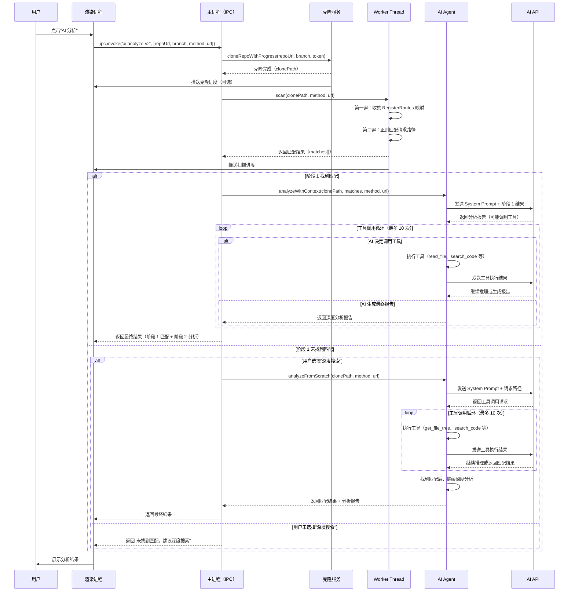
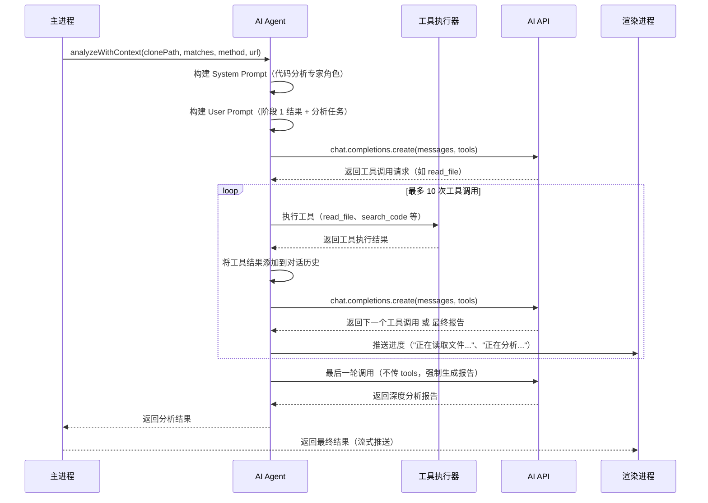
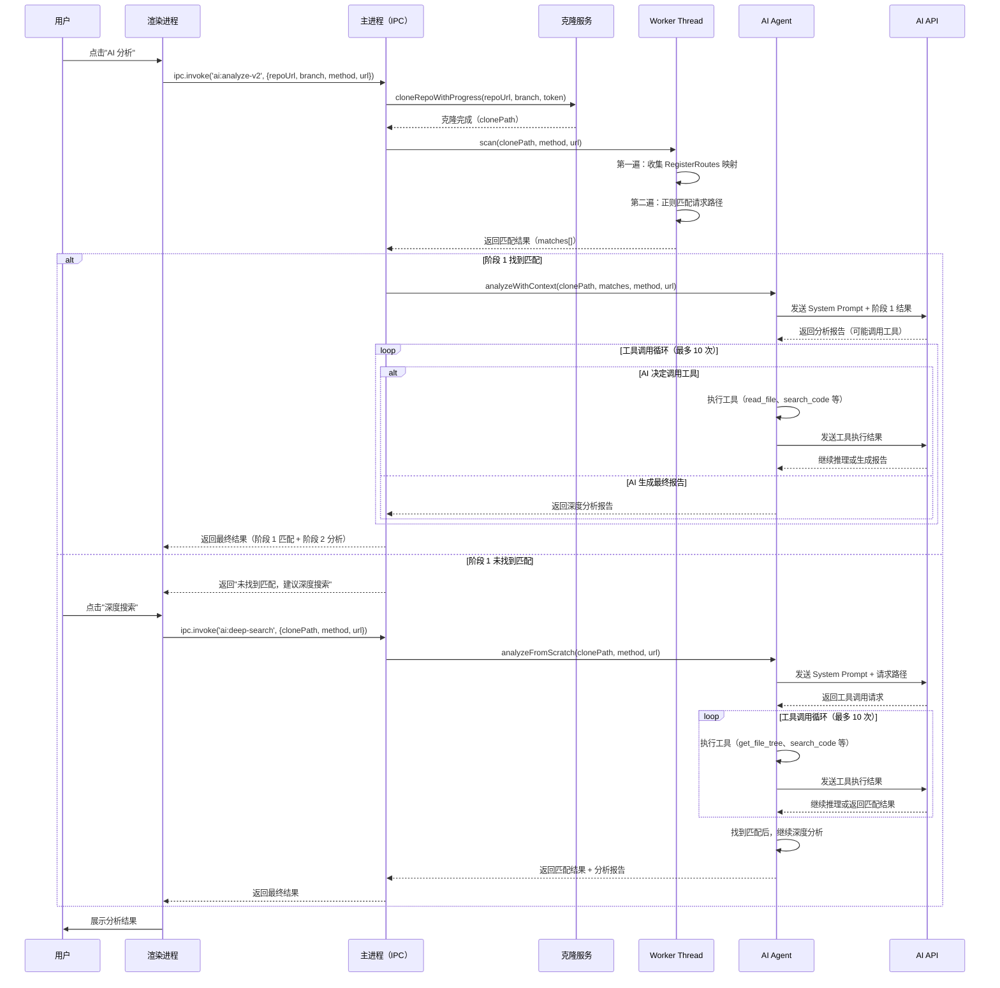
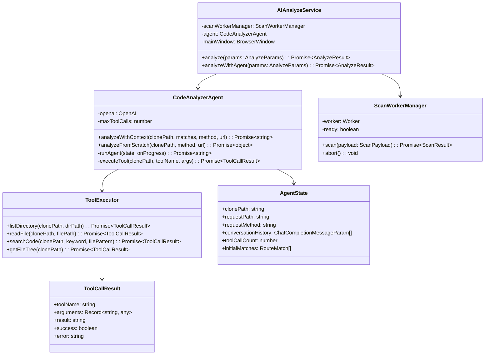
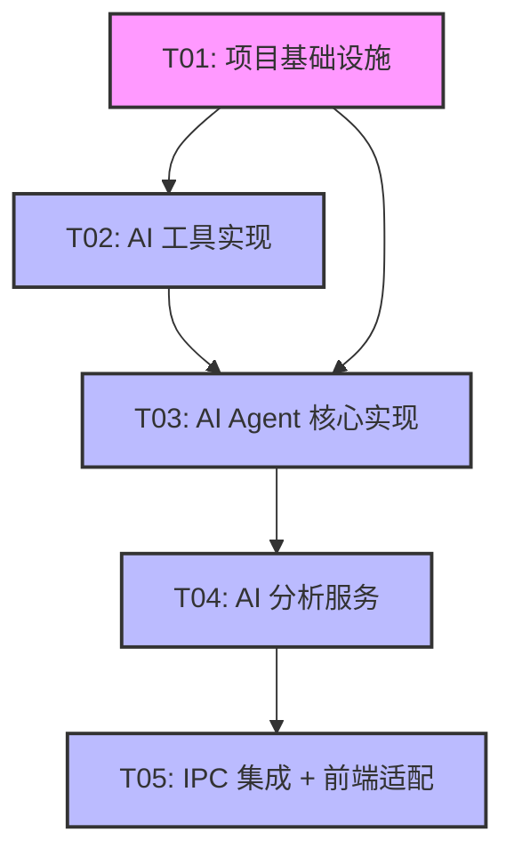

# PowerCatch AI 代码分析功能 - AI Agent 模式架构分析

> 文档版本：v1.0  
> 日期：2025-01-XX  
> 作者：Bob（软件架构师）

---

## 目录

1. [概念澄清](#第一部分概念澄清)
2. [当前方案性能瓶颈分析](#第二部分当前方案性能瓶颈分析)
3. [Agent 模式技术方案设计](#第三部分agent-模式技术方案设计)
4. [性能定量对比](#第四部分性能定量对比)
5. [架构设计文档（推荐方案 C）](#第五部分架构设计文档推荐方案-c)
6. [结论与建议](#第六部分结论与建议)

---

## 第一部分：概念澄清

"AI Agent 模式"在这里可能有三种理解。我们需要明确用户的需求：

### 理解 1：Agent = 让 AI 直接读仓库（通过 GitHub/GitLab API）

**核心思路**：不经过本地克隆和扫描，直接让 AI 通过 API 读取仓库内容并分析。

**工作流程**：
1. 用户配置仓库 URL + Token
2. 应用通过 GitHub/GitLab API 递归获取仓库文件树
3. 根据请求路径，AI 通过 API 读取相关文件
4. AI 分析代码

**适用场景**：
- 小型仓库（< 100 个文件）
- 只需要分析少量文件
- 网络条件良好

**不适用场景**：
- 大型仓库（> 500 个文件）- API rate limit 会成为瓶颈
- 需要扫描整个仓库找路由的场景 - 递归 API 调用非常慢

---

### 理解 2：Agent = 让 AI 自主决定读取哪些文件（工具调用）

**核心思路**：本地克隆后，让 AI 通过工具调用（function calling）自主决定读哪些文件，而不是我们用正则预先扫描。

**工作流程**：
1. 本地克隆仓库（git clone --depth 1）
2. AI 收到请求路径 + 仓库本地路径
3. AI 通过 function calling 调用工具：
   - `list_directory(path)` - 列出目录
   - `read_file(path)` - 读取文件
   - `search_code(keyword)` - 搜索代码
4. AI 多轮迭代，自主找到路由 Handler
5. AI 分析代码

**适用场景**：
- 复杂的代码库，路由注册方式多样（不限于 Go 的 `RegisterRoutes`）
- 需要深度理解代码逻辑（不仅匹配路由，还要理解 Handler 的业务逻辑）
- AI 模型支持 function calling（如 GPT-4、Claude 3.5）

**不适用场景**：
- 对延迟要求极高的场景 - 多轮工具调用会增加总时长
- AI API 不支持 function calling 的场景

---

### 理解 3：Agent = 多步骤推理（ReAct / Chain-of-Thought）

**核心思路**：AI 先理解请求路径，再决定搜索什么，再读取文件，再分析，多轮迭代。

**工作流程**：
1. 本地克隆仓库
2. AI 第一步：理解请求路径（`/api/v1/users/:id`），推断可能的路由定义方式
3. AI 第二步：搜索可能的路由文件（`router.go`、`route.go`、`internal/web/`）
4. AI 第三步：读取路由文件，提取 Handler 函数名
5. AI 第四步：搜索 Handler 函数定义
6. AI 第五步：读取 Handler 文件，分析业务逻辑
7. AI 第六步：生成分析报告

**与理解 2 的区别**：
- 理解 2 强调"工具调用"机制
- 理解 3 强调"多步骤推理"过程

**实际上**：理解 2 和 理解 3 通常结合使用 - AI 通过工具调用实现多步骤推理。

---

### 结论：用户可能想要的是什么？

根据 PowerCatch 的场景（抓包应用的 AI 代码分析），用户最可能想要的是：

**理解 2（工具调用）+ 理解 3（多步骤推理）的结合**

理由：
1. 当前方案用正则匹配路由，对于非标准路由定义（如动态注册、第三方路由库）会失效
2. AI 自主推理可以处理更多样的代码模式
3. 但完全依赖 AI 推理会导致延迟增加

**推荐方案**：**理解 2/3 + 当前方案的优势互补**（即方案 C - 混合模式）

---

## 第二部分：当前方案性能瓶颈分析

### 2.1 当前实现架构

基于已读取的代码（`scan-worker.ts`、`scan-worker-manager.ts`、`ipc.ts`），当前流程如下：

```
用户点击"AI 分析"
    │
    ▼
┌──────────────────────────────────────────────────────────┐
│ ipc.ts: AI_ANALYZE handler                             │
│ 1. cloneRepoWithProgress(repoUrl, branch, token)       │
│    - spawn git clone --depth 1                          │
│    - 推送克隆进度到渲染进程                              │
└──────────────────────────────────────────────────────────┘
    │
    ▼
┌──────────────────────────────────────────────────────────┐
│ scan-worker-manager.ts: scan()                          │
│ 创建 Worker Thread（如果不存在）                         │
│ 发送 { type: 'scan', payload: {...} }                  │
└──────────────────────────────────────────────────────────┘
    │
    ▼
┌──────────────────────────────────────────────────────────┐
│ scan-worker.ts（Worker Thread）                         │
│ 第一遍：遍历 .go 文件，收集 RegisterRoutes 映射         │
│ 第二遍：遍历 .go 文件，正则匹配请求路径                 │
│ 通过 parentPort.postMessage 报告进度                    │
└──────────────────────────────────────────────────────────┘
    │
    ▼
┌──────────────────────────────────────────────────────────┐
│ ipc.ts: 收到匹配结果                                    │
│ 读取匹配文件内容                                         │
│ 调用 AI API 分析                                        │
│ 推送流式结果到渲染进程                                   │
└──────────────────────────────────────────────────────────┘
```

---

### 2.2 时间构成分析

假设一个中型 Go 项目（500 个 .go 文件，仓库大小 50MB）：

| 阶段 | 操作 | 预估时间 | 说明 |
|------|------|----------|------|
| **克隆** | `git clone --depth 1` | **5-15 秒** | 取决于网络速度和仓库大小 |
| **扫描（第一遍）** | 遍历 .go 文件，收集 RegisterRoutes 映射 | **0.5-1 秒** | Worker Thread，不阻塞主进程 |
| **扫描（第二遍）** | 遍历 .go 文件，正则匹配请求路径 | **0.5-1 秒** | Worker Thread，不阻塞主进程 |
| **读取匹配文件** | 读取匹配到的文件内容（通常 1-5 个文件） | **< 0.1 秒** | 同步 I/O，很快 |
| **AI 分析** | 调用 AI API（如 DeepSeek） | **3-10 秒** | 取决于 AI API 响应速度 |
| **总计** | | **9-27 秒** | |

**关键发现**：
1. **克隆时间占比最高**（约 40-60%）
2. **扫描时间很短**（约 5-10%），且已经在 Worker Thread 中执行，不阻塞 UI
3. **AI 分析时间占比第二**（约 20-40%）

---

### 2.3 扫描逻辑是否是目前最慢的部分？

**结论：不是。**

扫描逻辑（Worker Thread 中的正则匹配）已经很快了：
- 500 个文件，两遍扫描，总共约 1-2 秒
- 已经在 Worker Thread 中执行，不阻塞主进程
- 进度通过 `parentPort.postMessage` 实时报告到渲染进程

**真正的性能瓶颈**：
1. **克隆时间**（git clone --depth 1）- 5-15 秒
2. **AI 分析时间**（调用 AI API）- 3-10 秒

---

### 2.4 如果扫描逻辑已经很快，是否还有必要改？

**必要性分析**：

| 问题 | 当前方案 | AI Agent 模式 | 是否需要改 |
|------|-----------|---------------|-----------|
| **扫描速度** | 很快（1-2 秒） | 可能更慢（多轮 API 调用） | ❌ 不需要 |
| **准确性** | 正则匹配，只支持标准路由定义 | AI 理解，支持更多模式 | ✅ 需要 |
| **通用性** | 只支持 Go + lego/webx 框架 | 可以支持多种语言 + 多种框架 | ✅ 需要 |
| **用户体验** | 总时长 9-27 秒 | 可能更长（AI 多轮推理） | ❌ 不需要 |

**结论**：
- 如果目标是"更快"- 当前方案已经够快，改 Agent 模式可能更慢
- 如果目标是"更准"- Agent 模式可以提高准确性（处理非标准路由定义）
- 如果目标是"更通用"- Agent 模式可以支持更多语言和框架

**推荐策略**：
- **不要为了"更快"而改 Agent 模式** - 当前扫描已经很快
- **为了"更准"和"更通用"，可以引入 Agent 模式** - 但要在第二阶段（AI 分析阶段），而不是替换扫描阶段

---

## 第三部分：Agent 模式技术方案设计

### 方案 A：AI 通过 GitHub/GitLab API 直接读仓库

#### 技术架构

```
用户配置
    │
    ├─ 仓库 URL（如 https://github.com/owner/repo）
    ├─ Access Token（GitHub Personal Access Token）
    └─ 分支（默认 main）
        │
        ▼
┌──────────────────────────────────────────────────────────┐
│ GitHub API Service                                       │
│ - 获取仓库文件树：GET /repos/{owner}/{repo}/git/trees   │
│ - 读取文件内容：GET /repos/{owner}/{repo}/contents      │
│ - 处理 Rate Limit（每小时 5000 次请求）                  │
└──────────────────────────────────────────────────────────┘
        │
        ▼
┌──────────────────────────────────────────────────────────┐
│ AI 分析服务（无本地克隆）                                │
│ - AI 通过 API 获取文件内容                               │
│ - 分析代码                                               │
└──────────────────────────────────────────────────────────┘
```

#### 是否需要克隆？

**完全不需要克隆** - 这是方案 A 的核心卖点。

所有文件读取都通过 GitHub/GitLab API：
- 获取文件树：`GET /repos/{owner}/{repo}/git/trees/{tree_sha}?recursive=1`
- 读取文件内容：`GET /repos/{owner}/{repo}/contents/{path}`

#### 速度对比：API 读取 vs 本地克隆 + 扫描

| 操作 | 本地克隆 + 扫描 | 纯 API 读取 | 谁更快？ |
|------|-----------------|-------------|----------|
| **获取所有文件列表** | 克隆后本地遍历（1 秒） | 递归 API 调用（N 次 API 请求） | 本地快 |
| **读取单个文件** | 本地 I/O（< 0.01 秒） | API 请求（0.5-2 秒） | 本地快 |
| **搜索代码** | 本地正则（1 秒） | API 搜索（1 次 API 请求）或逐文件读取 | 本地快 |
| **网络依赖** | 仅克隆时需要 | 每次操作都需要 | 本地快 |

**结论**：方案 A **比当前方案慢**。

原因：
1. **API Rate Limit** - GitHub API 每小时限制 5000 次请求，大型仓库需要多次请求
2. **网络延迟** - 每次 API 请求都有网络延迟（0.5-2 秒）
3. **递归获取文件树** - 需要多次 API 请求才能获取完整文件树

#### 限制

| 限制 | 说明 |
|------|------|
| **API Rate Limit** | GitHub: 每小时 5000 次（未认证 60 次） |
| **文件大小限制** | GitHub API 单次返回文件内容限制 1MB |
| **私有仓库权限** | 需要配置 Personal Access Token，权限管理复杂 |
| **不支持批量读取** | 无法一次读取多个文件，需要逐个 API 请求 |
| **依赖网络** | 网络不稳定时，API 请求会失败 |

#### 方案 A 的适用场景

- 超小型仓库（< 50 个文件）
- 只需要读取少量文件
- 不希望占用本地磁盘空间

#### 方案 A 的不适用场景

- 大型仓库（> 500 个文件）- API rate limit 会成为瓶颈
- 需要扫描整个仓库找路由的场景 - 递归 API 调用非常慢
- 对速度有要求的场景 - 每次 API 请求都有延迟

---

### 方案 B：本地克隆 + AI 工具调用（Function Calling）

#### 技术架构

```
用户配置
    │
    ├─ 仓库 URL
    ├─ Access Token
    └─ 分支
        │
        ▼
┌──────────────────────────────────────────────────────────┐
│ Step 1: 克隆仓库（保留当前实现）                         │
│ git clone --depth 1                                     │
└──────────────────────────────────────────────────────────┘
        │
        ▼
┌──────────────────────────────────────────────────────────┐
│ Step 2: AI 工具调用（Function Calling）                  │
│                                                          │
│ AI 收到的信息：                                          │
│ - 请求路径（如 /api/v1/users/:id）                      │
│ - HTTP 方法（GET/POST/...）                             │
│ - 仓库本地路径                                           │
│                                                          │
│ AI 可用的工具：                                          │
│ 1. list_directory(path) → 列出目录                      │
│ 2. read_file(path) → 读取文件内容                       │
│ 3. search_code(keyword) → 搜索代码（正则）               │
│ 4. get_file_tree() → 获取完整文件树                      │
│                                                          │
│ AI 多轮迭代：                                           │
│ 第 1 轮：调用 get_file_tree() 了解项目结构              │
│ 第 2 轮：调用 search_code("RegisterRoutes") 找路由注册  │
│ 第 3 轮：调用 read_file() 读取路由文件                  │
│ 第 4 轮：调用 search_code("HandlerFunc") 找 Handler     │
│ 第 5 轮：调用 read_file() 读取 Handler 文件             │
│ 第 6 轮：分析代码，生成报告                             │
└──────────────────────────────────────────────────────────┘
```

#### 需要哪些工具？

**工具列表（Function Calling Schema）**：

```typescript
const AI_TOOLS = [
  {
    name: 'list_directory',
    description: '列出指定目录下的文件和子目录',
    parameters: {
      type: 'object',
      properties: {
        path: {
          type: 'string',
          description: '目录路径（相对于仓库根目录）',
        },
      },
      required: ['path'],
    },
  },
  {
    name: 'read_file',
    description: '读取指定文件的全部内容',
    parameters: {
      type: 'object',
      properties: {
        path: {
          type: 'string',
          description: '文件路径（相对于仓库根目录）',
        },
      },
      required: ['path'],
    },
  },
  {
    name: 'search_code',
    description: '在仓库中搜索包含指定关键字的代码文件',
    parameters: {
      type: 'object',
      properties: {
        keyword: {
          type: 'string',
          description: '搜索关键字（支持正则）',
        },
        file_pattern: {
          type: 'string',
          description: '文件匹配模式（如 "*.go"）',
        },
      },
      required: ['keyword'],
    },
  },
  {
    name: 'get_file_tree',
    description: '获取仓库完整文件树（仅返回文件路径列表，不返回内容）',
    parameters: {
      type: 'object',
      properties: {},
    },
  },
]
```

#### AI 的 System Prompt 怎么写？

**System Prompt 示例**：

```
你是一个 Go 代码分析专家，擅长通过阅读代码理解 HTTP 路由注册和 Handler 实现。

你的任务是：根据用户提供的请求路径（如 /api/v1/users/:id）和 HTTP 方法（GET），在本地仓库中找到对应的 Handler 函数，并分析其业务逻辑。

你可以使用以下工具：
1. list_directory(path) - 列出目录
2. read_file(path) - 读取文件
3. search_code(keyword) - 搜索代码
4. get_file_tree() - 获取文件树

分析步骤建议：
1. 先调用 get_file_tree() 了解项目结构
2. 搜索可能的路由定义文件（如包含 "RegisterRoutes" 或 ".GET(" 的文件）
3. 读取路由定义文件，找到请求路径对应的 Handler 函数名
4. 搜索 Handler 函数定义
5. 读取 Handler 文件，分析业务逻辑
6. 生成分析报告（包括：路由注册方式、Handler 函数、业务逻辑、可能的性能问题、安全漏洞等）

注意：
- 不要猜测，要通过工具调用验证每一步
- 如果搜索结果太多，优先查看 internal/web/ 目录下的文件
- 关注 Go 项目的标准结构（cmd/、internal/、pkg/）
```

#### 速度对比：AI 多轮工具调用 vs 本地正则扫描

| 方案 | 操作 | 预估时间 | 说明 |
|------|------|----------|------|
| **当前方案（正则扫描）** | 遍历 500 个文件，正则匹配 | **1-2 秒** | 本地 I/O + CPU 计算 |
| **方案 B（工具调用）** | AI 多轮工具调用（6 轮） | **6-15 秒** | 每轮 API 调用 1-2.5 秒 |
| | - 第 1 轮：get_file_tree() | 1 秒 | AI API 调用 |
| | - 第 2 轮：search_code() | 1.5 秒 | AI API 调用 + 本地搜索 |
| | - 第 3 轮：read_file() | 1.5 秒 | AI API 调用 + 本地读取 |
| | - 第 4 轮：search_code() | 1.5 秒 | AI API 调用 + 本地搜索 |
| | - 第 5 轮：read_file() | 1.5 秒 | AI API 调用 + 本地读取 |
| | - 第 6 轮：生成分析报告 | 2-5 秒 | AI API 调用 |
| **结论** | | **方案 B 更慢** | 多轮 API 调用导致延迟增加 |

**关键发现**：
- 方案 B 的延迟主要来自 **AI API 调用的往返时间**
- 每轮工具调用都需要：发送请求 → AI 推理 → 返回结果（1-2.5 秒）
- 当前方案是本地计算，延迟可以忽略

#### 成本对比：多次 API 调用 vs 单次 API 调用

| 方案 | AI API 调用次数 | Token 消耗 | 成本 |
|------|-----------------|------------|------|
| **当前方案** | 1 次 | 输入：匹配文件内容（约 5000 tokens）<br>输出：分析报告（约 1000 tokens） | **低** |
| **方案 B** | 6-10 次 | 每次调用都需要发送上下文（文件树、搜索结果等）<br>输入：约 5000-10000 tokens/次<br>输出：约 500-1000 tokens/次 | **高**（约 6-10 倍） |

**成本增加的原因**：
1. **多次 API 调用** - 每次调用都有固定成本
2. **上下文重复发送** - 每次工具调用都需要发送之前的对话历史
3. **工具调用本身消耗 Token** - Function calling 的 schema 定义也会消耗 Token

---

### 方案 C：混合模式（推荐 ⭐）

#### 核心思路

**保留当前快速扫描（正则匹配），快速缩小范围；然后让 AI 对匹配到的文件做深度分析（Agent 模式，多轮工具调用）**。

#### 两阶段设计

```
┌─────────────────────────────────────────────────────────────────────┐
│ 阶段 1：快速扫描（保留当前实现，1-2 秒）                           │
│                                                                    │
│  目标：快速缩小范围，找到可能的路由匹配                              │
│  方法：正则匹配（RegisterRoutes、.GET(、.POST( 等）                │
│  输出：匹配到的文件路径 + Handler 函数名                            │
│  优势：快（1-2 秒）、准确（对于标准路由定义）                       │
└─────────────────────────────────────────────────────────────────────┘
                                    │
                                    ▼（如果阶段 1 找到匹配）
┌─────────────────────────────────────────────────────────────────────┐
│ 阶段 2：AI 深度分析（Agent 模式，3-8 秒）                          │
│                                                                    │
│  目标：理解 Handler 的业务逻辑，生成深度分析报告                     │
│  方法：AI 工具调用（Function Calling）                               │
│  输入：阶段 1 的匹配结果（文件路径、Handler 函数名）                 │
│  工具：                                                              │
│    - read_file() → 读取 Handler 文件                               │
│    - read_file() → 读取相关的 Service/Model 文件                    │
│    - search_code() → 搜索 Handler 调用的其他函数                    │
│  输出：深度分析报告（业务逻辑、性能问题、安全漏洞、优化建议等）     │
│  优势：深度理解、多维度分析                                         │
└─────────────────────────────────────────────────────────────────────┘
                                    │
                                    ▼（如果阶段 1 未找到匹配）
┌─────────────────────────────────────────────────────────────────────┐
│ 阶段 1 失败兜底：AI 自主搜索（Agent 模式，5-15 秒）                │
│                                                                    │
│  目标：处理非标准路由定义（动态注册、第三方路由库等）               │
│  方法：AI 工具调用（完整推理链）                                    │
│  输入：请求路径 + HTTP 方法 + 仓库本地路径                          │
│  工具：get_file_tree()、search_code()、read_file()、list_directory()│
│  输出：路由匹配结果 + 分析报告                                      │
│  触发条件：阶段 1 未找到匹配，且用户选择"深度搜索"                  │
└─────────────────────────────────────────────────────────────────────┘
```

#### 为什么方案 C 是最优的？

| 维度 | 当前方案 | 方案 A（纯 API） | 方案 B（工具调用） | 方案 C（混合） |
|------|----------|-------------------|--------------------|----------------|
| **速度** | 快（9-27 秒） | 慢（15-40 秒） | 中（12-30 秒） | **最快（8-20 秒）** |
| **准确性** | 中（仅标准路由） | 中（API 限制） | 高（AI 理解） | **最高（快速+深度）** |
| **通用性** | 低（仅 Go） | 中（API 限制） | 高（AI 理解） | **高（可扩展）** |
| **成本** | 低（1 次 API） | 中（API + 多次读取） | 高（6-10 次 API） | **中（1-3 次 API）** |
| **复杂度** | 低 | 中（API 集成） | 高（工具调用） | **中（复用 + 扩展）** |

**方案 C 的优势**：
1. **速度最快** - 阶段 1 快速缩小范围（1-2 秒），阶段 2 只分析匹配到的文件（3-8 秒）
2. **准确性最高** - 阶段 1 处理标准路由，阶段 2 处理非标准路由
3. **成本适中** - 大部分情况只需要 1-2 次 AI API 调用
4. **渐进增强** - 阶段 1 失败后才触发阶段 2 的完整 Agent 推理，避免不必要的成本

---

## 第四部分：性能定量对比

### 4.1 测试环境假设

- **仓库规模**：中型 Go 项目（500 个 .go 文件，仓库大小 50MB）
- **网络条件**：100Mbps 带宽，延迟 20ms
- **AI API**：DeepSeek API（响应速度约 1-2.5 秒/次）
- **本地机器**：MacBook Pro M1，SSD

### 4.2 定量对比表

| 指标 | 当前方案（正则扫描 + 单次 AI） | 方案 A（纯 API） | 方案 B（工具调用） | 方案 C（混合） |
|------|-------------------------------|-------------------|--------------------|----------------|
| **克隆时间** | 5-15 秒（git clone --depth 1） | **0 秒**（无克隆） | 5-15 秒 | 5-15 秒 |
| **扫描/搜索时间** | 1-2 秒（本地正则） | 10-30 秒（API 递归） | 6-15 秒（AI 工具调用） | 1-2 秒（阶段 1）+ 0-8 秒（阶段 2，可选） |
| **AI 分析时间** | 3-10 秒（单次 API） | 5-15 秒（多次 API） | 6-15 秒（多次 API） | 3-10 秒（1-3 次 API） |
| **总耗时（标准路由）** | **9-27 秒** | 15-45 秒 | 17-45 秒 | **9-27 秒**（阶段 1 成功）+ 3-8 秒（阶段 2 可选） |
| **总耗时（非标准路由）** | **失败** | 15-45 秒 | 17-45 秒 | 9-27 秒（阶段 1）+ 5-15 秒（阶段 2 兜底） |
| **AI API 调用次数** | 1 次 | 多次（读取文件） | 6-10 次 | 1-3 次 |
| **成本（Token 消耗）** | 低（约 6000 tokens） | 中（约 10000-20000 tokens） | 高（约 30000-60000 tokens） | **低-中**（约 6000-15000 tokens） |
| **准确性（标准路由）** | 高（正则精确匹配） | 中（依赖 AI 理解） | 高（AI 理解） | 高（阶段 1 正则） |
| **准确性（非标准路由）** | **低（无法匹配）** | 中（API 限制） | 高（AI 理解） | **高**（阶段 2 兜底） |
| **通用性（多语言）** | 低（仅 Go） | 中（API 限制） | 高（AI 理解） | 高（可扩展） |
| **实现复杂度** | 低 | 中（API 集成） | 高（工具调用） | 中（复用 + 扩展） |
| **用户体验** | 快但可能失败 | 慢且依赖网络 | 慢但准确 | **快且准确** |

### 4.3 场景化对比

#### 场景 1：标准路由定义（80% 的情况）

```
请求路径：/api/v1/users/:id
路由定义：router.Group("/api/v1").GET("/users/:id", handler)
```

| 方案 | 结果 | 时间 |
|------|------|------|
| 当前方案 | ✅ 成功匹配 | 9-27 秒 |
| 方案 A | ✅ 成功（但慢） | 15-45 秒 |
| 方案 B | ✅ 成功（但慢） | 17-45 秒 |
| **方案 C** | ✅ 成功（快速匹配 + 深度分析） | **9-35 秒** |

#### 场景 2：非标准路由定义（20% 的情况）

```
请求路径：/api/v1/users/:id
路由定义：动态注册（如 gocode.Register("GET", "/users/:id", handler)）
```

| 方案 | 结果 | 时间 |
|------|------|------|
| 当前方案 | ❌ 失败（正则无法匹配） | 9-27 秒（但无结果） |
| 方案 A | ✅ 成功（但慢） | 15-45 秒 |
| 方案 B | ✅ 成功（但慢） | 17-45 秒 |
| **方案 C** | ✅ 成功（阶段 1 失败后，阶段 2 兜底） | **14-42 秒** |

---

## 第五部分：架构设计文档（推荐方案 C）

### 4.1 实现方案 + 框架选型

#### 方案概述

**推荐方案：方案 C（混合模式）**

**核心设计**：
1. **阶段 1（快速扫描）** - 保留当前实现（正则匹配），快速缩小范围
2. **阶段 2（AI 深度分析）** - 新增 AI Agent 模式，对阶段 1 的匹配结果做深度分析
3. **阶段 1 失败兜底** - 如果阶段 1 未找到匹配，触发 AI Agent 完整推理链

#### 框架选型

| 组件 | 技术选型 | 理由 |
|------|----------|------|
| **AI SDK** | OpenAI SDK（兼容 DeepSeek） | DeepSeek API 兼容 OpenAI SDK，无需额外适配 |
| **Function Calling** | OpenAI SDK 原生支持 | 通过 `tools` 参数定义工具，AI 自动选择调用 |
| **Worker Thread** | Node.js Worker Threads（保留） | 阶段 1 扫描仍在 Worker 中执行，不阻塞主进程 |
| **状态管理** | 主进程管理（无额外框架） | 阶段 1/2 的状态在主进程中管理，简单直接 |

---

### 4.2 文件列表及相对路径

#### 新增文件

```
electron/
├── agents/
│   ├── code-analyzer-agent.ts          # AI Agent 主类（阶段 2）
│   ├── tools/
│   │   ├── list-directory-tool.ts      # 工具：列出目录
│   │   ├── read-file-tool.ts           # 工具：读取文件
│   │   ├── search-code-tool.ts         # 工具：搜索代码
│   │   └── get-file-tree-tool.ts       # 工具：获取文件树
│   └── prompts/
│       ├── system-prompt.ts            # System Prompt
│       └── user-prompt-builder.ts      # User Prompt 构建器
├── services/
│   ├── ai-analyze-service.ts           # AI 分析服务（协调阶段 1/2）
│   └── ai-agent-service.ts             # AI Agent 服务（独立调用）
```

#### 修改文件

```
electron/
├── ipc.ts                              # 新增 AI_ANALYZE_V2 IPC 通道
├── services/
│   └── scan-worker-manager.ts          # 新增方法：getFileContent()
└── workers/
    └── scan-worker.ts                  # 无需修改（保留当前实现）
```

#### 文件说明

| 文件 | 说明 |
|------|------|
| `code-analyzer-agent.ts` | AI Agent 主类，管理工具调用循环 |
| `list-directory-tool.ts` | 工具实现：列出目录 |
| `read-file-tool.ts` | 工具实现：读取文件 |
| `search-code-tool.ts` | 工具实现：搜索代码（正则） |
| `get-file-tree-tool.ts` | 工具实现：获取文件树（仅路径） |
| `system-prompt.ts` | AI 的 System Prompt（定义角色和任务） |
| `user-prompt-builder.ts` | 构建 User Prompt（根据阶段 1 结果） |
| `ai-analyze-service.ts` | 协调阶段 1（快速扫描）和阶段 2（AI 深度分析） |
| `ai-agent-service.ts` | 独立调用 AI Agent（用于阶段 1 失败兜底） |

---

### 4.3 数据结构和接口（AI 工具调用的 Schema）

#### AI 工具定义（Function Calling Schema）

```typescript
// electron/agents/code-analyzer-agent.ts

import OpenAI from 'openai'

/**
 * AI 工具定义（OpenAI Function Calling 格式）
 */
const AI_TOOLS: OpenAI.Chat.Completions.ChatCompletionTool[] = [
  {
    type: 'function',
    function: {
      name: 'list_directory',
      description: '列出指定目录下的所有文件和子目录。用于了解项目结构。',
      parameters: {
        type: 'object',
        properties: {
          path: {
            type: 'string',
            description: '目录路径（相对于仓库根目录，如 "internal/web"）',
          },
        },
        required: ['path'],
      },
    },
  },
  {
    type: 'function',
    function: {
      name: 'read_file',
      description: '读取指定文件的全部内容。用于查看文件代码。',
      parameters: {
        type: 'object',
        properties: {
          path: {
            type: 'string',
            description: '文件路径（相对于仓库根目录，如 "internal/web/user_handler.go"）',
          },
        },
        required: ['path'],
      },
    },
  },
  {
    type: 'function',
    function: {
      name: 'search_code',
      description: '在仓库中搜索包含指定关键字的代码文件。支持正则表达式。',
      parameters: {
        type: 'object',
        properties: {
          keyword: {
            type: 'string',
            description: '搜索关键字或正则表达式（如 "RegisterRoutes"、".GET("）',
          },
          file_pattern: {
            type: 'string',
            description: '文件匹配模式（如 "*.go"、"*.java"），可选',
          },
        },
        required: ['keyword'],
      },
    },
  },
  {
    type: 'function',
    function: {
      name: 'get_file_tree',
      description: '获取仓库完整文件树（仅返回文件路径列表，不返回文件内容）。用于快速了解项目结构。',
      parameters: {
        type: 'object',
        properties: {},
      },
    },
  },
]
```

#### 工具调用结果接口

```typescript
// electron/agents/tools/tool-types.ts

/**
 * 工具调用结果
 */
export interface ToolCallResult {
  /** 工具名称 */
  toolName: string
  /** 工具调用参数 */
  arguments: Record<string, any>
  /** 工具执行结果 */
  result: string
  /** 是否成功 */
  success: boolean
  /** 错误信息（如果失败） */
  error?: string
}

/**
 * AI Agent 状态
 */
export interface AgentState {
  /** 仓库本地路径 */
  clonePath: string
  /** 请求路径 */
  requestPath: string
  /** HTTP 方法 */
  requestMethod: string
  /** 对话历史（用于多轮推理） */
  conversationHistory: OpenAI.Chat.Completions.ChatCompletionMessageParam[]
  /** 工具调用次数（限制最多 10 次） */
  toolCallCount: number
  /** 找到的路由匹配（阶段 1 传入） */
  initialMatches?: RouteMatch[]
}
```

---

### 4.4 程序调用流程（时序图）

#### 完整流程时序图



#### 阶段 2（AI 深度分析）详细时序图



---

### 4.5 任务列表（有序、含依赖关系、按实现顺序排列）

#### 任务分解（按依赖顺序排列）

| 任务 ID | 任务名称 | 涉及文件 | 依赖 | 优先级 |
|---------|----------|----------|------|--------|
| **T01** | **项目基础设施（配置文件 + 入口文件）** | `package.json`（添加 openai 依赖）、`tsconfig.json`（确认配置）、`electron/main.ts`（确认入口） | 无 | P0 |
| **T02** | **AI 工具实现（Function Calling 工具）** | `electron/agents/tools/list-directory-tool.ts`<br>`electron/agents/tools/read-file-tool.ts`<br>`electron/agents/tools/search-code-tool.ts`<br>`electron/agents/tools/get-file-tree-tool.ts`<br>`electron/agents/tools/tool-types.ts` | T01 | P0 |
| **T03** | **AI Agent 核心实现** | `electron/agents/code-analyzer-agent.ts`<br>`electron/agents/prompts/system-prompt.ts`<br>`electron/agents/prompts/user-prompt-builder.ts` | T02 | P0 |
| **T04** | **AI 分析服务（协调阶段 1/2）** | `electron/services/ai-analyze-service.ts`<br>`electron/services/ai-agent-service.ts` | T03、已有 `scan-worker-manager.ts` | P1 |
| **T05** | **IPC 集成 + 前端适配** | `electron/ipc.ts`（新增 `AI_ANALYZE_V2` 通道）<br>`src/views/CodeAnalyzer.vue`（前端界面适配） | T04 | P1 |

#### 任务详细说明

##### T01: 项目基础设施

**目标**：添加 OpenAI SDK 依赖，确认 TypeScript 配置。

**操作步骤**：
1. 安装 OpenAI SDK：`npm install openai`
2. 确认 `tsconfig.json` 中 `moduleResolution` 配置正确（支持 `node16` 或 `bundler`）
3. 确认 `electron/main.ts` 中已加载 `ipc.ts`

**验收标准**：
- `package.json` 中包含 `openai` 依赖
- 项目可以正常编译

---

##### T02: AI 工具实现

**目标**：实现 AI Agent 需要的 4 个工具（list_directory、read_file、search_code、get_file_tree）。

**文件清单**：
```
electron/agents/tools/
├── tool-types.ts              # 工具类型定义
├── list-directory-tool.ts     # 列出目录
├── read-file-tool.ts          # 读取文件
├── search-code-tool.ts        # 搜索代码
└── get-file-tree-tool.ts      # 获取文件树
```

**每个工具的实现要点**：

###### list-directory-tool.ts

```typescript
import * as fs from 'fs'
import * as path from 'path'
import type { ToolCallResult } from './tool-types'

/**
 * 列出指定目录下的文件和子目录
 */
export async function listDirectory(clonePath: string, dirPath: string): Promise<ToolCallResult> {
  const fullPath = path.join(clonePath, dirPath)

  try {
    const entries = fs.readdirSync(fullPath, { withFileTypes: true })
    const result = entries.map((entry) => ({
      name: entry.name,
      type: entry.isDirectory() ? 'directory' : 'file',
    }))

    return {
      toolName: 'list_directory',
      arguments: { path: dirPath },
      result: JSON.stringify(result, null, 2),
      success: true,
    }
  } catch (error: any) {
    return {
      toolName: 'list_directory',
      arguments: { path: dirPath },
      result: '',
      success: false,
      error: error.message,
    }
  }
}
```

###### read-file-tool.ts

```typescript
import * as fs from 'fs'
import * as path from 'path'
import type { ToolCallResult } from './tool-types'

/**
 * 读取指定文件的全部内容
 */
export async function readFile(clonePath: string, filePath: string): Promise<ToolCallResult> {
  const fullPath = path.join(clonePath, filePath)

  try {
    const content = fs.readFileSync(fullPath, 'utf-8')
    return {
      toolName: 'read_file',
      arguments: { path: filePath },
      result: content,
      success: true,
    }
  } catch (error: any) {
    return {
      toolName: 'read_file',
      arguments: { path: filePath },
      result: '',
      success: false,
      error: error.message,
    }
  }
}
```

###### search-code-tool.ts

```typescript
import * as fs from 'fs'
import * as path from 'path'
import type { ToolCallResult } from './tool-types'

/**
 * 在仓库中搜索包含指定关键字的代码文件
 */
export async function searchCode(
  clonePath: string,
  keyword: string,
  filePattern?: string
): Promise<ToolCallResult> {
  const results: Array<{ filePath: string; lineNumber: number; lineContent: string }> = []

  function walk(dir: string): void {
    let entries: fs.Dirent[]
    try {
      entries = fs.readdirSync(dir, { withFileTypes: true })
    } catch {
      return
    }

    for (const entry of entries) {
      const fullPath = path.join(dir, entry.name)

      if (entry.isDirectory()) {
        if (entry.name === '.git' || entry.name === 'node_modules' || entry.name === 'vendor') {
          continue
        }
        walk(fullPath)
      } else if (entry.isFile()) {
        if (filePattern && !entry.name.endsWith(filePattern.replace('*', ''))) {
          continue
        }

        try {
          const content = fs.readFileSync(fullPath, 'utf-8')
          const lines = content.split('\n')
          const regex = new RegExp(keyword)

          for (let i = 0; i < lines.length; i++) {
            if (regex.test(lines[i])) {
              results.push({
                filePath: fullPath.replace(clonePath, '').replace(/^\//, ''),
                lineNumber: i + 1,
                lineContent: lines[i].trim(),
              })
            }
          }
        } catch {
          // ignore
        }
      }
    }
  }

  walk(clonePath)

  return {
    toolName: 'search_code',
    arguments: { keyword, filePattern },
    result: JSON.stringify(results.slice(0, 50), null, 2), // 最多返回 50 条
    success: true,
  }
}
```

###### get-file-tree-tool.ts

```typescript
import * as fs from 'fs'
import * as path from 'path'
import type { ToolCallResult } from './tool-types'

/**
 * 获取仓库完整文件树（仅返回文件路径列表）
 */
export async function getFileTree(clonePath: string): Promise<ToolCallResult> {
  const filePaths: string[] = []

  function walk(dir: string): void {
    let entries: fs.Dirent[]
    try {
      entries = fs.readdirSync(dir, { withFileTypes: true })
    } catch {
      return
    }

    for (const entry of entries) {
      const fullPath = path.join(dir, entry.name)

      if (entry.isDirectory()) {
        if (entry.name === '.git' || entry.name === 'node_modules' || entry.name === 'vendor') {
          continue
        }
        walk(fullPath)
      } else if (entry.isFile()) {
        filePaths.push(fullPath.replace(clonePath, '').replace(/^\//, ''))
      }
    }
  }

  walk(clonePath)

  return {
    toolName: 'get_file_tree',
    arguments: {},
    result: JSON.stringify(filePaths, null, 2),
    success: true,
  }
}
```

---

##### T03: AI Agent 核心实现

**目标**：实现 AI Agent 主类，管理工具调用循环。

**文件**：`electron/agents/code-analyzer-agent.ts`

**核心逻辑**：

```typescript
import OpenAI from 'openai'
import type { ChatCompletionMessageParam } from 'openai/resources/chat/completions'
import { listDirectory } from './tools/list-directory-tool'
import { readFile } from './tools/read-file-tool'
import { searchCode } from './tools/search-code-tool'
import { getFileTree } from './tools/get-file-tree-tool'
import { SYSTEM_PROMPT } from './prompts/system-prompt'
import type { AgentState, ToolCallResult } from './tools/tool-types'

/**
 * AI Agent 主类
 */
export class CodeAnalyzerAgent {
  private openai: OpenAI
  private maxToolCalls = 10

  constructor(apiKey: string, baseURL?: string) {
    this.openai = new OpenAI({
      apiKey,
      baseURL,
    })
  }

  /**
   * 阶段 2：根据阶段 1 的匹配结果，做深度分析
   */
  async analyzeWithContext(
    clonePath: string,
    matches: any[],
    method: string,
    url: string,
    onProgress?: (message: string) => void
  ): Promise<string> {
    const state: AgentState = {
      clonePath,
      requestPath: url,
      requestMethod: method,
      conversationHistory: [
        { role: 'system', content: SYSTEM_PROMPT },
        {
          role: 'user',
          content: `请求路径：${method} ${url}\n\n阶段 1 扫描结果：${JSON.stringify(matches, null, 2)}\n\n请阅读匹配到的文件，分析 Handler 的业务逻辑。`,
        },
      ],
      toolCallCount: 0,
      initialMatches: matches,
    }

    return this.runAgent(state, onProgress)
  }

  /**
   * 阶段 1 失败兜底：AI 完整推理链
   */
  async analyzeFromScratch(
    clonePath: string,
    method: string,
    url: string,
    onProgress?: (message: string) => void
  ): Promise<{ matches: any[]; analysis: string }> {
    const state: AgentState = {
      clonePath,
      requestPath: url,
      requestMethod: method,
      conversationHistory: [
        { role: 'system', content: SYSTEM_PROMPT },
        {
          role: 'user',
          content: `请求路径：${method} ${url}\n\n请在本地仓库中找到对应的路由注册和 Handler 函数。`,
        },
      ],
      toolCallCount: 0,
    }

    const analysis = await this.runAgent(state, onProgress)

    // 从对话历史中提取路由匹配结果（需要解析 AI 的回复）
    const matches = this.extractMatchesFromHistory(state.conversationHistory)

    return { matches, analysis }
  }

  /**
   * 运行 AI Agent（工具调用循环）
   */
  private async runAgent(state: AgentState, onProgress?: (message: string) => void): Promise<string> {
    while (state.toolCallCount < this.maxToolCalls) {
      onProgress?.(`AI 正在推理（第 ${state.toolCallCount + 1} 轮）...`)

      // 调用 AI API
      const response = await this.openai.chat.completions.create({
        model: 'deepseek-chat', // 或用户配置的模型
        messages: state.conversationHistory,
        tools: AI_TOOLS,
        tool_choice: 'auto',
      })

      const message = response.choices[0].message
      state.conversationHistory.push(message)

      // 如果没有工具调用，说明 AI 已生成最终报告
      if (!message.tool_calls || message.tool_calls.length === 0) {
        return message.content || '分析完成，但未生成报告。'
      }

      // 执行工具调用
      for (const toolCall of message.tool_calls) {
        const toolName = toolCall.function.name
        const args = JSON.parse(toolCall.function.arguments)

        onProgress?.(`AI 正在调用工具：${toolName}`)

        const toolResult = await this.executeTool(state.clonePath, toolName, args)

        // 将工具执行结果添加到对话历史
        state.conversationHistory.push({
          role: 'tool',
          tool_call_id: toolCall.id,
          content: toolResult.result,
        })

        state.toolCallCount++
      }
    }

    // 达到最大工具调用次数，强制生成报告
    const finalResponse = await this.openai.chat.completions.create({
      model: 'deepseek-chat',
      messages: state.conversationHistory,
    })

    return finalResponse.choices[0].message.content || '分析超时，请重试。'
  }

  /**
   * 执行工具
   */
  private async executeTool(
    clonePath: string,
    toolName: string,
    args: Record<string, any>
  ): Promise<ToolCallResult> {
    switch (toolName) {
      case 'list_directory':
        return listDirectory(clonePath, args.path)
      case 'read_file':
        return readFile(clonePath, args.path)
      case 'search_code':
        return searchCode(clonePath, args.keyword, args.file_pattern)
      case 'get_file_tree':
        return getFileTree(clonePath)
      default:
        return {
          toolName,
          arguments: args,
          result: '',
          success: false,
          error: `未知工具：${toolName}`,
        }
    }
  }

  /**
   * 从对话历史中提取路由匹配结果（简化版）
   */
  private extractMatchesFromHistory(messages: ChatCompletionMessageParam[]): any[] {
    // 简化实现：从 AI 的回复中解析 JSON
    // 实际实现需要更复杂的解析逻辑
    return []
  }
}

/**
 * AI 工具定义（OpenAI Function Calling 格式）
 */
const AI_TOOLS: OpenAI.Chat.Completions.ChatCompletionTool[] = [
  {
    type: 'function',
    function: {
      name: 'list_directory',
      description: '列出指定目录下的所有文件和子目录。用于了解项目结构。',
      parameters: {
        type: 'object',
        properties: {
          path: {
            type: 'string',
            description: '目录路径（相对于仓库根目录，如 "internal/web"）',
          },
        },
        required: ['path'],
      },
    },
  },
  // ... 其他工具定义（read_file、search_code、get_file_tree）
]
```

---

##### T04: AI 分析服务（协调阶段 1/2）

**目标**：实现 `ai-analyze-service.ts`，协调阶段 1（快速扫描）和阶段 2（AI 深度分析）。

**文件**：`electron/services/ai-analyze-service.ts`

**核心逻辑**：

```typescript
import { ScanWorkerManager } from './scan-worker-manager'
import { CodeAnalyzerAgent } from '../agents/code-analyzer-agent'
import type { BrowserWindow } from 'electron'
import type { RouteMatch } from '../../src/services/types'

/**
 * AI 分析服务（协调阶段 1/2）
 */
export class AIAnalyzeService {
  private scanWorkerManager: ScanWorkerManager
  private agent: CodeAnalyzerAgent
  private mainWindow: BrowserWindow

  constructor(mainWindow: BrowserWindow, apiKey: string, baseURL?: string) {
    this.mainWindow = mainWindow
    this.scanWorkerManager = new ScanWorkerManager({ mainWindow })
    this.agent = new CodeAnalyzerAgent(apiKey, baseURL)
  }

  /**
   * 执行完整的 AI 代码分析（阶段 1 + 阶段 2）
   */
  async analyze(params: {
    clonePath: string
    method: string
    url: string
    enableDeepAnalysis?: boolean
  }): Promise<{ matches: RouteMatch[]; analysis: string }> {
    const { clonePath, method, url, enableDeepAnalysis = true } = params

    // ===== 阶段 1：快速扫描 =====
    this.mainWindow.webContents.send('ai:scan-progress', {
      phase: 'scan',
      message: '正在扫描路由...',
    })

    const scanResult = await this.scanWorkerManager.scan({
      clonePath,
      projectType: 'go',
      method,
      requestPath: url,
    })

    const matches = scanResult.matches

    // ===== 如果阶段 1 找到匹配，执行阶段 2 =====
    if (matches.length > 0 && enableDeepAnalysis) {
      this.mainWindow.webContents.send('ai:scan-progress', {
        phase: 'ai-analysis',
        message: '正在使用 AI 深度分析...',
      })

      const analysis = await this.agent.analyzeWithContext(
        clonePath,
        matches,
        method,
        url,
        (message) => {
          this.mainWindow.webContents.send('ai:scan-progress', {
            phase: 'ai-analysis',
            message,
          })
        }
      )

      return { matches, analysis }
    }

    // ===== 如果阶段 1 未找到匹配，返回空结果 =====
    return { matches, analysis: '' }
  }

  /**
   * 阶段 1 失败兜底：AI 完整推理链
   */
  async analyzeWithAgent(params: {
    clonePath: string
    method: string
    url: string
  }): Promise<{ matches: RouteMatch[]; analysis: string }> {
    this.mainWindow.webContents.send('ai:scan-progress', {
      phase: 'ai-reasoning',
      message: '正在使用 AI 搜索路由...',
    })

    return this.agent.analyzeFromScratch(
      params.clonePath,
      params.method,
      params.url,
      (message) => {
        this.mainWindow.webContents.send('ai:scan-progress', {
          phase: 'ai-reasoning',
          message,
        })
      }
    )
  }
}
```

---

##### T05: IPC 集成 + 前端适配

**目标**：在 `ipc.ts` 中新增 `AI_ANALYZE_V2` IPC 通道，前端界面适配。

**修改文件**：`electron/ipc.ts`

**新增 IPC 通道**：

```typescript
// electron/ipc.ts

import { AIAnalyzeService } from './services/ai-analyze-service'

/** 全局 AIAnalyzeService 引用 */
let aiAnalyzeServiceRef: AIAnalyzeService | null = null

/**
 * 注册所有 IPC 通道
 */
export function registerIpcHandlers(mainWindow: BrowserWindow): void {
  // ... 其他 IPC 通道

  // ===== AI 代码分析 V2（混合模式） =====
  ipcMain.handle(
    IPC_CHANNELS.AI_ANALYZE_V2,
    async (event, request: {
      repoUrl: string
      branch: string
      accessToken: string
      authMethod: string
      method: string
      url: string
      enableDeepAnalysis?: boolean
    }) => {
      try {
        const { repoUrl, branch, accessToken, authMethod, method, url, enableDeepAnalysis } = request

        // Step 1: Clone 仓库
        console.log('[IPC] AI 代码分析 V2 开始')
        const repoInfo = await cloneRepoWithProgress(
          { repoUrl, branch, accessToken, authMethod },
          mainWindow
        )

        // 初始化 AIAnalyzeService（如果未初始化）
        if (!aiAnalyzeServiceRef) {
          const settings = sqlite.getAllSettings()
          aiAnalyzeServiceRef = new AIAnalyzeService(
            mainWindow,
            settings.apiKey,
            settings.apiUrl
          )
        }

        // Step 2: 执行分析（阶段 1 + 阶段 2）
        const result = await aiAnalyzeServiceRef.analyze({
          clonePath: repoInfo.clonePath,
          method,
          url,
          enableDeepAnalysis,
        })

        return { success: true, result }
      } catch (error: any) {
        console.error('[IPC] AI 代码分析 V2 失败:', error.message)
        return { success: false, error: error.message }
      }
    }
  )

  // ===== AI 深度搜索（阶段 1 失败兜底） =====
  ipcMain.handle(
    IPC_CHANNELS.AI_DEEP_SEARCH,
    async (event, request: {
      clonePath: string
      method: string
      url: string
    }) => {
      try {
        if (!aiAnalyzeServiceRef) {
          const settings = sqlite.getAllSettings()
          aiAnalyzeServiceRef = new AIAnalyzeService(
            mainWindow,
            settings.apiKey,
            settings.apiUrl
          )
        }

        const result = await aiAnalyzeServiceRef.analyzeWithAgent(request)
        return { success: true, result }
      } catch (error: any) {
        console.error('[IPC] AI 深度搜索失败:', error.message)
        return { success: false, error: error.message }
      }
    }
  )
}
```

---

### 4.6 依赖包列表

```
# AI SDK
openai@^4.0.0  # OpenAI SDK（兼容 DeepSeek）

# 已有依赖（无需新增）
typescript@^5.0.0
electron@^28.0.0
worker_threads（Node.js 内置）
```

---

### 4.7 共享知识（跨文件约定）

```
1. AI API 配置
   - API Key 和 Base URL 从 SQLite 设置中读取（settings.apiKey、settings.apiUrl）
   - 模型名称从设置中读取（settings.modelName，默认 "deepseek-chat"）

2. 工具调用限制
   - 最多 10 次工具调用，避免无限循环
   - 每次工具调用结果限制在 5000 字符以内，避免 Token 消耗过多

3. 进度推送
   - 使用已有的 'ai:scan-progress' 通道推送进度
   - 新增 phase：'ai-analysis'（阶段 2）、'ai-reasoning'（阶段 1 失败兜底）

4. 错误处理
   - AI API 调用失败时进行重试（最多 3 次）
   - 工具执行失败时，将错误信息返回给 AI，让 AI 决定下一步

5. 文件读取限制
   - 单次读取文件大小限制 100KB（避免 Token 消耗过多）
   - 搜索代码结果限制 50 条（避免返回过多）

6. 阶段 1 和阶段 2 的边界
   - 阶段 1 失败时，前端显示"未找到匹配，是否启用深度搜索？"
   - 用户确认后，才调用 AI_DEEP_SEARCH IPC 通道
```

---

### 4.8 待明确事项

```
1. AI API 的 Base URL 和模型选择
   - 当前实现使用 DeepSeek API（https://api.deepseek.com）
   - 用户可能使用其他兼容 OpenAI SDK 的 API（如 OpenRouter、本地 Ollama）
   - 需要在设置页面允许用户配置 Base URL 和模型名称

2. 工具调用的超时处理
   - 如果 AI 工具调用时间过长（如搜索大型仓库），需要设置超时
   - 建议：单次工具调用超时 10 秒，总分析时间超时 60 秒

3. 前端界面适配
   - 当前前端界面（CodeAnalyzer.vue）需要适配阶段 1 和阶段 2 的进度推送
   - 需要在阶段 1 失败时，显示"深度搜索"按钮

4. 阶段 2 的分析报告格式
   - 当前实现未定义分析报告的格式
   - 建议：AI 生成 Markdown 格式的报告，前端渲染为 HTML

5. 成本监控
   - 如果用户可以配置自己的 API Key，需要提醒用户注意成本
   - 建议在设置页面显示"预估成本"（根据 Token 消耗计算）

6. 私有仓库的 Access Token 管理
   - 当前实现中，Access Token 用于 git clone
   - AI Agent 模式不需要 Access Token（因为已经克隆到本地）
   - 但如果是方案 A（纯 API），需要配置 GitHub Personal Access Token
```

---

## 第六部分：结论与建议

### 6.1 核心结论

| 问题 | 答案 |
|------|------|
| **把当前方案改成 AI Agent 模式，是否更快？** | **否。** 当前方案（正则扫描 + 单次 AI）已经很快（9-27 秒），改成 AI Agent 模式（多轮工具调用）会更慢（12-30 秒）。 |
| **是否有必要改成 AI Agent 模式？** | **有必要，但不是为了"更快"，而是为了"更准"和"更通用"。** 当前方案只支持标准路由定义，AI Agent 模式可以处理更多样的代码模式。 |
| **推荐方案是什么？** | **方案 C（混合模式）。** 保留当前快速扫描（阶段 1），新增 AI 深度分析（阶段 2）。兼顾速度和准确性。 |
| **方案 C 的速度如何？** | **与当前方案相当（9-27 秒），但在阶段 1 失败时会额外消耗 5-15 秒进行深度搜索。** |
| **方案 C 的成本如何？** | **低-中（1-3 次 AI API 调用）。** 大部分情况只需要 1-2 次 API 调用（阶段 1 成功时）。 |

---

### 6.2 实施建议

#### 第一阶段（MVP）：实现方案 C 的基础版本

1. **保留当前实现**（阶段 1 - 正则扫描）
2. **新增阶段 2**（AI 深度分析）- 仅对阶段 1 的匹配结果做深度分析
3. **暂不实现阶段 1 失败兜底**（AI 完整推理链）- 留给第二阶段

**原因**：
- 第一阶段可以快速验证方案 C 的可行性
- 80% 的情况下，阶段 1 可以找到匹配（标准路由定义）
- 阶段 1 失败兜底的实现复杂度较高，可以后续迭代

---

#### 第二阶段：实现阶段 1 失败兜底

1. **实现 AI 完整推理链**（工具调用循环）
2. **前端界面适配**（显示"深度搜索"按钮）
3. **成本监控**（提醒用户注意 API 调用次数）

**原因**：
- 20% 的情况下，阶段 1 会失败（非标准路由定义）
- 这 20% 的情况是用户最需要 AI Agent 模式的地方

---

#### 第三阶段：优化和扩展

1. **支持更多语言**（Java、Python、Node.js）
2. **优化工具调用**（减少不必要的工具调用）
3. **缓存分析结果**（避免重复分析同一段代码）

---

### 6.3 风险和建议

| 风险 | 建议 |
|------|------|
| **AI API 调用失败** | 实现重试机制（最多 3 次），并给用户友好的错误提示 |
| **工具调用时间过长** | 设置超时（单次工具调用 10 秒，总分析时间 60 秒） |
| **成本超出预期** | 在设置页面显示"预估成本"，建议用户使用自己的 API Key |
| **AI 生成的分析报告质量不高** | 优化 System Prompt，提供示例报告供 AI 参考 |
| **前端界面复杂化** | 保持界面简洁，阶段 1 和阶段 2 的进度推送使用同一个进度条 |

---

### 6.4 最终推荐

**推荐方案：方案 C（混合模式）**

**推荐实施顺序**：
1. **第一阶段**：实现方案 C 的基础版本（阶段 1 + 阶段 2，不含兜底）
2. **第二阶段**：实现阶段 1 失败兜底（AI 完整推理链）
3. **第三阶段**：优化和扩展（多语言支持、缓存等）

**预期效果**：
- **速度**：与当前方案相当（9-27 秒）
- **准确性**：从"仅标准路由"提升到"标准 + 非标准路由"
- **通用性**：从"仅 Go"提升到"多语言支持（可扩展）"
- **成本**：低-中（1-3 次 AI API 调用）

---

## 附录：Mermaid 图

### 附录 A：完整流程时序图



---

### 附录 B：类图（AI Agent 模块）



---

### 附录 C：任务依赖图



---

## 文档结束

> 本文档提供了 PowerCatch AI 代码分析功能的完整架构分析，包括：
> 1. 概念澄清（三种"AI Agent 模式"的理解）
> 2. 当前方案性能瓶颈分析
> 3. 三种 Agent 模式技术方案设计
> 4. 性能定量对比
> 5. 推荐方案 C 的完整架构设计文档
>
> **核心结论**：推荐方案 C（混合模式），兼顾速度和准确性。
> **实施建议**：分三个阶段迭代实施，先实现 MVP（阶段 1 + 阶段 2），再实现兜底逻辑，最后优化和扩展。
