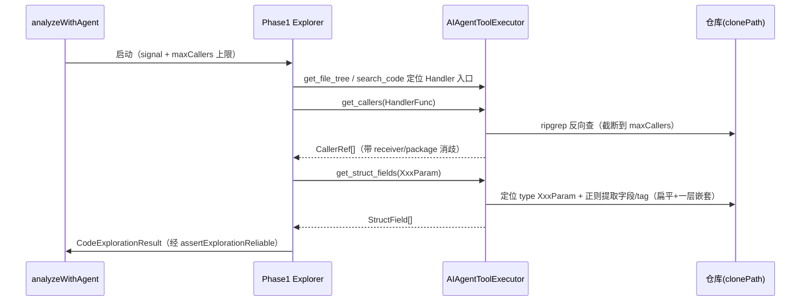

# AI 代码分析 Agent 增强方案（v2.1 · 工具增强 + 健壮性）

> **版本**: v2.1-enhancement-plan (rev.2，据代码现状核验修订)
> **日期**: 2026-07-06
> **方向**: 工具增强 + 健壮性（用户选定）
> **作者角色**: 主理人齐活林（降级交付 —— architect 子代理在当前运行时不可用，由主理人基于 v2.0 文档 + 直接代码核验产出）
> **依赖**: `docs/ai-analysis-optimization-plan.md`（v2.0，Phase 0~4 已实施）+ `docs/ai-analysis-compatibility-audit.md`

---

## 〇、代码现状核验结论（2026-07-06 直接 Explore）

> 落地前必做核验（rev.2 新增）。结论：v2.0 确实已落地，但本方案草稿有 5 处需对齐真实代码。

| # | 核验项 | 真实代码现状 | 对方案的影响 |
|---|--------|-------------|-------------|
| B1 | 双阶段方法名 | 真实方法是 `analyzeWithTwoPhasePipeline`（非 `analyzeWithAgent`）；主入口 `analyzeWithAgent` try/catch → `analyzeWithAgentLegacy(request)`（line 158） | 方案任务落点改用真实方法名 |
| B2 | 工具执行器 | 4 工具（list_directory/read_file/search_code/get_file_tree）存在；`get_callers`/`get_struct_fields` **未实现** | 确认方案为纯增量 ✅ |
| B3 | Phase1 超时 | `PHASE1_TIMEOUT_MS = 10*60*1000`（**10 分钟，软超时**：轮询到时强制 AI 输出最终 JSON，`ai-analyze-service.ts:302/328`） | 草稿写的 `phase1Ms=120s` **错误**，已修正为真实值 + 硬 abort |
| B4 | 工具调用上限 | `toolCallCount` 只计数（`434`/`1398`）**无 `>=MAX break` 截断** → AI 死循环调工具会跑到 10min 软超时 | 新增 `MAX_TOOL_CALLS` 硬上限任务（Phase1=15/Phase2=10） |
| B5 | 降级粒度 | 任何 pipeline 错误（含 Phase2 失败但 Phase1 已可靠）都整体回退 `analyzeWithAgentLegacy(request)`，**不收 explorationResult** | 细分降级需扩展 legacy 签名 `analyzeWithAgentLegacy(request, explorationResult?)` |
| B6 | JSON 解析 | `parseExplorationResult`(466-505)/`parseScenariosResult`(902-950) **已有"修复/截断重试"** | 印证 P0 硬伤；`parseAgentJson` 必须不信任修复结果 |
| B7 | AI 调用 | 均为 `openai.chat.completions.create(...)`（OpenAI SDK 支持 `signal`） | `withTimeout` 透传 signal 真实中断**可行** ✅ |
| B8 | 已知遗留 | `electron/__tests__/ai-analyze-service.test.ts` 套件加载期失败（fs mock 不完整，node-env 历史问题） | 与本方案无关，落地时注意别被该失败误导 |

---

## 一、方案概述 + 框架选型

在**已落地的 v2.0 双 Agent Pipeline**（`analyzeWithTwoPhasePipeline`：Phase1 Code Explorer → `assertExplorationReliable` → Phase2 Test Generator → Result Assembler）之上做两件事：

1. **工具增强**：在现有 `AIAgentToolExecutor` 上**纯新增 2 个工具**——`get_callers`（反向查调用方）、`get_struct_fields`（提取 struct 字段与 tag）。
2. **工程健壮性**：把 Phase1/2 的 JSON 解析升级为「schema 校验 + 退避重试 + **不信任修复结果**」的共享工具；把现有 **软超时**改为**真实硬中断**，并补 **工具调用次数硬上限** 与**细分降级决策树**。

**选型结论**：
- 复用现有双 Agent 架构与 `AIAgentToolExecutor`，**不新增 npm 依赖**（工具用 Node 内置 `child_process` 调 ripgrep/正则；超时用 `AbortController`；JSON 解析用纯 TS）。
- 新工具是**纯增量**，不破坏现有 4 工具、`pushDone` / IPC / SSE 协议。
- 非 Go 语言的 struct 解析本次返回 `unsupported` 提示，不报错（多语言为独立未来方向）。

---

## 二、文件清单（相对路径）

| 动作 | 文件 | 说明 |
|------|------|------|
| 改 | `electron/services/ai-agent-tool-executor.ts` | 新增 `get_callers` / `get_struct_fields` 实现 + 工具清单 + `maxCallers` 上限 |
| 改 | `electron/services/ai-analyze-service.ts` | 接入新工具；每个 `create()` 加 `signal`；补 `MAX_TOOL_CALLS` 硬上限；`withTimeout` 套两阶段 + 总预算；`parseExplorationResult`/`parseScenariosResult` 复用共享解析；扩展 `analyzeWithAgentLegacy(request, explorationResult?)`；移除 Phase1 软超时"强制输出"分支 |
| 改 | `electron/services/prompts/code-explorer-system.md` | 指引 Phase1 优先用 `get_callers` / `get_struct_fields` |
| 新增 | `electron/services/ai-parse-util.ts` | 共享 `parseAgentJson<T>()`（保守清洗 + schema 校验 + 退避重试，**修复结果仅 last-resort 且校验不过即降级**） |
| 新增 | `electron/services/ai-timeout-util.ts` | `withTimeout()`（signal 版）+ `PipelineTimeoutConfig` |
| 改 | `electron/services/types.ts` | 新增 `ParseRetryConfig` / `ParseResult<T>` / `PipelineTimeoutConfig` / `DegradationMode` / `CallerRef` / `GetCallersResult` / `StructField` / `GetStructFieldsResult`（**内部类型统一放 electron 侧，不进 renderer bundle**） |
| 改 | `src/services/sse.ts` | 复用现有 `agent_tool_call` / `agent_tool_result`，data.tool 加 `callers:` / `struct:` 前缀（**不新增 event type**） |
| 改 | `src/stores/ai-analysis-store.ts` | 降级/超时 warning 事件接入（复用现有 banner 状态） |
| 改 | `src/views/AiAnalysisProgressView.vue` | 显示「已降级 / 超时」提示文案 |
| 新增 | `electron/services/__tests__/ai-agent-tool-executor-tools.test.ts` | 两个新工具单测 |
| 新增 | `electron/services/__tests__/ai-parse-util.test.ts` | JSON 鲁棒清洗 + 重试单测 |
| 新增 | `electron/services/__tests__/ai-timeout-util.test.ts` | 超时触发 abort + 降级单测 |

---

## 三、数据结构与接口（全部放 `electron/services/types.ts`）

```typescript
// get_callers：反向查找谁调用了 symbol（加 maxCallers 上限 + 消歧字段）
interface CallerRef {
  file: string
  line: number
  functionName: string
  receiver: string          // 方法接收者类型（如 *OrderHandler），用于同名消歧
  package: string           // 所属 package，进一步消歧
  snippet: string
}
interface GetCallersResult {
  symbol: string
  callers: CallerRef[]       // 已截断到 maxCallers（默认 50）
}

// get_struct_fields：提取 struct 字段 + tag（边界：扁平 + 一层嵌套，见 §5.3）
interface StructField {
  name: string
  type: string
  tags: Record<string, string>
  nestedType?: string
}
interface GetStructFieldsResult {
  structName: string
  language: 'go' | 'unsupported'
  fields: StructField[]
  note?: string              // 如 "嵌套 struct X 未展开（超出一层）"
}

// 解析重试：修复结果绝不信任，schema 校验不过即降级
interface ParseRetryConfig {
  maxAttempts: number        // 默认 2（含初次）
  baseDelayMs: number        // 默认 50
  validate?: (raw: unknown) => string[]   // 返回错误字段列表；空=通过
}
type ParseResult<T> =
  | { ok: true; value: T }
  | { ok: false; errors: string[]; raw: string }

// 超时 / 降级（值据 B3 修正：总预算 10min，Phase1/2 各 3min）
interface PipelineTimeoutConfig {
  phase1Ms: number    // 180_000
  phase2Ms: number    // 180_000
  totalMs: number     // 600_000
}
type DegradationMode =
  | 'none'
  | 'phase1-fallback-legacy'   // Phase1 失败/超时 → 整体降级单 Agent
  | 'phase2-fallback-legacy'   // Phase1 OK 但 Phase2 失败 → 复用 Phase1 结果兜底
  | 'total-timeout'            // 总超时 → 中止并推错误
```

---

## 四、程序调用流程

### 4.1 新工具在 Phase 1 内部的调用时机



### 4.2 跨阶段降级决策树（据 B5 修订：细分 phase2 降级）

```mermaid
flowchart TD
  Start[analyzeWithAgent] --> TO[withTimeout totalMs=600s, signal]
  TO --> P1[Phase1 探索<br/>phase1Ms=180s, signal, MAX_TOOL_CALLS=15]
  P1 -- 成功且可靠 --> AR[assertExplorationReliable 通过]
  P1 -- 失败/超时 --> D1[DegradationMode=phase1-fallback-legacy<br/>analyzeWithAgentLegacy(request)]
  AR --> P2[Phase2 生成<br/>phase2Ms=180s, signal, MAX_TOOL_CALLS=10]
  P2 -- 成功 --> Asm[Result Assembler]
  P2 -- 失败/超时且 Phase1 可靠 --> D2[DegradationMode=phase2-fallback-legacy<br/>analyzeWithAgentLegacy(request, explorationResult)]
  TO -- 总超时 --> DT[DegradationMode=total-timeout<br/>abort + 推错误]
  D1 --> Warn1[push warning: 已降级单Agent]
  D2 --> Warn2[push warning: Phase2 降级, 复用 Phase1]
  Asm --> Done[pushDone]
  Warn1 --> Done
  Warn2 --> Done
  DT --> Err[pushError]
```

### 4.3 超时与 SSE 协同（据 B3/B4/B7 修订）

- **真实硬中断**：新增 `withTimeout(promiseFactory, ms, controller)`，超时即 `controller.abort()`；每个 `openai.chat.completions.create(...)`（line 336/361/853/1318/1332）增加 `signal: controller.signal`。abort 使 in-flight（含 stream）create 抛 AbortError → 阶段方法 throw → 被 `analyzeWithAgent` catch → 走降级。
- **移除软超时脆弱分支**：删除 Phase1 现有「轮询到时强制 AI 输出最终 JSON」逻辑（`ai-analyze-service.ts:328-355`），改由 `withTimeout` 统一硬中断 + 降级。理由：强制输出易产出语义残缺 JSON，不如干净降级。
- **工具调用硬上限**：在工具循环 `toolCallCount++` 后 `if (toolCallCount >= cap) { 停止调工具并要求 AI 输出 JSON; break }`（cap: Phase1=15 / Phase2=10）。
- **超时值（据 B3 修正）**：`phase1Ms=180_000`、`phase2Ms=180_000`、`totalMs=600_000`；总预算套在最外层 `analyzeWithAgent`，signal 同时中止两阶段。
- **SSE**：超时/降级 `pushProgress('warning', { mode, reason })`，前端 `AiAnalysisProgressView` 复用 banner 显示「已降级 / 超时」。

---

## 五、任务列表（Phase 5 工具增强 / Phase 6 健壮性）

> 依赖：v2.0 Phase 0~4 已实现（已核验 B1-B2）。Phase 5 与 Phase 6 相互独立可并行。

### Phase 5：工具增强

| # | 任务 | 文件 | 复杂度 | 依赖 |
|---|------|------|--------|------|
| 5.1 | 扩展工具执行器，注册 `get_callers` / `get_struct_fields` 两项定义 | `ai-agent-tool-executor.ts` | 中 | v2.0 |
| 5.2 | 实现 `get_callers`：ripgrep 反向查 `Symbol(` / `Symbol.`，返回 `CallerRef[]`（带 receiver/package 消歧），**截断到 `maxCallers=50`** | 同上 | 中 | 5.1 |
| 5.3 | 实现 `get_struct_fields`：定位 `type Xxx struct`，正则提取字段名/类型/tag；**边界：仅扁平 + 一层嵌套**，更深嵌套在 `note` 标注不展开（运行环境有 `go` 时可升级 AST 解析，留 TODO） | 同上 | 中 | 5.1 |
| 5.4 | Phase1 Prompt 接入：code-explorer-system.md 指引「优先 get_callers 反查 / get_struct_fields 取约束」 | `prompts/code-explorer-system.md` | 低 | 5.2,5.3 |
| 5.5 | 类型 + SSE 前缀：`CallerRef`/`GetCallersResult`/`StructField`/`GetStructFieldsResult` 放 `electron/services/types.ts`；data.tool 加 `callers:`/`struct:` 前缀 | `types.ts` + `sse.ts` | 低 | 5.1 |
| 5.6 | 单测：mock grep 输出 / 正则解析样例 struct / maxCallers 截断 | `__tests__/ai-agent-tool-executor-tools.test.ts` | 低 | 5.2,5.3 |

### Phase 6：健壮性（据 B3-B7 修订）

| # | 任务 | 文件 | 复杂度 | 依赖 |
|---|------|------|--------|------|
| 6.1 | 新增共享解析 `parseAgentJson<T>()`：**保守清洗**（只去 ```json 包裹 + 尾随 prose）+ schema 校验 + 退避重试；**修复/截断结果仅作 last-resort 且校验不过即降级，绝不信任** | `ai-parse-util.ts` | 中 | v2.0 |
| 6.2 | 新增 `ParseRetryConfig` / `ParseResult<T>` 类型（钉死 `electron/services/types.ts`） | `types.ts` | 低 | — |
| 6.3 | 改造 `parseExplorationResult()` / `parseScenariosResult()` 复用 `parseAgentJson`，返回字段级错误 | `ai-analyze-service.ts` | 中 | 6.1,6.2 |
| 6.4 | 新增 `withTimeout()`(signal 版) + `PipelineTimeoutConfig`(180/180/600s) / `DegradationMode` | `ai-timeout-util.ts` + `types.ts` | 低 | — |
| 6.5 | **超时硬中断 + 工具上限 + 细分降级**：① 每个 `create()` 加 `signal`；② 工具循环加 `MAX_TOOL_CALLS`(15/10) 硬上限；③ `analyzeWithAgent` 套 `withTimeout`(总 600s)；④ 移除 Phase1 软超时"强制输出"分支；⑤ 细分降级（见 4.2 伪代码） | `ai-analyze-service.ts` | 高 | 6.3,6.4 |
| 6.6 | 扩展 `analyzeWithAgentLegacy(request, explorationResult?)` 签名：传 explorationResult 时跳过 Phase1 直接生成（支撑 `phase2-fallback-legacy`） | `ai-analyze-service.ts` | 中 | 6.5 |
| 6.7 | SSE 协同 + 前端提示：warning 事件接入 store / ProgressView 显示「已降级」 | `sse.ts` + `ai-analysis-store.ts` + `AiAnalysisProgressView.vue` | 低 | 6.5 |
| 6.8 | 单测：JSON 鲁棒清洗（代码块/截断/伪JSON 不信任修复）、超时触发 abort+降级、Phase2 失败复用 Phase1 兜底、MAX_TOOL_CALLS 截断 | `ai-parse-util.test.ts` + `ai-timeout-util.test.ts` | 中 | 6.1,6.5 |

**6.5 降级伪代码（补骨架）**：
```typescript
async analyzeWithAgent(request) {
  const ctrl = new AbortController()
  try {
    return await withTimeout(() => this.analyzeWithTwoPhasePipeline(request, ctrl.signal),
                             TOTAL_MS, ctrl)
  } catch (err) {
    // Phase1 失败/超时
    if (!this.lastExplorationResult || !this.lastExplorationReliable) {
      pushWarning('phase1-fallback-legacy')
      return this.analyzeWithAgentLegacy(request)            // 整体降级
    }
    // Phase1 成功但 Phase2 失败/超时 → 复用 Phase1 结果兜底
    pushWarning('phase2-fallback-legacy')
    return this.analyzeWithAgentLegacy(request, this.lastExplorationResult)
  }
}
```

---

## 六、依赖包列表

| 包 | 是否新增 | 说明 |
|----|---------|------|
| （无 npm 依赖） | — | 工具用 Node 内置 `child_process.execFile` 调 ripgrep；JSON/超时用纯 TS + `AbortController` |
| `go` / `go/ast`（可选未来） | 否 | 若运行环境保证有 Go，可把 `get_struct_fields` 升级为 AST 解析；**本次默认正则（扁平+一层嵌套）**，不引入 |

---

## 七、共享知识（跨文件约定）

- **SSE 事件复用**：新工具复用现有 `agent_tool_call` / `agent_tool_result`，`data.tool` 以 `callers:` / `struct:` 前缀区分；**禁止新增 event type**。
- **超时默认值（据 B3 修正）**：`phase1Ms=180_000`、`phase2Ms=180_000`、`totalMs=600_000`；工具预算 `Phase1=15` / `Phase2=10`。
- **真实中断**：`signal` 必须透传到每个 `create()`；`withTimeout` 超时即 `abort()`，不靠 `Promise.race` 只丢弃结果。
- **JSON 不信任修复**：`parseAgentJson` 修复/截断结果仅 last-resort，schema 校验不过直接降级。
- **降级透明**：任何降级都 `push warning` 带 `reason`；Phase1 成功绝不因 Phase2 失败整体失败。
- **类型落点**：所有新增内部类型放 `electron/services/types.ts`（不进 renderer bundle）。
- **非 Go 语言**：`get_struct_fields` 返回 `language:'unsupported'` + 空 fields，不抛错。

---

## 八、待明确事项

1. **超时值确认** ✅ **已拍板（2026-07-06）**：采纳 Phase1/2 各 3 分钟（180_000ms）+ 总 10 分钟（600_000ms）**硬中断**（`signal` 透传每个 `openai.chat.completions.create(...)`），并移除现有 Phase1 软超时"强制输出 JSON"分支；工具硬上限 Phase1=15 / Phase2=10 同步生效。其余 4 条待明确项维持原议。
2. **`get_struct_fields` 语言范围**：本次按 Go（扁平+一层嵌套）。是否要顺带支持 Java/Python？（建议留独立方向）
3. **降级时是否推送部分 scenarios**：默认「推」+ warning banner（Phase1 OK + Phase2 兜底 → 仍出 scenarios）。需前端确认文案。
4. **Phase 3.2（删旧 scenarioType）**：建议独立处理（v2.0 收尾），不混入本次。
5. **`get_struct_fields` AST 升级**：是否要求运行环境必须有 `go`？默认正则实现不依赖 `go`。

---

## 九、IS_PASS 自检

`IS_PASS: YES`（rev.2，已据代码现状核验修正）

理由：方案自洽——纯增量扩展现有双 Agent 架构，新工具不破坏 4 工具/IPC/SSE；任务依赖无环（Phase5 内部 5.1→5.2/5.3→5.4/5.5/5.6，Phase6 内部 6.1/6.2→6.3、6.4→6.5→6.6/6.7/6.8，Phase5 与 Phase6 并行）；**完整覆盖用户 4 个落点**（`get_callers`/`get_struct_fields`/JSON 解析重试/跨阶段降级+超时），且已据真实代码（B1-B7）修正 5 处偏差：超时值(120s→180s 且硬 abort)、补 `MAX_TOOL_CALLS` 上限、扩展 legacy 签名支撑细分降级、JSON 不信任修复、类型落点钉死。

---

## 附：与 v2.0 方案的关系

| v2.0（已实现/进行中） | v2.1 本方案（新增） |
|----------------------|---------------------|
| `analyzeWithTwoPhasePipeline` 双 Agent | 在 Pipeline 上挂 2 个新工具 |
| Phase1/2 已有基础 JSON retry（含修复/截断） | 升级为共享 `parseAgentJson`（schema+退避+**不信任修复**） |
| 软超时 10min（强制输出 JSON） | 改为 `withTimeout` 真实硬中断（signal） |
| 工具调用**无上限** | 补 `MAX_TOOL_CALLS` 硬上限（15/10） |
| 降级：任何错误整体 legacy(request) | 细分：phase1 失败→legacy；phase1 OK+phase2 失败→legacy(request, explorationResult) |
| §3.3 规划 get_callers/get_struct_fields（P1/P2） | 落地实现 |
