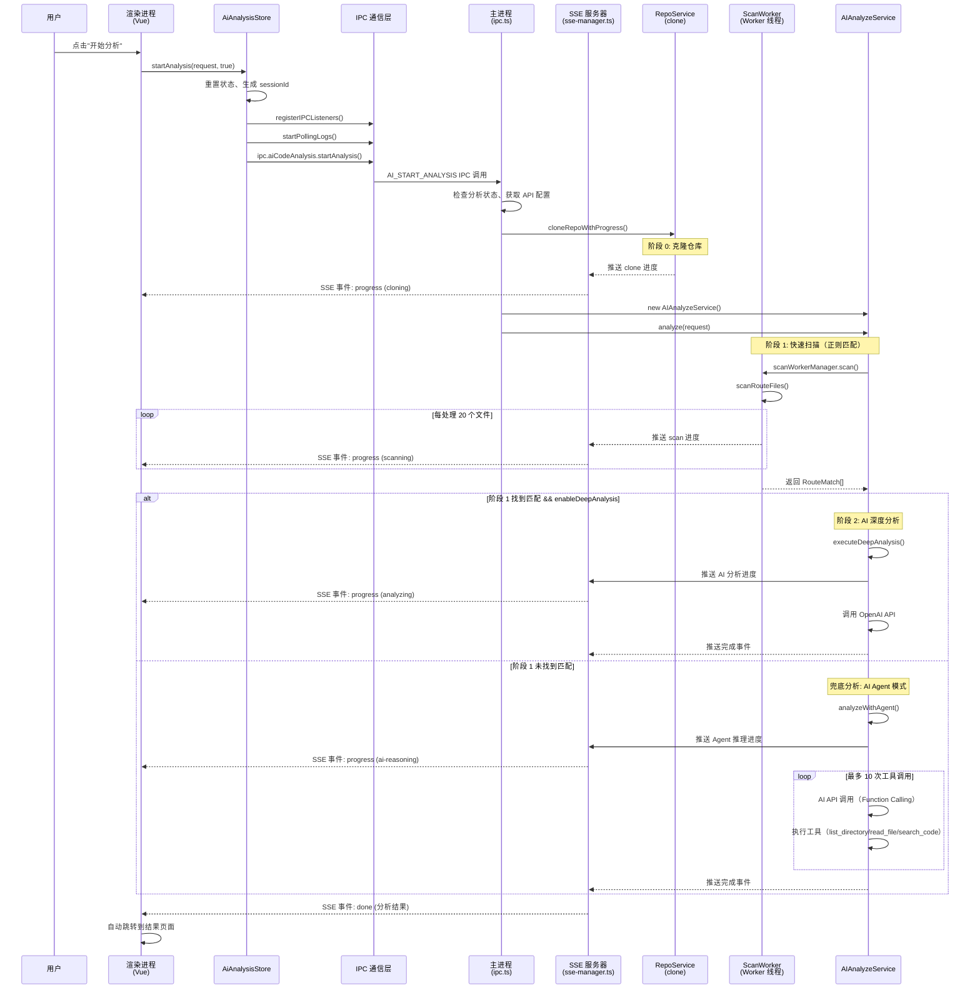

# AI 分析功能现状代码梳理文档

> **文档版本**: v1.0  
> **生成时间**: 2025-01-20  
> **项目路径**: `/Users/SL/NodeProject/packet-capture-app`  
> **目的**: 完整梳理 AI 分析功能的现状代码，为后续重构做准备

---

## 一、功能入口

### 1.1 用户操作入口

用户在渲染进程界面中，通过以下路径触发 AI 分析：

1. **入口页面**: `src/views/AiAnalysisView.vue` (AI 分析配置页面)
2. **触发动作**: 点击"开始分析"按钮
3. **代码位置**: `AiAnalysisView.vue:646-649`

```typescript
async function handleStartAnalysis(): Promise<void> {
  // ... 参数准备 ...
  await store.startAnalysis(request, true)  // 启用深度分析
  router.push('/ai-analysis/progress')  // 导航到进度页面
}
```

### 1.2 渲染进程状态管理入口

**Store 文件**: `src/stores/ai-analysis-store.ts`  
**关键方法**: `startAnalysis()` (行 282-324)

该方法是分析启动的核心入口，负责：
- 重置分析状态
- 注册 IPC 监听器
- 启动日志轮询
- 调用主进程的 `ai:start-analysis` IPC 通道

### 1.3 主进程 IPC 处理入口

**文件**: `electron/ipc.ts`  
**IPC 通道**: `AI_START_ANALYSIS` (行 877-927)

```typescript
ipcMain.handle(IPC_CHANNELS.AI_START_ANALYSIS, async (event, args: any) => {
  // 1. 检查是否已有分析在运行
  // 2. 获取 API 配置
  // 3. 异步执行分析（不阻塞 IPC 返回）
  executeAnalysisAsync({...})
  return { success: true, message: '分析已启动' }
})
```

---

## 二、完整执行流程

### 2.1 流程图（Mermaid）



### 2.2 详细执行步骤

#### **阶段 0: 克隆仓库**

1. **入口**: `ipc.ts:executeAnalysisAsync()` (行 51-134)
2. **调用**: `cloneRepoWithProgress()` (来自 `repo-service.ts`)
3. **进度推送**: 通过 `pushProgress('cloning', ...)` 推送克隆进度
4. **完成**: 返回 `repoInfo` 对象（包含 `clonePath`, `repoName`, `projectType`）

#### **阶段 1: 快速扫描（正则匹配）**

1. **入口**: `ai-analyze-service.ts:analyze()` (行 105-175)
2. **调用**: `scanWorkerManager.scan()` (行 113-118)
3. **Worker 线程**: `scan-worker.ts:scanRouteFiles()` (行 218-446)
   - 递归遍历目录收集 `.go` 文件（同步 I/O）
   - 第一遍：收集 `RegisterRoutes` 映射和 `contextPath`
   - 第二遍：正则匹配路由定义
4. **进度推送**: 每处理 `PROGRESS_INTERVAL` (20) 个文件推送一次
5. **完成**: 返回 `RouteMatch[]` 数组

#### **阶段 2: AI 深度分析（条件执行）**

**触发条件**: `matches.length > 0 && enableDeepAnalysis === true`

1. **入口**: `ai-analyze-service.ts:executeDeepAnalysis()` (行 377-436)
2. **读取文件**: 读取匹配到的文件内容
3. **构建 Prompt**: 将路由匹配结果和文件内容构建为 Prompt
4. **调用 AI API**: 使用 OpenAI API 进行分析
5. **解析响应**: 尝试解析 JSON 格式的响应，提取 `analysisSummary` 和 `scenarios`
6. **完成**: 返回 `{ analysis, scenarios }`

#### **兜底分析: AI Agent 模式（条件执行）**

**触发条件**: `matches.length === 0` (阶段 1 未找到匹配)

1. **入口**: `ai-analyze-service.ts:analyzeWithAgent()` (行 188-366)
2. **工具定义**: 定义 4 个工具（`list_directory`, `read_file`, `search_code`, `get_file_tree`）
3. **工具调用循环**: 最多 10 次
   - 调用 AI API（Function Calling）
   - 执行工具调用
   - 将工具执行结果添加到对话历史
4. **完成**: 返回 `{ matches, analysis, scenarios }`

---

## 三、核心模块详解

### 3.1 ScanWorker（scan-worker.ts）

**文件路径**: `electron/workers/scan-worker.ts`  
**职责**: 在独立线程中执行 CPU 密集型的路由扫描操作

#### 3.1.1 核心函数

| 函数名 | 行号 | 职责 |
|-------|------|------|
| `scanRouteFiles()` | 218-446 | 扫描路由文件，返回路由匹配结果 |
| `findHandlerFile()` | 456-471 | 查找 Handler 函数所在的文件 |
| `extractCallChain()` | 481-574 | 提取调用链文件 |
| `walkGoFiles()` | 96-129 | 递归遍历目录，收集 `.go` 文件（同步版本） |
| `collapseGoCode()` | 139-142 | 将多行 Go 代码折叠为单行（用于正则匹配） |
| `matchRequestPath()` | 151-173 | 路径匹配（支持路径参数 `:id` 等） |
| `classifyGoFile()` | 181-204 | 分类 Go 文件类型（handler/service/model/other） |

#### 3.1.2 正则表达式

| 正则名 | 行号 | 用途 |
|--------|------|------|
| `GO_ROUTE_SCAN_REGEX` | 59-60 | 路由扫描正则（lego/webx 框架） |
| `GO_ROUTE_EXTRACT_REGEX` | 63-64 | 路由提取正则（精细匹配，用于解析扫描结果） |
| `GO_GENERIC_ROUTE_REGEX` | 67-68 | 通用 Go 路由匹配正则（Gin/Echo 等框架） |

#### 3.1.3 性能优化措施

1. **同步 I/O**: Worker 线程中使用同步 I/O，不影响主进程（行 91）
2. **文件大小限制**: 跳过超过 100KB 的文件（行 319-322）
3. **路由关键字预过滤**: 只处理包含路由关键字的文件（行 326-335）
4. **进度报告间隔**: 每处理 20 个文件推送一次进度（行 85）
5. **代码折叠长度限制**: 超过 50000 字符的代码只取前面部分（行 137）

### 3.2 AIAnalyzeService（ai-analyze-service.ts）

**文件路径**: `electron/services/ai-analyze-service.ts`  
**职责**: 协调阶段 1/2，混合模式实现

#### 3.2.1 公共方法

| 方法名 | 行号 | 职责 |
|--------|------|------|
| `analyze()` | 105-175 | 执行完整的 AI 代码分析（阶段 1 + 阶段 2） |
| `analyzeWithAgent()` | 188-366 | 阶段 1 失败兜底：AI 完整推理链 |
| `updateApiConfig()` | 85-92 | 更新 AI API 配置 |
| `destroy()` | 759-763 | 销毁服务（应用退出时调用） |

#### 3.2.2 私有方法

| 方法名 | 行号 | 职责 |
|--------|------|------|
| `executeDeepAnalysis()` | 377-436 | 执行深度分析（阶段 2） |
| `getSystemPrompt()` | 441-473 | 获取 System Prompt |
| `buildUserPrompt()` | 478-490 | 构建 User Prompt（阶段 1 结果 + 分析任务） |
| `buildDeepAnalysisPrompt()` | 495-533 | 构建深度分析 Prompt（阶段 2） |
| `parseAIResponse()` | 538-556 | 解析 AI 响应，提取分析报告和结构化场景 |
| `extractMatchesFromCode()` | 561-574 | 从代码内容中提取路由匹配 |
| `pushProgress()` | 579-601 | 推送进度到渲染进程和 SSE 客户端 |
| `toolListDirectory()` | 640-653 | 工具：列出目录 |
| `toolReadFile()` | 658-667 | 工具：读取文件 |
| `toolSearchCode()` | 672-721 | 工具：搜索代码 |
| `toolGetFileTree()` | 726-754 | 工具：获取文件树 |

#### 3.2.3 analyzeWithAgent 工具调用循环

**位置**: `ai-analyze-service.ts:304-355`

```typescript
const MAX_TOOL_CALLS = 10  // 最多 10 次工具调用

while (toolCallCount < MAX_TOOL_CALLS) {
  // 1. 调用 AI API
  const response = await this.openai.chat.completions.create({
    model: this.modelName,
    messages,
    tools,
    tool_choice: 'auto',
  })

  // 2. 如果没有工具调用，说明 AI 已生成最终报告
  if (!message.tool_calls || message.tool_calls.length === 0) {
    const { analysis, scenarios } = this.parseAIResponse(content)
    return { matches, analysis, scenarios }
  }

  // 3. 执行工具调用
  for (const toolCall of message.tool_calls) {
    const toolResult = await executeTool(toolName, args)
    messages.push({ role: 'tool', tool_call_id: toolCall.id, content: toolResult })
    toolCallCount++
  }
}
```

### 3.3 ScanWorkerManager（scan-worker-manager.ts）

**文件路径**: `electron/services/scan-worker-manager.ts`  
**职责**: Worker 线程生命周期管理器

#### 3.3.1 核心方法

| 方法名 | 行号 | 职责 |
|--------|------|------|
| `scan()` | 220-222 | 扫描路由文件 |
| `findHandler()` | 227-229 | 查找 Handler 文件 |
| `extractCallChain()` | 234-236 | 提取调用链 |
| `abort()` | 241-248 | 中断当前扫描（terminate Worker 线程） |
| `destroy()` | 273-281 | 销毁 Manager（应用退出时调用） |
| `ensureWorker()` | 64-99 | 延迟创建或复用 Worker |
| `waitForReady()` | 104-111 | 等待 Worker ready |
| `sendRequest()` | 182-215 | 向 Worker 发送请求并等待结果 |
| `handleWorkerMessage()` | 116-157 | 处理 Worker 发来的消息 |

#### 3.3.2 Worker 生命周期管理

1. **延迟创建**: 第一次调用 `scan()` 时才创建 Worker（行 64-99）
2. **复用**: 如果 Worker 已存在且存活，直接返回（行 65-67）
3. **中断**: 调用 `abort()` 时 terminate Worker（行 244-247）
4. **销毁**: 应用退出时调用 `destroy()`（行 273-281）
5. **自动重建**: Worker 退出后，`cleanup()` 会清空引用，下次调用会自动重建（行 253-257）

### 3.4 SSE 管理器（sse-manager.ts）

**文件路径**: `electron/sse-manager.ts`  
**职责**: 负责 SSE 服务器生命周期和事件推送

#### 3.4.1 核心方法

| 方法名 | 行号 | 职责 |
|--------|------|------|
| `startSSEServer()` | 30-96 | 启动 SSE 服务器 |
| `stopSSEServer()` | 101-128 | 停止 SSE 服务器 |
| `pushSSEEvent()` | 135-156 | 推送 SSE 事件到所有连接的客户端 |
| `pushProgress()` | 164-170 | 推送进度消息（便捷方法） |
| `pushLog()` | 177-196 | 推送日志消息（便捷方法），同时写入日志缓冲区 |
| `pushDone()` | 202-206 | 推送分析完成事件 |
| `pushError()` | 212-216 | 推送分析错误事件 |
| `getBufferedLogs()` | 21-24 | 获取缓冲区中的日志（用于 IPC 轮询降级方案） |

#### 3.4.2 SSE 服务器端点

**端点**: `http://localhost:3001/ai-analysis-progress`  
**协议**: SSE (Server-Sent Events)  
**响应格式**:

```
data: {"event":"progress","data":{"phase":"cloning","message":"正在克隆仓库..."},"timestamp":1234567890}\n\n
```

#### 3.4.3 日志缓冲区

**位置**: `sse-manager.ts:17-24`  
**用途**: 用于 IPC 轮询降级方案（当 SSE 连接不稳定时）

- **缓冲区大小**: 最多 1000 条（行 188-190）
- **获取增量日志**: `getBufferedLogs(lastId)` 返回 `lastId` 之后的日志

---

## 四、数据结构

### 4.1 核心数据结构

#### 4.1.1 RouteMatch（路由匹配结果）

**定义位置**: `src/services/types.ts:227-233`

```typescript
export interface RouteMatch {
  filePath: string       // 文件路径
  content: string       // 文件内容（截断前 2000 字符）
  routePattern: string   // 路由模式（如 `/api/v1/users/:id`）
  handlerName: string   // Handler 函数名（如 `UserController.GetUser`）
  lineNumber: number    // 行号
}
```

#### 4.1.2 AnalysisScenario（分析场景）

**定义位置**: `src/services/types.ts:715-726`

```typescript
export interface AnalysisScenario {
  scenarioName: string                        // 场景名称（正常流程/参数校验失败/权限校验失败）
  scenarioType: 'normal' | 'param-error' | 'auth-error'  // 场景类型
  callChain: CallChainStep[]                  // 调用链路
  curlCommand: string                        // curl 命令
  pythonAssertion: string                    // Python 断言代码
}

export interface CallChainStep {
  step: number           // 步骤序号
  component: string      // 组件类型（Router/Handler/Service/Model/DB）
  filePath: string      // 文件路径
  functionName: string  // 函数名
  description: string    // 描述
}
```

#### 4.1.3 AIDeepAnalysisResult（AI 深度分析结果）

**定义位置**: `src/services/types.ts:731-748`

```typescript
export interface AIDeepAnalysisResult {
  success: boolean
  repoName?: string
  handlerFile?: string
  handlerFunction?: string
  scenarios: AnalysisScenario[]
  analysisSummary?: string  // Markdown 格式的分析报告
  error?: string
  usedFallback?: boolean  // 是否触发了兜底分析（阶段 1 失败后自动触发阶段 2）
}
```

#### 4.1.4 AnalysisPhase（分析阶段枚举）

**定义位置**: `src/services/types.ts:672-681`

```typescript
export type AnalysisPhase =
  | 'idle'              // 空闲
  | 'cloning'          // 克隆仓库中
  | 'scanning'         // 阶段 1：扫描中
  | 'scan-failed'      // 阶段 1：扫描失败
  | 'analyzing'        // 阶段 2：AI 分析中
  | 'generating'       // 生成报告中
  | 'done'             // 完成
  | 'error'            // 错误
```

### 4.2 Worker 消息协议

**定义位置**: `electron/workers/scan-worker-protocol.ts`

#### 4.2.1 请求消息（主进程 -> Worker）

```typescript
export type WorkerRequestMessage =
  | { type: 'scan'; id: string; payload: ScanPayload }
  | { type: 'findHandler'; id: string; payload: FindHandlerPayload }
  | { type: 'extractCallChain'; id: string; payload: ExtractCallChainPayload }
  | { type: 'agentToolCall'; id: string; payload: AgentToolCallPayload }
```

#### 4.2.2 响应消息（Worker -> 主进程）

```typescript
export type WorkerResponseMessage =
  | { type: 'ready' }  // Worker 就绪
  | { type: 'progress'; id: string; payload: ProgressPayload }  // 进度推送
  | { type: 'result'; id: string; payload: ... }  // 请求结果
  | { type: 'error'; id: string; payload: { message: string } }  // 错误
  | { type: 'agentToolCallResult'; id: string; payload: AgentToolCallResultPayload }
```

---

## 五、IPC 通信

### 5.1 主进程与渲染进程之间的 IPC 通道

**定义位置**: `src/services/types.ts:456-579` (IPC_CHANNELS 常量)

#### 5.1.1 AI 代码分析相关通道

| 通道名 | 常量名 | 用途 |
|--------|--------|------|
| `ai:analyze` | `AI_ANALYZE` | 发起 AI 代码分析（旧版本） |
| `ai:abort` | `AI_ABORT` | 中断分析 |
| `ai:cleanup-repo` | `AI_CLEANUP_REPO` | 清理临时仓库 |
| `ai:check-git-availability` | `AI_CHECK_GIT_AVAILABILITY` | 检查 Git 可用性 |
| `ai:check-disk-space` | `AI_CHECK_DISK_SPACE` | 检查磁盘空间 |
| `ai:fetch-branches` | `AI_FETCH_BRANCHES` | 获取分支列表 |
| `ai:scan-progress` | `AI_SCAN_PROGRESS` | 扫描进度推送 |
| `ai:start-analysis` | `AI_START_ANALYSIS` | 开始 AI 分析（混合模式） |
| `ai:cancel-analysis` | `AI_CANCEL_ANALYSIS` | 取消 AI 分析 |
| `ai:sse-get-port` | `AI_SSE_GET_PORT` | 获取 SSE 服务器端口号 |
| `ai:get-logs` | `AI_GET_LOGS` | 获取分析日志（IPC 轮询降级方案） |

### 5.2 主进程与 Worker 线程之间的通信协议

**定义位置**: `electron/workers/scan-worker-protocol.ts`

#### 5.2.1 消息类型

| 消息类型 | 方向 | 用途 |
|----------|------|------|
| `ready` | Worker -> 主进程 | Worker 就绪 |
| `scan` | 主进程 -> Worker | 扫描路由文件请求 |
| `findHandler` | 主进程 -> Worker | 查找 Handler 文件请求 |
| `extractCallChain` | 主进程 -> Worker | 提取调用链请求 |
| `progress` | Worker -> 主进程 | 进度推送 |
| `result` | Worker -> 主进程 | 请求结果 |
| `error` | Worker -> 主进程 | 错误 |

### 5.3 SSE 事件推送

**端点**: `http://localhost:3001/ai-analysis-progress`  
**事件类型**:

| 事件名 | 数据格式 | 用途 |
|----------|----------|------|
| `connected` | `{ message: '连接成功' }` | 客户端连接成功 |
| `log` | `{ level: 'info', message: '...' }` | 日志推送 |
| `progress` | `{ phase: 'cloning', message: '...' }` | 进度推送 |
| `done` | `{ result: AIDeepAnalysisResult }` | 分析完成 |
| `error` | `{ message: '...' }` | 分析错误 |
| `disconnect` | `{ message: '服务器关闭' }` | 服务器关闭 |

---

## 六、UI 交互

### 6.1 渲染进程组件结构

```
src/views/
├── AiAnalysisView.vue          # AI 分析配置页面（入口页面）
├── AiAnalysisProgressView.vue  # AI 分析进度页面（实时日志）
└── AiAnalysisResultView.vue    # AI 分析结果页面（链路分析 + curl 测试用例）

src/components/
├── CloneProgress.vue           # Clone 进度组件
├── AnalysisLogViewer.vue      # 分析日志查看器组件
├── ScenarioTable.vue          # 场景链路分析表格组件
├── CurlAssertionPanel.vue    # curl + Python 断言面板组件
└── TestScenarioCard.vue      # 测试场景卡片组件（旧版本）

src/stores/
└── ai-analysis-store.ts      # AI 分析状态管理（Pinia Store）
```

### 6.2 页面路由与状态流转

#### 6.2.1 页面路由

| 路由路径 | 组件 | 用途 |
|----------|------|------|
| `/ai-analysis` | `AiAnalysisView.vue` | AI 分析配置页面（输入仓库 URL、分支、Token 等） |
| `/ai-analysis/progress` | `AiAnalysisProgressView.vue` | AI 分析进度页面（实时日志、进度条） |
| `/ai-analysis/result` | `AiAnalysisResultView.vue` | AI 分析结果页面（链路分析、curl 测试用例） |

#### 6.2.2 状态流转

```
idle --> cloning --> scanning --> analyzing --> done
                                            --> error
               --> scan-failed --> analyzing --> done
                                    --> error
```

**状态管理**: `ai-analysis-store.ts`  
**关键状态**:

| 状态名 | 类型 | 用途 |
|--------|------|------|
| `analyzing` | `Ref<boolean>` | 是否正在分析 |
| `phase` | `Ref<AnalysisPhase>` | 当前分析阶段 |
| `logs` | `Ref<AnalysisLogEntry[]>` | 实时日志（最多保存 1000 条） |
| `cloneProgress` | `Ref<CloneProgress \| null>` | Clone 进度 |
| `scanProgress` | `Ref<...>` | 扫描进度 |
| `deepAnalysisResult` | `Ref<AIDeepAnalysisResult \| null>` | AI 深度分析结果 |
| `autoScroll` | `Ref<boolean>` | 日志自动滚动 |

### 6.3 实时日志获取方案

**方案 1: SSE 事件推送**（主要方案）  
- **端点**: `http://localhost:3001/ai-analysis-progress`
- **实现**: `AiAnalysisProgressView.vue` 中通过 `EventSource` 连接 SSE 服务器
- **事件**: `log`, `progress`, `done`, `error`

**方案 2: IPC 轮询**（降级方案）  
- **触发**: 当 SSE 连接不稳定时
- **实现**: `ai-analysis-store.ts:startPollingLogs()` (行 345-367)
- **频率**: 每 500ms 轮询一次
- **通道**: `ai:get-logs`
- **增量获取**: 通过 `lastLogId` 参数获取增量日志

---

## 七、配置文件

### 7.1 AI 分析相关配置项

**存储位置**: `sqlite` 数据库（`settings` 表）  
**读取方式**: `sqlite.getAllSettings()`

| 配置项 | 类型 | 默认值 | 用途 |
|--------|------|--------|------|
| `apiUrl` | `string` | `''` | AI API 地址（如 `https://api.deepseek.com`） |
| `apiKey` | `string` | `''` | AI API Key |
| `modelName` | `string` | `'deepseek-chat'` | AI 模型名称 |
| `aiCodeAnalysisConfig` | `object` | `{}` | AI 代码分析配置（仓库 URL、分支、Token 等） |

#### 7.1.1 aiCodeAnalysisConfig 结构

```typescript
export interface RepoConfig {
  repoUrl: string                    // 代码仓库 URL
  repoType: 'github' | 'gitlab' | 'gitee' | 'bitbucket' | 'unknown'  // 仓库类型
  branch: string                     // 分支名
  accessToken: string                // Access Token（私有仓库需要）
  authMethod: 'http' | 'ssh'      // 认证方式
  cloneDir: string                  // 克隆目录
  repoUrlHistory: string[]           // 仓库 URL 历史记录（最多 20 条）
}
```

### 7.2 环境变量

无环境变量配置。所有配置均保存在 SQLite 数据库中。

---

## 八、关键代码位置索引

### 8.1 功能入口

| 功能 | 文件路径 | 行号 |
|------|----------|------|
| 用户点击"开始分析" | `src/views/AiAnalysisView.vue` | 646-649 |
| Store 分析入口 | `src/stores/ai-analysis-store.ts` | 282-324 |
| 主进程 IPC 处理入口 | `electron/ipc.ts` | 877-927 |

### 8.2 核心模块

| 模块 | 文件路径 | 关键函数/行号 |
|------|----------|------------------|
| ScanWorker | `electron/workers/scan-worker.ts` | `scanRouteFiles()` (218-446) |
| AIAnalyzeService | `electron/services/ai-analyze-service.ts` | `analyze()` (105-175), `analyzeWithAgent()` (188-366) |
| ScanWorkerManager | `electron/services/scan-worker-manager.ts` | `scan()` (220-222), `ensureWorker()` (64-99) |
| SSE 管理器 | `electron/sse-manager.ts` | `startSSEServer()` (30-96), `pushLog()` (177-196) |

### 8.3 数据结构定义

| 数据结构 | 文件路径 | 行号 |
|----------|----------|------|
| `RouteMatch` | `src/services/types.ts` | 227-233 |
| `AnalysisScenario` | `src/services/types.ts` | 715-726 |
| `AIDeepAnalysisResult` | `src/services/types.ts` | 731-748 |
| `AnalysisPhase` | `src/services/types.ts` | 672-681 |
| Worker 消息协议 | `electron/workers/scan-worker-protocol.ts` | 1-89 |

### 8.4 IPC 通信

| 通道名 | 定义位置 | 主进程处理位置 |
|----------|----------|------------------|
| `ai:start-analysis` | `src/services/types.ts` (546) | `electron/ipc.ts` (877-927) |
| `ai:cancel-analysis` | `src/services/types.ts` (547) | `electron/ipc.ts` (932-941) |
| `ai:get-logs` | `src/services/types.ts` (548) | `electron/ipc.ts` (946-956) |
| `ai:scan-progress` | `src/services/types.ts` (535) | `electron/ipc.ts` (512-512) |

---

## 九、当前实现的问题点（导致卡死的原因分析）

### 9.1 Worker 线程卡死问题

#### 9.1.1 正则表达式灾难性回溯

**位置**: `electron/workers/scan-worker.ts:59-68`  
**问题**: `GO_ROUTE_SCAN_REGEX` 和 `GO_ROUTE_EXTRACT_REGEX` 正则表达式中包含大量 `.` 和 `.*` 匹配，在处理超长单行代码时可能导致灾难性回溯，使 Worker 线程卡死。

**影响文件**: 超大文件（> 10000 字符）且包含复杂嵌套的函数调用时。

**当前缓解措施**:
- `collapseGoCode()` 函数将代码截断到 50000 字符（行 137）
- 跳过超过 100KB 的文件（行 319-322）
- 只对 < 10000 字符的文件使用 `collapseGoCode()` 尝试匹配（行 377）

**仍存在的问题**:
- 50000 字符的限制仍然可能触发正则回溯
- 没有超时机制，一旦卡死只能等待 Worker 线程被 terminate

#### 9.1.2 同步 I/O 阻塞 Worker 线程

**位置**: `electron/workers/scan-worker.ts`  
**问题**: `walkGoFiles()`、`fs.readFileSync()`、`fs.statSync()` 等同步 I/O 操作在 Worker 线程中执行，虽然不影响主进程，但在处理大量文件时可能导致 Worker 线程长时间阻塞，无法响应中断请求。

**影响**: 用户点击"中断分析"按钮时，如果 Worker 线程正在执行同步 I/O，可能无法及时 terminate。

**当前缓解措施**:
- `abort()` 方法调用 `worker.terminate()` 强制终止 Worker 线程（行 241-248）
- Worker 线程中注册了 `uncaughtException` 和 `unhandledRejection` 全局异常捕获（行 22-54）

### 9.2 主进程卡死问题

#### 9.2.1 analyzeWithAgent 工具调用循环无超时

**位置**: `electron/services/ai-analyze-service.ts:304-355`  
**问题**: `analyzeWithAgent()` 中的工具调用循环没有设置超时，如果 AI API 调用或工具执行耗时过长，整个分析流程会卡死。

**影响**: 用户只能强制退出应用。

**当前缓解措施**:
- 最多 10 次工具调用限制（行 304）
- 达到最大工具调用次数后强制生成报告（行 357-365）

**仍存在的问题**:
- 每次工具调用没有独立的超时限制
- 如果某次 AI API 调用或工具执行耗时超过 10 分钟，用户只能等待

#### 9.2.2 OpenAI API 调用无超时

**位置**: `electron/services/ai-analyze-service.ts:310-315`  
**问题**: `this.openai.chat.completions.create()` 调用没有设置 `timeout` 参数，如果 AI API 服务响应慢或网络不通，会导致分析流程卡死。

**建议修复**:

```typescript
const response = await this.openai.chat.completions.create({
  model: this.modelName,
  messages,
  tools,
  tool_choice: 'auto',
}, {
  timeout: 60000  // 60 秒超时
})
```

### 9.3 渲染进程卡死问题

#### 9.3.1 大量日志导致渲染进程卡顿

**位置**: `src/stores/ai-analysis-store.ts:384-425`  
**问题**: `appendLog()` 函数在接收到大量日志时（如每秒 10 条以上），会频繁触发 Vue 响应式更新，导致渲染进程卡顿。

**影响**: 用户在分析进度页面时，页面可能卡顿或无响应。

**当前缓解措施**:
- 日志去重（1 秒内相同内容的日志只保留第一条）（行 392-409）
- 限制日志数量（最多 1000 条）（行 422-424）

**仍存在的问题**:
- 去重逻辑只检查最后 10 条日志，如果日志量超大，去重本身也有性能开销
- 每 500ms 轮询一次，如果每次返回 50 条日志，一天下来会有 86400 次更新

#### 9.3.2 流式输出文本导致渲染卡顿

**位置**: `src/stores/ai-analysis-store.ts:264-266`  
**问题**: `streamContent.value += chunk` 操作在接收到每个 chunk 时都会触发 Vue 响应式更新，如果 chunk 频率过高，会导致渲染卡顿。

**影响**: 在 AI 分析阶段，如果 AI 生成速度很快，渲染进程可能卡顿。

**建议修复**:
- 使用 `requestAnimationFrame` 或 `setTimeout` 批量更新
- 或者改用 SSE 流式推送，不在渲染进程中拼接字符串

### 9.4 SSE 连接不稳定问题

#### 9.4.1 SSE 连接断开后无自动重连

**位置**: `src/views/AiAnalysisProgressView.vue`  
**问题**: 如果 SSE 连接因网络波动断开，渲染进程不会自动重连，导致日志推送中断。

**影响**: 用户看不到实时日志，只能依赖 IPC 轮询降级方案。

**当前缓解措施**:
- IPC 轮询降级方案（每 500ms 轮询一次）（`ai-analysis-store.ts:345-367`）
- 日志缓冲区（`sse-manager.ts:17-24`）

**仍存在的问题**:
- IPC 轮询增加了主进程和渲染进程的负担
- 轮询间隔 500ms 可能导致日志显示延迟

#### 9.4.2 SSE 服务器单点故障

**位置**: `electron/sse-manager.ts:8-11`  
**问题**: SSE 服务器是单点，如果服务器崩溃，所有客户端都会断开连接。

**影响**: 分析进度无法实时推送，用户只能依赖 IPC 轮询。

**当前缓解措施**:
- 渲染进程中有降级方案（IPC 轮询）
- 主进程中有日志缓冲区（`getBufferedLogs()`）

---

## 十、调用链路图（Mermaid）

### 10.1 完整调用链路

```mermaid
graph TB
    subgraph 渲染进程
        A[AiAnalysisView.vue<br/>用户点击"开始分析"]
        B[ai-analysis-store.ts<br/>startAnalysis&#40;&#41;]
        C[AiAnalysisProgressView.vue<br/>实时日志展示]
        D[AiAnalysisResultView.vue<br/>结果展示]
    end

    subgraph 主进程
        E[ipc.ts<br/>AI_START_ANALYSIS]
        F[executeAnalysisAsync&#40;&#41;]
        G[cloneRepoWithProgress&#40;&#41;]
        H[AIAnalyzeService<br/>analyze&#40;&#41;]
        I[ SSE 服务器<br/>sse-manager.ts]
    end

    subgraph Worker 线程
        J[ScanWorkerManager<br/>scan&#40;&#41;]
        K[scan-worker.ts<br/>scanRouteFiles&#40;&#41;]
    end

    subgraph 外部服务
        L[Git 仓库]
        M[OpenAI API]
    end

    A -->|"点击按钮"| B
    B -->|"ipc.aiCodeAnalysis.startAnalysis&#40;&#41;"| E
    E -->|"异步执行"| F
    F -->|"克隆仓库"| G
    G -->|"git clone"| L
    G -->|"推送进度"| I
    I -->|"SSE 事件"| C
    F -->|"创建 AIAnalyzeService"| H
    H -->|"阶段 1: 扫描"| J
    J -->|"postMessage"| K
    K -->|"返回匹配结果"| J
    J -->|"返回 matches"| H
    H -->|"阶段 2: AI 分析"| M
    H -->|"推送进度"| I
    I -->|"SSE 事件"| C
    M -->|"返回分析报告"| H
    H -->|"推送完成事件"| I
    I -->|"SSE 事件: done"| C
    C -->|"自动跳转"| D
```

### 10.2 阶段 1 扫描流程

```mermaid
graph LR
    A[AIAnalyzeService.analyze&#40;&#41;] --> B[scanWorkerManager.scan&#40;&#41;]
    B --> C[Worker 线程<br/>scanRouteFiles&#40;&#41;]
    C --> D[walkGoFiles&#40;&#41;<br/>收集 .go 文件]
    D --> E[第一遍:<br/>收集 RegisterRoutes 映射]
    E --> F[第二遍:<br/>正则匹配路由]
    F --> G[返回 RouteMatch&#91;&#93;]
    G --> H{matches.length > 0?}
    H -->|是| I[执行阶段 2]
    H -->|否| J[触发兜底分析]
```



### 10.3 阶段 2 AI 深度分析流程

```mermaid
graph TB
    A[executeDeepAnalysis&#40;&#41;] --> B[读取匹配到的文件内容]
    B --> C[构建 Prompt]
    C --> D[调用 OpenAI API]
    D --> E[解析 AI 响应]
    E --> F{JSON 解析成功?}
    F -->|是| G[提取 analysisSummary 和 scenarios]
    F -->|否| H[使用原始内容作为分析报告]
    G --> I[返回 &#123; analysis, scenarios &#125;]
    H --> I
```



### 10.4 兜底分析（AI Agent 模式）流程

```mermaid
graph TB
    A[analyzeWithAgent&#40;&#41;] --> B[构建 System Prompt 和 User Prompt]
    B --> C[定义工具列表]
    C --> D&#123;工具调用循环&#125;
    D --> E[调用 OpenAI API<br/>Function Calling]
    E --> F{有工具调用?}
    F -->|是| G[执行工具调用]
    G --> H[list_directory<br/>read_file<br/>search_code<br/>get_file_tree]
    H --> I[将工具执行结果<br/>添加到对话历史]
    I --> D
    F -->|否| J[解析 AI 生成的最终报告]
    J --> K[返回 &#123; matches, analysis, scenarios &#125;]
    D -.->|"最多 10 次"| L[强制生成报告]
```

---

## 十一、总结与建议

### 11.1 当前实现优点

1. **混合模式设计**: 阶段 1 快速扫描 + 阶段 2 AI 深度分析，兼顾速度和准确性
2. **Worker 线程**: CPU 密集型操作放在独立线程，避免阻塞主进程
3. **SSE 实时推送**: 分析进度实时推送到渲染进程，用户体验好
4. **降级方案**: SSE 连接不稳定时，自动切换到 IPC 轮询
5. **中断支持**: 用户可以中断分析，Worker 线程可以被 terminate

### 11.2 当前实现问题总结

| 问题类别 | 具体问题 | 严重程度 | 修复建议 |
|----------|----------|----------|----------|
| Worker 线程 | 正则灾难性回溯 | **高** | 1. 优化正则表达式<br/>2. 增加超时机制<br/>3. 使用流式解析替代正则 |
| 主进程 | OpenAI API 调用无超时 | **高** | 设置 `timeout` 参数 |
| 主进程 | analyzeWithAgent 无超时 | **中** | 增加整体超时机制 |
| 渲染进程 | 大量日志导致卡顿 | **中** | 批量更新、虚拟滚动 |
| 渲染进程 | 流式输出导致卡顿 | **低** | 使用 SSE 流式推送 |
| SSE | 无自动重连 | **中** | 实现自动重连逻辑 |
| SSE | 单点故障 | **低** | 已有降级方案，可接受 |

### 11.3 重构建议

#### 11.3.1 阶段 1 扫描优化

1. **使用 AST 解析替代正则匹配**: 使用 Go AST 解析库（如 `@babel/parser` 的 Go 插件）替代正则表达式，彻底解决灾难性回溯问题
2. **增加超时机制**: 在 Worker 线程中增加扫描超时（如 5 分钟），超时后自动终止并返回已匹配的结果
3. **流式返回结果**: 每找到一个匹配就立即返回，而不是等所有文件扫描完再返回

#### 11.3.2 阶段 2 AI 分析优化

1. **设置 API 调用超时**: 所有 OpenAI API 调用都设置 `timeout` 参数（建议 60 秒）
2. **增加整体超时**: `analyzeWithAgent()` 增加整体超时（如 10 分钟），超时后返回已分析的部分结果
3. **优化 Prompt**: 减少冗余信息，只发送关键代码段，降低 Token 消耗

#### 11.3.3 SSE 连接优化

1. **实现自动重连**: 在渲染进程中实现 SSE 自动重连逻辑（指数退避）
2. **心跳检测**: SSE 服务器增加心跳检测，及时发现断开的连接

#### 11.3.4 日志管理优化

1. **虚拟滚动**: 在 `AnalysisLogViewer.vue` 中使用虚拟滚动，只渲染可见区域的日志
2. **批量更新**: 在 `appendLog()` 中使用 `requestAnimationFrame` 批量更新，减少 Vue 响应式更新次数
3. **日志分级展示**: 增加日志级别筛选（info/warn/error/debug），用户可以只看错误日志

---

## 十二、附录

### 12.1 文件清单

| 文件路径 | 职责 |
|----------|------|
| `electron/workers/scan-worker.ts` | Worker 线程：路由扫描逻辑 |
| `electron/workers/scan-worker-protocol.ts` | Worker 消息协议类型定义 |
| `electron/services/ai-analyze-service.ts` | AI 分析服务（协调阶段 1/2） |
| `electron/services/scan-worker-manager.ts` | Worker 线程生命周期管理器 |
| `electron/sse-manager.ts` | SSE 管理器（独立模块，避免循环依赖） |
| `electron/ipc.ts` | IPC 通信层（注册所有 IPC 通道处理） |
| `electron/main.ts` | Electron 主进程入口（窗口管理、服务初始化） |
| `electron/services/repo-service.ts` | 仓库克隆服务 |
| `src/services/types.ts` | TypeScript 类型定义（所有共享类型） |
| `src/services/ipc.ts` | IPC 通信封装（类型安全的异步函数） |
| `src/stores/ai-analysis-store.ts` | AI 分析状态管理（Pinia Store） |
| `src/views/AiAnalysisView.vue` | AI 分析配置页面（入口页面） |
| `src/views/AiAnalysisProgressView.vue` | AI 分析进度页面（实时日志） |
| `src/views/AiAnalysisResultView.vue` | AI 分析结果页面（链路分析 + curl 测试用例） |
| `src/components/AnalysisLogViewer.vue` | 分析日志查看器组件 |
| `src/components/ScenarioTable.vue` | 场景链路分析表格组件 |
| `src/components/CurlAssertionPanel.vue` | curl + Python 断言面板组件 |

### 12.2 参考文档

- [Electron 官方文档](https://www.electronjs.org/docs)
- [Worker Threads 官方文档](https://nodejs.org/api/worker_threads.html)
- [OpenAI API 文档](https://platform.openai.com/docs)
- [Server-Sent Events (SSE) 规范](https://html.spec.whatwg.org/multipage/server-sent-events.html)
- [Pinia 官方文档](https://pinia.vuejs.org/)
- [Vue 3 官方文档](https://vuejs.org/)

---

**文档结束**
