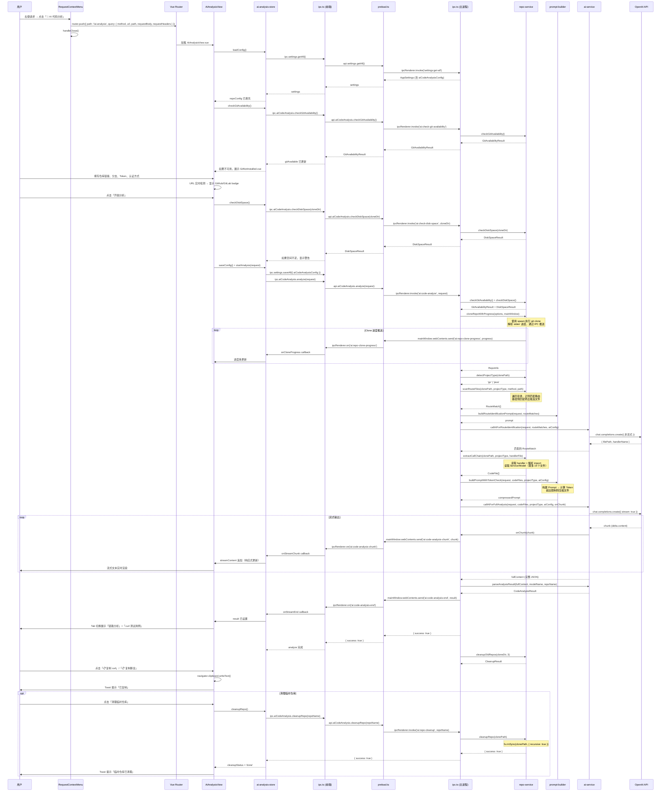
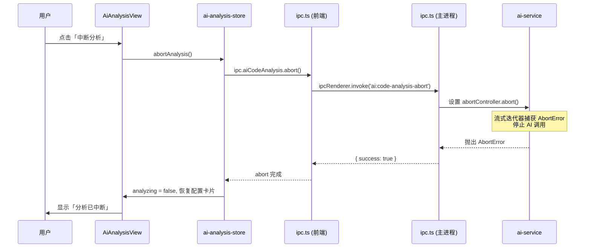
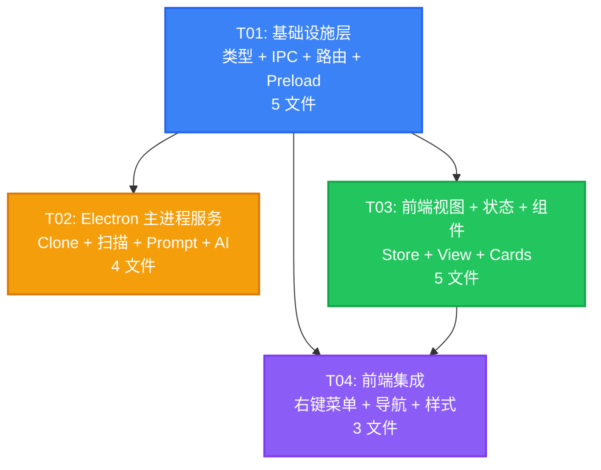

# AI 代码分析 — 系统架构设计文档

## 项目信息

| 项 | 值 |
|---|---|
| **项目名称** | PowerCatch · AI 代码分析功能 |
| **文档类型** | 系统架构设计 + 任务分解 |
| **技术栈** | Vue 3 + Pinia + Vue Router (hash) + Tailwind CSS + Electron IPC + OpenAI SDK |
| **架构师** | 高见远（Gao） |
| **文档版本** | v1.3 (POC验证更新版) |

---

## Part A: 系统设计

### 1. 实现方案

#### 1.1 整体架构概述

AI 代码分析功能在现有 PowerCatch 抓包工具基础上新增一条「抓包请求 → 代码仓库 Clone → 路由匹配 → AI 两阶段分析 → 测试用例生成」的自动化链路。

核心设计决策基于用户确认的 Q1-Q11：

| 决策项 | 方案 |
|--------|------|
| 代码获取方式 | **Shallow Clone**（`git clone --depth 1`），非 API 拉文件 |
| 支持语言 | Go（v1.0）/ Java（v1.1） |
| Clone 认证 | HTTP + Token 为主，SSH 可选（页面 toggle 切换） |
| Clone 目录 | 可配置，默认 `~/.powercatch/repos/` |
| Clone 清理 | 默认保留，结果页提供「清理临时仓库」按钮 |
| Token 存储 | 明文存储（与现有 apiKey 一致） |
| 结果持久化 | 不持久化（仅当前会话有效） |
| 测试入参来源 | 抓包参数为基线 + AI 补充 |
| 认证头处理 | 保留原始请求头（Cookie/Bearer 等） |
| 大仓库优化 | 只发链路相关文件，跳过 test/vendor/docs |
| Prompt 策略 | 基础 Prompt + 动态扩展（Go/Java） |
| curl 目标地址 | 使用抓包请求的原始 URL |

#### 1.2 关键技术选型

| 技术点 | 选型 | 理由 |
|--------|------|------|
| 仓库获取 | `child_process.spawn('git', ['clone', '--depth', '1', ...])` | Shallow clone 只拉最新一次提交，速度快、磁盘占用小；使用 spawn 实时获取进度 |
| 项目类型检测 | 检测 `go.mod`（Go）/ `pom.xml` 或 `build.gradle`（Java） | 简单可靠，覆盖主流项目 |
| 路由扫描 | 本地正则匹配 + AI 辅助识别 | 正则快速预筛候选文件，AI 做最终确认（处理路径参数、中间件等复杂情况） |
| 调用链提取 | 解析 import 语句 → 解析为本地文件路径 → 读取文件 | Go: `github.com/user/repo/internal/xxx` → `./internal/xxx`；Java: 包路径 → 文件路径 |
| AI 调用 | OpenAI SDK 流式输出（复用现有 `ai-service.ts` 模式） | 与现有 AI 对比功能保持一致的技术栈和代码风格 |
| Prompt 构建 | 基础 Prompt + Go/Java 动态扩展 | 通用规则不变，语言特定规则按需拼接，减少 Token 消耗 |
| IPC 通信 | `ipcMain.handle` + `mainWindow.webContents.send`（复用现有模式） | 与现有 AI 流式对比完全一致的架构 |
| 配置持久化 | SQLite key-value（复用现有 settings 存储） | 与现有 apiKey、breakpointRules 等存储方式一致 |
| Git 可用性 | 启动时检测 `git --version`，失败时引导安装 | 防止 Clone 开始时才报错，提升用户体验（M1） |
| 磁盘空间 | Clone 前检查可用空间，<1GB 警告 <500MB 阻止 | 防止磁盘被占满（M3） |
| Token 管理 | 简单估算（1 Token ≈ 4 字符）+ 文件内容压缩 | 防止超出 AI 模型限制（M4） |

#### 1.3 两阶段 AI 分析流程

这是本功能的核心设计，解决大仓库 Token 消耗问题（Q9）：

```
┌─────────────────────────────────────────────────────────────┐
│  Stage 1: 路由识别（AI 辅助）                                │
│                                                             │
│  1. 本地正则扫描所有路由文件（.go / .java）                   │
│  2. 路径预匹配：按 method + path 关键词筛出候选文件           │
│  3. 将候选路由文件的「路由注册行 + 上下文」发给 AI             │
│  4. AI 返回：匹配的 handler 文件路径 + 函数名                 │
│                                                             │
│  → 非流式调用（需要完整结果才能进入下一阶段）                  │
│  → 输入小（只发路由注册行，不发完整文件）                      │
└──────────────────────┬──────────────────────────────────────┘
                       │
                       ▼
┌─────────────────────────────────────────────────────────────┐
│  调用链提取（本地，无 AI）                                    │
│                                                             │
│  1. 读取 AI 确认的 handler 文件完整内容                       │
│  2. 解析 import 语句                                        │
│  3. 对内部包引用（同仓库），解析为本地文件路径并读取           │
│  4. 跳过：test/、vendor/、docs/、node_modules/、.git/         │
│  5. 限制深度：handler → service → model（最多 2 层）          │
│  6. 限制文件数：最多 15 个文件（防止 Token 爆炸）              │
│                                                             │
│  → 纯本地文件操作，速度快                                     │
└──────────────────────┬──────────────────────────────────────┘
                       │
                       ▼
┌─────────────────────────────────────────────────────────────┐
│  Stage 2: 完整分析 + 测试用例生成（AI 流式）                  │
│                                                             │
│  1. 构建 Prompt = 基础 Prompt + 语言扩展 + 代码上下文         │
│  2. 代码上下文 = handler 代码 + 调用链文件 + 接口信息          │
│  3. AI 流式输出：链路分析 + curl 列表 + Python 断言            │
│  4. 流式 chunk 实时推送到前端                                 │
│  5. 完成后解析 JSON 结果                                      │
│                                                             │
│  → 流式调用（复用现有 onStreamChunk 模式）                    │
│  → 输入可控（只发链路相关文件）                                │
└─────────────────────────────────────────────────────────────┘
```

#### 1.4 与现有系统的集成方式

| 集成点 | 方式 |
|--------|------|
| AI 服务 | 扩展现有 `ai-service.ts`，新增 `executeCodeAnalysis()` 函数，复用 OpenAI SDK 和流式模式 |
| IPC 通信 | 新增 `ai:code-analyze` / `ai:code-analysis-chunk` / `ai:code-analysis-end` / `ai:code-analysis-abort` / `ai:repo-cleanup` 通道 |
| Settings 存储 | 扩展 `AppSettings` 接口，新增 `aiCodeAnalysisConfig` 字段（repoUrl, branch, accessToken, authMethod, cloneDir） |
| 路由 | 新增 `/ai-analysis` 路由 |
| 右键菜单 | 在 `RequestContextMenu.vue` 新增菜单项 |
| 导航 | 在 `TitleBar.vue` 新增「🤖 AI分析」按钮 |
| 全局样式 | 复用现有 `.card` / `.btn` / `.tab-bar` / `.method-*` / `.badge-*` / `.md-content` 等全局类 |

#### 1.5 M1-M6 设计要点（架构评审改进）

本节汇总 M1-M6 的核心设计决策，详细实现参考对应任务说明：

**M1: Git 可用性检测**
- `checkGitAvailability()`: 检测 git 是否在 PATH 中，Windows 检查常见安装路径，返回 `{ available, version, error }`
- 失败时展示 `GitNotInstalled.vue` 组件（提供下载链接和重新检测按钮）
- 检测时机：页面加载时自动检测，Clone 开始前再次确认

**M2: Clone 超时与进度推送**
- 使用 `spawn` 替代 `execFile`，实时获取 git stderr 输出
- 超时从 120s 调整到 300s（5 分钟）
- 解析 stderr 中的百分比（`Receiving objects: 45%`），通过 `ai:repo-clone-progress` 推送进度
- 前端展示 `CloneProgress.vue` 组件（进度条 + 状态文字）

**M3: 磁盘空间检查与自动清理**
- Clone 前调用 `checkDiskSpace()`，<1GB 警告，<500MB 阻止操作
- `cleanupOldRepos()`: LRU 策略，删除超过 3 天未使用的仓库（按 atime 判断）
- 分析完成后自动触发清理，用户也可手动点击「清理临时仓库」

**M4: Token 计算与文件压缩**
- Token 估算：`estimateTokenCount()` → 1 Token ≈ 4 字符
- 精确计算（可选）：使用 `tiktoken` 库
- 文件压缩策略：
  - Handler 文件：保留完整内容
  - Model/DTO：只保留 struct/class 定义（删除方法实现）
  - Service 文件：压缩方法体（保留签名，方法体截断）
- 压缩阈值：90K Tokens 触发压缩，100K 强制减少文件数

**M5: 语言支持策略**
- v1.0 只支持 Go 项目（Java 推迟到 v1.1）
- 前端 UI 禁用 Java 选项（显示"v1.1 支持"）
- `scanRouteFiles()` v1.0 只扫描 `.go` 文件，使用 `GO_ROUTE_PATTERNS` 正则

**M6: IPC 类型定义一致性**
- 在 `preload.ts` 中导入 `ElectronAPI` 类型（来自 `src/services/ipc.ts`）
- 使用 `tsc --noEmit` 验证类型一致性
- 确保渲染进程和主进程的类型定义同步

---

### 2. 文件列表

#### 新增文件（5 个）

| # | 文件路径 | 说明 |
|---|----------|------|
| 1 | `electron/services/repo-service.ts` | 仓库 Clone + 文件扫描 + 路由匹配 + 调用链提取 + Git检测 + 磁盘检查 + 自动清理 |
| 2 | `electron/services/prompt-builder.ts` | Prompt 构建（基础 + Go/Java 动态扩展）+ Token 计算 + 文件压缩 |
| 3 | `src/stores/ai-analysis-store.ts` | AI 分析状态管理（Pinia store） |
| 4 | `src/views/AiAnalysisView.vue` | AI 代码分析主视图（含 Clone 进度展示） |
| 5 | `src/components/TestScenarioCard.vue` | 测试场景卡片组件（curl + Python 断言展示） |

#### 修改文件（8 个）

| # | 文件路径 | 修改内容 |
|---|----------|----------|
| 1 | `src/services/types.ts` | 新增类型定义 + IPC_CHANNELS 常量 + AppSettings 扩展 + M1/M2/M3 新增接口 |
| 2 | `src/services/ipc.ts` | 新增 `aiCodeAnalysis` 命名空间 + ElectronAPI 类型扩展 |
| 3 | `src/router/index.ts` | 新增 `/ai-analysis` 路由 |
| 4 | `electron/preload.ts` | 暴露 `aiCodeAnalysis` API 命名空间，导入 `ElectronAPI` 类型（M6） |
| 5 | `electron/services/ai-service.ts` | 新增 `executeCodeAnalysis()` 函数 + 互斥锁 + 结果解析 + Token 检查 |
| 6 | `electron/ipc.ts` | 注册新 IPC handlers（analyze / abort / cleanup + M1/M2/M3 handlers） |
| 7 | `src/components/TitleBar.vue` | 新增「🤖 AI分析」导航按钮 |
| 8 | `src/components/RequestContextMenu.vue` | 新增「🤖 AI 代码分析」菜单项 |

---

### 3. 数据结构和接口

#### 3.1 类图

```mermaid
classDiagram
    class RepoConfig {
        +repoUrl: string
        +repoType: RepoType
        +branch: string
        +accessToken: string
        +authMethod: 'http' | 'ssh'
        +cloneDir: string
        +repoUrlHistory: string[]
    }

    class CodeAnalysisRequest {
        +request: AnalysisRequestInfo
        +repo: RepoConfig
        +aiConfig: AiConfig
    }

    class AnalysisRequestInfo {
        +method: HttpMethod
        +url: string
        +path: string
        +requestBody?: string
        +requestHeaders?: HttpHeaders
    }

    class AiConfig {
        +apiUrl: string
        +apiKey: string
        +modelName: string
    }

    class TestScenario {
        +type: '正常' | '边界值' | '异常'
        +title: string
        +description: string
        +curl: string
        +pythonAssertion: string
    }

    class CodeAnalysisResult {
        +routeInfo: string
        +analysis: string
        +scenarios: TestScenario[]
        +modelName: string
        +analyzedAt: string
        +repoName: string
    }

    class CloneOptions {
        +repoUrl: string
        +branch: string
        +accessToken: string
        +authMethod: 'http' | 'ssh'
        +cloneDir: string
    }

    class RepoInfo {
        +clonePath: string
        +projectType: 'go' | 'java' | 'unknown'
        +repoName: string
    }

    class RouteMatch {
        +filePath: string
        +content: string
        +routePattern: string
        +handlerName: string
        +lineNumber: number
    }

    class CodeFile {
        +filePath: string
        +content: string
        +fileType: 'handler' | 'service' | 'model' | 'dto' | 'other'
    }

    class GitAvailabilityResult {
        +available: boolean
        +version?: string
        +error?: string
    }

    class CloneProgress {
        +percent: number
        +message: string
    }

    class DiskSpaceResult {
        +freeBytes: number
        +hasEnoughSpace: boolean
        +warning: string | null
    }

    class RepoService {
        <<electron/services/repo-service.ts>>
        +cloneRepo(options: CloneOptions): Promise~RepoInfo~
        +checkGitAvailability(): Promise~GitAvailabilityResult~
        +checkDiskSpace(dirPath: string): Promise~DiskSpaceResult~
        +detectProjectType(clonePath: string): 'go' | 'java' | 'unknown'
        +scanRouteFiles(clonePath: string, projectType: string, method: string, path: string): RouteMatch[]
        +extractCallChain(clonePath: string, projectType: string, handlerFile: CodeFile): CodeFile[]
        +cleanupRepo(clonePath: string): Promise~void~
        +cleanupOldRepos(cloneDir: string, maxAgeDays: number): Promise~CleanupResult~
        -buildCloneUrl(repoUrl: string, token: string, authMethod: string): string
    }

    class PromptBuilder {
        <<electron/services/prompt-builder.ts>>
        +buildBasePrompt(): string
        +buildGoExtension(): string
        +buildJavaExtension(): string
        +buildRouteIdentificationPrompt(request: AnalysisRequestInfo, routeFiles: RouteMatch[]): string
        +buildFullAnalysisPrompt(request: AnalysisRequestInfo, codeContext: CodeFile[], projectType: string): string
        +compressCodeFile(content: string, fileType: string, projectType: string): string
        +buildPromptWithTokenCheck(request: AnalysisRequestInfo, codeFiles: CodeFile[], projectType: string, aiConfig: AiConfig): Promise~string~
        -buildCodeContextBlock(files: CodeFile[]): string
    }

    class AiService {
        <<electron/services/ai-service.ts>>
        -isAnalyzing: boolean
        +executeCompare(request, onChunk, onEnd): Promise~CompareResult~
        +executeCodeAnalysis(request, onChunk, onEnd): Promise~CodeAnalysisResult~
        -callAIForRouteIdentification(request, routeFiles, aiConfig): Promise~RouteMatch~
        -callAIForFullAnalysis(request, codeContext, projectType, aiConfig, onChunk): Promise~string~
        -parseAnalysisResult(rawContent: string, modelName: string, repoName: string): CodeAnalysisResult
        +isAnalysisInProgress(): boolean
    }

    class AiAnalysisStore {
        <<src/stores/ai-analysis-store.ts>>
        +analyzing: Ref~boolean~
        +streamContent: Ref~string~
        +result: Ref~CodeAnalysisResult | null~
        +error: Ref~string | null~
        +repoConfig: Ref~RepoConfig~
        +cleanupStatus: Ref~string~
        +loadConfig(): Promise~void~
        +saveConfig(): Promise~void~
        +addRepoUrlToHistory(): Promise~void~
        +startAnalysis(request: CodeAnalysisRequest): Promise~void~
        +abortAnalysis(): Promise~void~
        +cleanupRepo(): Promise~void~
        +reset(): void
    }

    class TestScenarioCard {
        <<src/components/TestScenarioCard.vue>>
        +scenario: TestScenario
        +copyCurl(): void
        +copyPython(): void
    }

    CodeAnalysisRequest --> RepoConfig
    CodeAnalysisRequest --> AnalysisRequestInfo
    CodeAnalysisRequest --> AiConfig
    CodeAnalysisResult --> TestScenario
    RepoService ..> CloneOptions : uses
    RepoService ..> RepoInfo : returns
    RepoService ..> RouteMatch : returns
    RepoService ..> CodeFile : returns
    RepoService ..> GitAvailabilityResult : returns (M1)
    RepoService ..> CloneProgress : emits (M2)
    RepoService ..> DiskSpaceResult : returns (M3)
    AiService --> RepoService : calls
    AiService --> PromptBuilder : calls
    AiService ..> CodeAnalysisResult : returns
    AiAnalysisStore ..> AiService : via IPC
    AiAnalysisStore ..> CodeAnalysisResult : manages
    TestScenarioCard --> TestScenario
```



#### 3.2 新增 TypeScript 类型定义（`src/services/types.ts`）

```typescript
// ===== AI 代码分析相关类型 =====

/** 仓库类型 */
export type RepoType = 'github' | 'gitlab'

/** Clone 认证方式 */
export type CloneAuthMethod = 'http' | 'ssh'

/** 仓库配置 */
export interface RepoConfig {
  /** 仓库链接，如 https://github.com/org/repo */
  repoUrl: string
  /** 仓库类型（自动识别） */
  repoType: RepoType
  /** 分支名，默认 main */
  branch: string
  /** Access Token（私有仓库需要） */
  accessToken: string
  /** 认证方式：HTTP+Token 或 SSH */
  authMethod: CloneAuthMethod
  /** Clone 目录，默认 ~/.powercatch/repos/ */
  cloneDir: string
  /** 仓库 URL 历史记录（本地持久化，下拉选择用） */
  repoUrlHistory: string[]
}

/** 分析请求中的接口信息 */
export interface AnalysisRequestInfo {
  method: HttpMethod
  url: string
  path: string
  /** 请求体（POST/PUT 等可能有，作为 AI 参考基线） */
  requestBody?: string
  /** 请求头（保留原始认证头，方便生成可直接执行的 curl） */
  requestHeaders?: HttpHeaders
}

/** AI 代码分析请求参数 */
export interface CodeAnalysisRequest {
  /** 选中的抓包请求信息 */
  request: AnalysisRequestInfo
  /** 仓库配置 */
  repo: RepoConfig
  /** AI 配置（从 settings 获取） */
  aiConfig: {
    apiUrl: string
    apiKey: string
    modelName: string
  }
}

/** 单个测试场景 */
export interface TestScenario {
  /** 场景类型 */
  type: '正常' | '边界值' | '异常'
  /** 场景标题 */
  title: string
  /** 场景描述 */
  description: string
  /** curl 命令 */
  curl: string
  /** Python 断言代码（只断言 JSON 字段） */
  pythonAssertion: string
}

/** AI 代码分析结果 */
export interface CodeAnalysisResult {
  /** 接口路由信息（如 @PostMapping 路径） */
  routeInfo: string
  /** 链路分析（Markdown 格式） */
  analysis: string
  /** 测试场景列表 */
  scenarios: TestScenario[]
  /** 使用的模型名 */
  modelName: string
  /** 分析时间 */
  analyzedAt: string
  /** 仓库名称（用于清理标识） */
  repoName: string
}

/** Git 可用性检测结果（M1） */
export interface GitAvailabilityResult {
  available: boolean
  version?: string
  gitPath?: string  // Windows 上找到的 git 路径
  error?: string
}

/** Clone 进度（M2） */
export interface CloneProgress {
  percent: number      // 0-100 的百分比
  message: string      // 人类可读的进度描述
}

/** 磁盘空间检查结果（M3） */
export interface DiskSpaceResult {
  freeBytes: number
  hasEnoughSpace: boolean
  warning: string | null
}

/** AppSettings 扩展字段 */
// 在现有 AppSettings 接口中新增:
//   aiCodeAnalysisConfig?: {
//     repoUrl: string
//     branch: string
//     accessToken: string
//     authMethod: CloneAuthMethod
//     cloneDir: string
//     repoUrlHistory: string[]
//   }
```

#### 3.3 新增 IPC 通道定义（`src/services/types.ts` 的 `IPC_CHANNELS`）

```typescript
// 在 IPC_CHANNELS 对象中新增:
// AI 代码分析
AI_CODE_ANALYZE: 'ai:code-analyze',              // 发起分析（主进程内部执行 Clone + 两阶段 AI 分析）
AI_CODE_ANALYSIS_CHUNK: 'ai:code-analysis-chunk', // 流式 chunk 推送
AI_CODE_ANALYSIS_END: 'ai:code-analysis-end',     // 流式结束 + 最终结果
AI_CODE_ANALYSIS_ABORT: 'ai:code-analysis-abort', // 中断分析
AI_REPO_CLEANUP: 'ai:repo-cleanup',               // 清理临时仓库
// M1: Git 可用性检测
AI_CHECK_GIT_AVAILABILITY: 'ai:check-git-availability', // 检测 Git 是否可用
// M2: Clone 进度推送
AI_REPO_CLONE_PROGRESS: 'ai:repo-clone-progress', // Clone 进度推送
// M3: 磁盘空间检查
AI_CHECK_DISK_SPACE: 'ai:check-disk-space',       // 检查磁盘空间
```

#### 3.4 IPC 层扩展（`src/services/ipc.ts`）

```typescript
// 在 ipc 对象中新增 aiCodeAnalysis 命名空间:
aiCodeAnalysis: {
  /** 发起代码分析（流式） */
  analyze: async (request: CodeAnalysisRequest): Promise<{ success: boolean; error?: string }> => {
    const api = getElectronAPI()
    if (!api) return { success: false, error: 'Not in Electron environment' }
    return api.aiCodeAnalysis.analyze(JSON.parse(JSON.stringify(request)))
  },

  /** 流式 chunk 监听 */
  onStreamChunk: (callback: (chunk: string) => void): (() => void) => {
    const api = getElectronAPI()
    if (!api) return () => {}
    return api.aiCodeAnalysis.onStreamChunk(callback)
  },

  /** 流式结束监听 */
  onStreamEnd: (callback: (result: CodeAnalysisResult) => void): (() => void) => {
    const api = getElectronAPI()
    if (!api) return () => {}
    return api.aiCodeAnalysis.onStreamEnd(callback)
  },

  /** 中断分析 */
  abort: async (): Promise<{ success: boolean }> => {
    const api = getElectronAPI()
    if (!api) return { success: false }
    return api.aiCodeAnalysis.abort()
  },

  /** 清理临时仓库 */
  cleanupRepo: async (repoName: string): Promise<{ success: boolean; error?: string }> => {
    const api = getElectronAPI()
    if (!api) return { success: false, error: 'Not in Electron environment' }
    return api.aiCodeAnalysis.cleanupRepo(repoName)
  },

  // M1: Git 可用性检测
  checkGitAvailability: async (): Promise<GitAvailabilityResult> => {
    const api = getElectronAPI()
    if (!api) return { available: false, error: 'Not in Electron environment' }
    return api.aiCodeAnalysis.checkGitAvailability()
  },

  // M2: Clone 进度监听
  onCloneProgress: (callback: (progress: CloneProgress) => void): (() => void) => {
    const api = getElectronAPI()
    if (!api) return () => {}
    return api.aiCodeAnalysis.onCloneProgress(callback)
  },

  // M3: 磁盘空间检查
  checkDiskSpace: async (cloneDir: string): Promise<DiskSpaceResult> => {
    const api = getElectronAPI()
    if (!api) return { freeBytes: 0, hasEnoughSpace: false, warning: null }
    return api.aiCodeAnalysis.checkDiskSpace(cloneDir)
  },
}
```

#### 3.5 Preload 暴露（`electron/preload.ts`）

```typescript
// 在 electronAPI 对象中新增（导入 ElectronAPI 类型确保一致性 - M6）:
import { ElectronAPI } from '../src/services/ipc'

const electronAPI: ElectronAPI = {
  // ... 现有 API
  
  // AI 代码分析 API
  aiCodeAnalysis: {
    analyze: (request: any) =>
      ipcRenderer.invoke(IPC_CHANNELS.AI_CODE_ANALYZE, request),
    
    onStreamChunk: (callback: (chunk: string) => void) => {
      const handler = (_event: any, chunk: string) => callback(chunk)
      ipcRenderer.on(IPC_CHANNELS.AI_CODE_ANALYSIS_CHUNK, handler)
      return () => ipcRenderer.removeListener(IPC_CHANNELS.AI_CODE_ANALYSIS_CHUNK, handler)
    },
    
    onStreamEnd: (callback: (result: any) => void) => {
      const handler = (_event: any, result: any) => callback(result)
      ipcRenderer.on(IPC_CHANNELS.AI_CODE_ANALYSIS_END, handler)
      return () => ipcRenderer.removeListener(IPC_CHANNELS.AI_CODE_ANALYSIS_END, handler)
    },
    
    abort: () => ipcRenderer.invoke(IPC_CHANNELS.AI_CODE_ANALYSIS_ABORT),
    
    cleanupRepo: (repoName: string) =>
      ipcRenderer.invoke(IPC_CHANNELS.AI_REPO_CLEANUP, repoName),
    
    // M1: Git 可用性检测
    checkGitAvailability: () =>
      ipcRenderer.invoke(IPC_CHANNELS.AI_CHECK_GIT_AVAILABILITY),
    
    // M2: Clone 进度监听
    onCloneProgress: (callback: (progress: any) => void) => {
      const handler = (_event: any, progress: any) => callback(progress)
      ipcRenderer.on(IPC_CHANNELS.AI_REPO_CLONE_PROGRESS, handler)
      return () => ipcRenderer.removeListener(IPC_CHANNELS.AI_REPO_CLONE_PROGRESS, handler)
    },
    
    // M3: 磁盘空间检查
    checkDiskSpace: (cloneDir: string) =>
      ipcRenderer.invoke(IPC_CHANNELS.AI_CHECK_DISK_SPACE, cloneDir),
  },
}

contextBridge.exposeInMainWorld('electronAPI', electronAPI)
```

#### 3.6 新增 Store 结构（`src/stores/ai-analysis-store.ts`）

```typescript
export const useAiAnalysisStore = defineStore('aiAnalysis', () => {
  // ===== State =====
  const analyzing = ref(false)                             // 是否正在分析
  const streamContent = ref('')                            // 流式输出文本
  const result = ref<CodeAnalysisResult | null>(null)      // 分析结果
  const error = ref<string | null>(null)                   // 错误信息
  const repoConfig = ref<RepoConfig>({                     // 仓库配置（持久化）
    repoUrl: '',
    repoType: 'github',
    branch: 'main',
    accessToken: '',
    authMethod: 'http',
    cloneDir: '',  // 空则使用默认 ~/.powercatch/repos/
    repoUrlHistory: [],  // 仓库URL历史记录
  })
  const cleanupStatus = ref<'idle' | 'cleaning' | 'done'>('idle')
  const gitAvailable = ref<boolean | null>(null)           // M1: Git 可用性
  const cloneProgress = ref<CloneProgress | null>(null)    // M2: Clone 进度

  // ===== Actions =====
  /** 加载持久化的仓库配置（从 settings.aiCodeAnalysisConfig） */
  async function loadConfig(): Promise<void>

  /** 保存仓库配置到 settings */
  async function saveConfig(): Promise<void>

  /** 将当前 repoUrl 加入历史记录（去重，最多20条） */
  async function addRepoUrlToHistory(): Promise<void>

  /** 检测 Git 可用性（M1） */
  async function checkGitAvailability(): Promise<void>

  /** 检查磁盘空间（M3） */
  async function checkDiskSpace(): Promise<DiskSpaceResult | null>

  /** 发起分析 */
  async function startAnalysis(request: CodeAnalysisRequest): Promise<void>

  /** 中断分析 */
  async function abortAnalysis(): Promise<void>

  /** 清理临时仓库 */
  async function cleanupRepo(): Promise<void>

  /** 重置状态 */
  function reset(): void

  return {
    analyzing, streamContent, result, error, repoConfig, cleanupStatus,
    gitAvailable, cloneProgress,
    loadConfig, saveConfig, addRepoUrlToHistory,
    checkGitAvailability, checkDiskSpace,
    startAnalysis, abortAnalysis, cleanupRepo, reset,
  }
})
```

---

### 4. 程序调用流程

#### 4.1 完整分析流程时序图



#### 4.2 中断分析流程



---

### 5. M1-M6 详细设计要点

#### 5.1 M1: Git 可用性检测
`checkGitAvailability(): Promise<GitAvailabilityResult>` - 检测 git 是否在 PATH 中，Windows 检查常见路径，返回 `{ available, version, error }`。

`GitNotInstalled.vue` - 独立页面组件，展示检测信息和下载链接，提供「重新检测」按钮。

集成点：`AiAnalysisView.vue` 页面加载时自动检测，失败时展示错误页。

#### 5.2 M2: Clone 超时与进度推送
使用 `spawn` 替代 `execFile`，超时 300s，解析 stderr 进度（`Receiving objects: 45%`），通过 `ai:repo-clone-progress` 推送。

`CloneProgress.vue` - Props: `progress: CloneProgress`，展示进度条 + 状态文字。

错误解析：`parseGitError(stderr)` 匹配 `Authentication failed`/`not found`/`timeout` 返回友好错误信息。

#### 5.3 M3: 磁盘空间检查与自动清理
`checkDiskSpace(dirPath): Promise<DiskSpaceResult>` - Windows 用 `wmic`，macOS/Linux 用 `statvfs`，返回可用字节数和警告。

`cleanupOldRepos(cloneDir, maxAgeDays=3)` - 按 atime 删除超过 3 天未使用的仓库，返回清理数量和释放空间。

集成点：Clone 前检查，分析完成后自动清理，用户可手动清理。

#### 5.4 M4: Token 计算与文件压缩

**设计目标**：
1. 估算发送给 AI 的 Prompt Token 数
2. 实现文件内容压缩策略，防止超出模型限制
3. 配置 `MAX_TOKENS_PER_REQUEST = 100000`

**Token 计算方法**（简要说明）：

`estimateTokenCount(text: string): number`
- 简单估算：1 Token ≈ 4 字符
- 代码通常更紧凑，可调整为 5-6

`countTokensPrecise(text: string, model: string): Promise<number>`
- 使用 `tiktoken` 库精确计算
- 支持多种模型（GPT-3.5, GPT-4, Claude 等）
- 如果库不可用，降级到简单估算

**文件压缩策略**（简要说明）：

`compressCodeFile(content: string, fileType: string, projectType: string): string`
- Handler 文件：保留完整内容
- Model/DTO：只保留 `struct/class` 定义（删除方法实现）
- Service 文件：压缩方法体（保留签名，方法体截断到前 500 行 + 后 100 行）
- 注释：删除普通注释，保留文档注释（`///` 或 `/**`）

**压缩效果示例**：

压缩前（Go DTO 文件，约 120 行）：
```go
// UserParam 用户参数
type UserParam struct {
    UserID   int64  `json:"userId" binding:"required"`
    UserName string `json:"userName" binding:"required"`
    Email    string `json:"email" binding:"required,email"`
    Age      int    `json:"age" binding:"gte=0,lte=150"`
}

// Validate 参数校验
func (p *UserParam) Validate() error {
    if p.UserID <= 0 {
        return errors.New("userId must be positive")
    }
    // ... 100 行校验逻辑
    return nil
}
```

压缩后（约 10 行）：
```go
// UserParam 用户参数
type UserParam struct {
    UserID   int64  `json:"userId" binding:"required"`
    UserName string `json:"userName" binding:"required"`
    Email    string `json:"email" binding:"required,email"`
    Age      int    `json:"age" binding:"gte=0,lte=150"`
}
```

**Token 检查流程**（伪代码）：
```typescript
async function buildPromptWithTokenCheck(request, codeFiles, projectType, aiConfig) {
  let prompt = buildFullAnalysisPrompt(request, codeFiles, projectType)
  let tokenCount = await countTokensPrecise(prompt, aiConfig.modelName)
  
  if (tokenCount > MAX_TOKENS_PER_REQUEST) {
    // 压缩文件内容
    const compressedFiles = codeFiles.map(f => ({
      ...f,
      content: compressCodeFile(f.content, f.fileType, projectType)
    }))
    prompt = buildFullAnalysisPrompt(request, compressedFiles, projectType)
    
    // 再次检查，仍然超出则减少文件数
    tokenCount = await countTokensPrecise(prompt, aiConfig.modelName)
    if (tokenCount > MAX_TOKENS_PER_REQUEST) {
      prompt = buildFullAnalysisPrompt(request, compressedFiles.slice(0, compressedFiles.length / 2), projectType)
    }
  }
  
  return prompt
}
```

#### 5.5 M5: 语言支持策略

**决策**：v1.0 只支持 Go 项目，Java 支持推迟到 v1.1。

**理由**：
1. Go 路由扫描正则已较完善（附录 B）
2. Java 路由扫描需要增强（类级别 @RequestMapping + 路径变量处理）
3. 降低初期风险，确保 v1.0 稳定发布

**实现要点**：

`scanRouteFiles(clonePath, projectType, method, path): RouteMatch[]`
- v1.0: 只处理 `projectType === 'go'`，否则抛出错误
- 扫描 `.go` 文件，使用 `GO_ROUTE_PATTERNS` 正则（附录 B）
- 路径预匹配：按 method + path 关键词筛出候选文件

**前端 UI 调整**：
- 新增语言选择下拉菜单（v1.0 只启用 Go）
- Java 选项禁用，显示"v1.1 支持"

#### 5.6 M6: IPC 类型定义一致性

**设计目标**：确保 `src/services/ipc.ts` 中的 `ElectronAPI` 接口与 `electron/preload.ts` 中的实现签名一致。

**实现方案**：

1. 在 `preload.ts` 中导入 `ElectronAPI` 类型：
   ```typescript
   import { ElectronAPI } from '../src/services/ipc'
   
   const electronAPI: ElectronAPI = {
     // 实现所有接口定义的方法
   }
   ```

2. 使用 `tsc --noEmit` 验证类型一致性：
   ```json
   // package.json
   {
     "scripts": {
       "type-check": "tsc --noEmit"
     }
   }
   ```

3. 确保 `tsconfig.json` 包含 `preload.ts` 和 `src/services/ipc.ts`

**关键检查点**：
- `aiCodeAnalysis.analyze` 签名一致
- `aiCodeAnalysis.onStreamChunk` 签名一致（返回 cleanup 函数）
- M1-M3 新增方法签名一致

---

### 6. 待明确事项（已更新）

| # | 事项 | 当前状态 | 影响 |
|---|------|----------|------|
| 1 | **Git 命令可用性** | ✅ 已解决（M1） | 已实现 `checkGitAvailability()` + 前端错误提示页 |
| 2 | **SSH Key 配置** | ⚠️ 部分解决 | SSH 方式依赖用户系统已配置好 SSH Key，错误信息已优化 |
| 3 | **大文件截断** | ⚠️ 部分解决（M4） | 已实现文件内容压缩，但函数级提取（A3）推迟到 v1.1 |
| 4 | **AI Stage 1 输出格式** | ⚠️ 已有 fallback | 需要做 fallback：如果解析失败，用正则匹配第一个候选文件的 handler |
| 5 | **并发分析** | ✅ 已明确 | 使用独立 `isAnalyzing` 互斥锁，不共享 `isComparing` |
| 6 | **Clone 超时** | ✅ 已解决（M2） | 超时调整为 300 秒，并实现进度推送 |
| 7 | **磁盘空间检查** | ✅ 已解决（M3） | 已实现磁盘空间检查 + 自动清理 |
| 8 | **Token 计算** | ✅ 已解决（M4） | 已实现 Token 估算 + 文件压缩 |
| 9 | **Java 路由扫描** | ⚠️ 推迟到 v1.1（M5） | v1.0 只支持 Go 项目 |
| 10 | **IPC 类型一致性** | ✅ 已解决（M6） | 已在 `preload.ts` 中导入 `ElectronAPI` 类型 |

---

## Part B: 任务分解

### 7. 依赖包列表

| 包名 | 版本 | 用途 |
|------|------|------|
| `openai` | `^4.28.0`（已有） | AI 大模型 API 调用（复用现有依赖） |
| `tiktoken` | `^1.0.0`（可选） | 精确计算 Token 数（M4，可选安装） |

> **说明**：`spawn` 是 Node.js 内置 `child_process` 模块，无需额外安装。`tiktoken` 是可选依赖，如果不安装则使用简单估算。

---

### 8. 任务列表（包含 M1-M6）

#### T01: 基础设施层 — 类型定义 + IPC 通道 + 路由 + Preload

| 项 | 内容 |
|---|---|
| **任务编号** | T01 |
| **任务名称** | 基础设施层：类型定义 + IPC 通道 + 路由 + Preload 暴露 |
| **优先级** | P0 |
| **依赖** | 无 |
| **复杂度** | 中等 |

**涉及文件（5 个）**：

| 文件 | 操作 | 修改内容 |
|------|------|----------|
| `src/services/types.ts` | [修改] | 新增 `RepoConfig`、`AnalysisRequestInfo`、`CodeAnalysisRequest`、`TestScenario`、`CodeAnalysisResult` 类型；新增 `GitAvailabilityResult`、`CloneProgress`、`DiskSpaceResult` 接口（M1/M2/M3）；在 `IPC_CHANNELS` 新增 8 个通道常量；在 `AppSettings` 新增 `aiCodeAnalysisConfig` 字段 |
| `src/services/ipc.ts` | [修改] | 新增 `aiCodeAnalysis` 命名空间（含 M1/M2/M3 新增方法）；扩展 `ElectronAPI` 接口类型 |
| `src/router/index.ts` | [修改] | 新增 `/ai-analysis` 路由，懒加载 `AiAnalysisView.vue` |
| `electron/preload.ts` | [修改] | 新增 `aiCodeAnalysis` 命名空间到 `electronAPI` 对象；**导入 `ElectronAPI` 类型**（M6）确保签名一致 |
| `src/components/GitNotInstalled.vue` | [新增] | Git 不可用错误提示页（M1） |

**关键实现要点**：
- IPC 通道命名遵循现有 `ai:xxx` 前缀规范
- `ElectronAPI` 接口在 `ipc.ts` 中定义，`preload.ts` 中导入类型并实现（M6）
- 流式监听方法返回 cleanup 函数（与现有模式一致）
- 路由使用懒加载 `() => import(...)`

---

#### T02: Electron 主进程服务 — Clone + 文件扫描 + Prompt 构建 + AI 分析 + IPC 注册

| 项 | 内容 |
|---|---|
| **任务编号** | T02 |
| **任务名称** | Electron 主进程：repo-service + prompt-builder + ai-service 扩展 + IPC handler 注册 |
| **优先级** | P0 |
| **依赖** | T01 |
| **复杂度** | 复杂 |

**涉及文件（5 个）**：

| 文件 | 操作 | 修改内容 |
|------|------|----------|
| `electron/services/repo-service.ts` | [新增] | 完整的仓库 Clone（带进度推送，M2）+ Git 可用性检测（M1）+ 磁盘空间检查（M3）+ 文件扫描 + 路由匹配 + 调用链提取 + 自动清理 |
| `electron/services/prompt-builder.ts` | [新增] | Prompt 构建：基础 Prompt + Go 扩展 + Java 扩展 + 路由识别 Prompt + 完整分析 Prompt + Token 计算（M4）+ 文件压缩（M4） |
| `electron/services/ai-service.ts` | [修改] | 新增 `executeCodeAnalysis()` + `isAnalysisInProgress()` + `parseAnalysisResult()`；新增 `isAnalyzing` 互斥锁；集成 Token 检查与压缩（M4） |
| `electron/ipc.ts` | [修改] | 注册 6 个 handler：`ai:code-analyze`、`ai:code-analysis-abort`、`ai:repo-cleanup`、`ai:check-git-availability`、`ai:repo-clone-progress`、`ai:check-disk-space` |

**关键函数签名**（简要说明）：

```typescript
// repo-service.ts
export async function checkGitAvailability(): Promise<GitAvailabilityResult>
// 检测 Git 是否可用，Windows 检查常见路径

export async function checkDiskSpace(dirPath: string): Promise<DiskSpaceResult>
// 检查磁盘空间，返回可用字节数和警告信息

export async function cloneRepoWithProgress(
  options: CloneOptions,
  mainWindow: BrowserWindow
): Promise<RepoInfo>
// 使用 spawn 执行 git clone，解析进度并推送

export async function cleanupOldRepos(
  cloneDir: string,
  maxAgeDays: number = 3
): Promise<CleanupResult>
// LRU 策略删除超过 N 天未使用的仓库

export function detectProjectType(clonePath: string): 'go' | 'java' | 'unknown'
// v1.0 只支持 Go

export function scanRouteFiles(
  clonePath: string,
  projectType: string,
  method: string,
  path: string
): RouteMatch[]
// v1.0 只扫描 .go 文件

export function extractCallChain(
  clonePath: string,
  projectType: string,
  handlerFile: CodeFile
): CodeFile[]
// 解析 import，提取调用链文件（最多 15 个）

// prompt-builder.ts
export function compressCodeFile(
  content: string,
  fileType: string,
  projectType: string
): string
// 压缩文件内容（Model只保留struct，Service压缩方法体）

export async function buildPromptWithTokenCheck(
  request: AnalysisRequestInfo,
  codeFiles: CodeFile[],
  projectType: string,
  aiConfig: AiConfig
): Promise<string>
// 构建 Prompt 前检查 Token 数，超出则压缩
```

---

#### T03: 前端视图 + 状态管理 + 测试场景组件

| 项 | 内容 |
|---|---|
| **任务编号** | T03 |
| **任务名称** | 前端：ai-analysis-store + AiAnalysisView + TestScenarioCard + GitNotInstalled + CloneProgress |
| **优先级** | P0 |
| **依赖** | T01 |
| **复杂度** | 复杂 |

**涉及文件（5 个）**：

| 文件 | 操作 | 修改内容 |
|------|------|----------|
| `src/stores/ai-analysis-store.ts` | [新增] | Pinia store：状态管理（含 M1/M2/M3 新增状态）+ 所有 actions |
| `src/views/AiAnalysisView.vue` | [新增] | AI 代码分析主视图：接口信息卡片 + 仓库配置表单 + Clone 进度条（M2）+ 分析中状态区 + 结果展示区 |
| `src/components/TestScenarioCard.vue` | [新增] | 测试场景卡片：场景标题 + badge + 左右布局（curl + Python 断言）+ 复制按钮 |
| `src/components/GitNotInstalled.vue` | [新增] | Git 不可用错误提示页（M1） |
| `src/components/CloneProgress.vue` | [新增] | Clone 进度展示组件（M2） |

**关键实现要点**：
- `AiAnalysisView.vue`：
  - 页面加载时自动检测 Git 可用性（M1）
  - 如果 Git 不可用，展示 `GitNotInstalled.vue`
  - Clone 过程中展示 `CloneProgress.vue`（M2）
  - 磁盘空间不足时展示警告（M3）
- `GitNotInstalled.vue`：提供下载链接和重新检测按钮
- `CloneProgress.vue`：监听 `ai:repo-clone-progress` 更新进度条

---

#### T04: 前端集成 — 右键菜单 + 导航 + 全局样式

| 项 | 内容 |
|---|---|
| **任务编号** | T04 |
| **任务名称** | 前端集成：RequestContextMenu 菜单项 + TitleBar 导航按钮 + 全局样式补充 |
| **优先级** | P0 |
| **依赖** | T01, T03 |
| **复杂度** | 简单 |

**涉及文件（3 个）**：

| 文件 | 操作 | 修改内容 |
|------|------|----------|
| `src/components/RequestContextMenu.vue` | [修改] | 新增「🤖 AI 代码分析」菜单项；新增 `handleAiAnalysis` 方法 |
| `src/components/TitleBar.vue` | [修改] | 新增「🤖 AI分析」导航按钮，当前路由高亮 |
| `src/styles/main.css` | [修改] | 新增 `.code-block` + `.scenario-card` + `.progress-bar` 样式 |

---

### 9. 共享知识（跨文件约定）

#### 9.1 IPC 通道命名规范

| 通道名 | 方向 | 说明 |
|--------|------|------|
| `ai:code-analyze` | Renderer → Main (`invoke`) | 发起代码分析 |
| `ai:code-analysis-chunk` | Main → Renderer (`send`) | 流式推送 AI 输出 chunk |
| `ai:code-analysis-end` | Main → Renderer (`send`) | 推送最终分析结果 |
| `ai:code-analysis-abort` | Renderer → Main (`invoke`) | 中断分析 |
| `ai:repo-cleanup` | Renderer → Main (`invoke`) | 清理临时仓库 |
| `ai:check-git-availability` | Renderer → Main (`invoke`) | **M1**：检测 Git 可用性 |
| `ai:repo-clone-progress` | Main → Renderer (`send`) | **M2**：推送 Clone 进度 |
| `ai:check-disk-space` | Renderer → Main (`invoke`) | **M3**：检查磁盘空间 |

#### 9.2 错误处理规范

| 错误场景 | 处理方式 | 错误信息 |
|----------|----------|----------|
| git 未安装（M1） | `checkGitAvailability()` 返回 available=false | 「未检测到 Git，请先安装」 |
| Clone 认证失败 | 捕获 git stderr 中的 `Authentication failed` | 「仓库认证失败，请检查 Token」 |
| 仓库不存在 | 捕获 git stderr 中的 `not found` | 「仓库不存在或无访问权限」 |
| Clone 超时（M2） | spawn timeout 300 秒 | 「Clone 超时（5分钟）」 |
| 磁盘空间不足（M3） | `checkDiskSpace()` 返回 hasEnoughSpace=false | 「磁盘空间不足（剩余 X GB）」 |
| 项目类型未知 | detectProjectType 返回 'unknown' | 跳过路由扫描，直接发送全部文件给 AI |
| 路由未匹配 | scanRouteFiles 返回空数组 | Stage 1 Prompt 中告知 AI「未找到匹配路由」 |
| AI Stage 1 解析失败 | parseAnalysisResult fallback | 用正则提取第一个候选文件的 handler |
| AI Stage 2 超时 | 300 秒超时保护 | 「分析超时，请重试」 |
| AI 输出非 JSON | 正则提取 ` ```json ... ``` ` 块 | 结果展示区显示原始文本 + 提示 |
| 互斥冲突 | isAnalyzing 为 true 时拒绝新请求 | 「代码分析正在进行中」 |
| Token 超出限制（M4） | `buildPromptWithTokenCheck()` 压缩 | Toast 提示「已压缩代码内容」 |

#### 9.3 Clone 目录管理规范

```
~/.powercatch/repos/              ← 默认根目录
├── order-service/                ← 仓库名作为目录名
│   ├── .git/
│   ├── go.mod
│   ├── internal/
│   └── cmd/
├── payment-gateway/
│   ├── pom.xml
│   └── src/
└── ...
```

- 目录名：从 repoUrl 提取仓库名（去掉 `.git` 后缀）
- 如果目录已存在：先删除再 Clone（确保最新代码）
- 清理操作：`fs.rmSync(join(cloneDir, repoName), { recursive: true, force: true })`
- **自动清理（M3）**：分析完成后，调用 `cleanupOldRepos()` 清理超过 3 天未使用的仓库

#### 9.4 Prompt 拼接规范

```
完整分析 Prompt = 基础 Prompt + "\n\n" + 语言扩展 + "\n\n" + 接口信息 + "\n\n" + 代码上下文 + "\n\n" + 输出要求
```

**代码上下文格式**：
```
## 代码上下文
### 文件: {filePath} ({fileType})
```{language}
{fileContent}
```
```

**Token 计算与压缩（M4）**：
- 使用 `estimateTokenCount()` 或 `countTokensPrecise()` 计算 Token 数
- 如果超出 `MAX_TOKENS_PER_REQUEST`（100K），调用 `compressCodeFile()` 压缩
- 压缩策略：优先保留 handler，DTO/Model 只保留 struct 定义

#### 9.5 流式输出复用规范

| 复用项 | 来源 | 复用方式 |
|--------|------|----------|
| OpenAI SDK | `ai-service.ts` 已引入 `openai` | 直接使用 `client.chat.completions.create({ stream: true })` |
| 流式迭代 | `ai-service.ts` 的 `executeCompare` | 复制 `for await (const chunk of stream)` 模式 |
| chunk 推送 | `ipc.ts` 的 `AI_COMPARE` handler | 复制 `mainWindow.webContents.send` 模式 |
| **进度推送（M2）** | **`repo-service.ts`** | **通过 `mainWindow.webContents.send('ai:repo-clone-progress', progress)` 推送** |
| 前端监听 | `preload.ts` 的 `ai.onStreamChunk` | 复制 `ipcRenderer.on` + 返回 cleanup 函数模式 |
| 互斥锁 | `ai-service.ts` 的 `isComparing` | 新增独立的 `isAnalyzing` |
| 超时保护 | `ipc.ts` 的 `AI_COMPARE` handler | 复制 `Promise.race([executeCodeAnalysis(...), timeoutPromise])` 模式（**M2：300秒**） |
| 前端深拷贝 | `ipc.ts` 的 `ai.compare` | 复制 `JSON.parse(JSON.stringify(request))` |

#### 9.6 文件扫描跳过规则

以下目录在扫描时跳过（不读取内容）：
- `.git/`
- `test/` / `tests/` / `*_test.go` / `Test*.java`
- `vendor/`
- `docs/` / `doc/`
- `node_modules/`
- `.idea/` / `.vscode/`
- `dist/` / `build/` / `target/`

#### 9.7 Token 管理规范（M4）

| 配置项 | 值 | 说明 |
|--------|------|----------|
| `MAX_TOKENS_PER_REQUEST` | 100,000 | 每次请求最大 Token 数 |
| `TOKEN_WARNING_THRESHOLD` | 80,000 | 警告阈值（80%） |
| `TOKEN_COMPRESSION_THRESHOLD` | 90,000 | 压缩阈值（90%） |
| 估算比例 | 1 Token ≈ 4 字符 | 简单估算（英文/代码） |
| 精确计算 | 使用 `tiktoken` 库 | 可选，需要安装 |

**压缩策略优先级**：
1. 优先保留 handler 文件完整内容
2. DTO/Model 只保留 struct/class 定义
3. 注释可以删除（保留文档注释）
4. 如果仍然超 Token，截断中间部分

---

### 10. 任务依赖图



**依赖说明**：
- **T01 → T02**：T02 需要使用 T01 定义的类型和 IPC_CHANNELS
- **T01 → T03**：T03 的 store 需要使用 T01 定义的类型和 IPC 封装
- **T01 → T04**：T04 需要 T01 注册的路由
- **T03 → T04**：T04 需要跳转到 T03 创建的 AiAnalysisView
- **M6（IPC 类型一致性）**：T01 的 `preload.ts` 必须导入 `ipc.ts` 的 `ElectronAPI` 类型

**并行可能性**：
- T02 和 T03 可以在 T01 完成后并行开发
- T04 依赖 T01 和 T03，但样式修改（main.css）不依赖 T03

---

### 附录 A：完整文件变更清单

| # | 文件路径 | 操作 | 所属任务 | M1-M6 关联 |
|---|----------|------|----------|----------|
| 1 | `src/services/types.ts` | [修改] | T01 | M1/M2/M3/M6 |
| 2 | `src/services/ipc.ts` | [修改] | T01 | M1/M2/M3/M6 |
| 3 | `src/router/index.ts` | [修改] | T01 | - |
| 4 | `electron/preload.ts` | [修改] | T01 | M6 |
| 5 | `electron/services/repo-service.ts` | [新增] | T02 | M1/M2/M3/M5 |
| 6 | `electron/services/prompt-builder.ts` | [新增] | T02 | M4 |
| 7 | `electron/services/ai-service.ts` | [修改] | T02 | M2/M4 |
| 8 | `electron/ipc.ts` | [修改] | T02 | M1/M2/M3 |
| 9 | `src/stores/ai-analysis-store.ts` | [新增] | T03 | M1/M2/M3 |
| 10 | `src/views/AiAnalysisView.vue` | [新增] | T03 | M1/M2/M3 |
| 11 | `src/components/TestScenarioCard.vue` | [新增] | T03 | - |
| 12 | `src/components/GitNotInstalled.vue` | [新增] | T03 | M1 |
| 13 | `src/components/CloneProgress.vue` | [新增] | T03 | M2 |
| 14 | `src/components/RequestContextMenu.vue` | [修改] | T04 | - |
| 15 | `src/components/TitleBar.vue` | [修改] | T04 | - |
| 16 | `src/styles/main.css` | [修改] | T04 | M2 |

**统计**：新增 6 个文件，修改 6 个文件，共 16 个文件。

---

### 附录 B：Go 路由扫描正则模式（POC 验证更新版）

> **POC 验证**（kylin-admin 项目）：lego/webx 框架实际使用 `.Group("/prefix").METHOD("/path", wrapper(pkg.Handler))` 链式模式注册路由，Handler 包装器为 `sa.ControllerWithResp` / `sa.ControllerWithReqResp` / `adapter.ControllerWithReqResp`。以下正则已根据实际代码更新。

#### B.1 核心路由扫描正则

**预处理**：读取 `.go` 文件内容为字符串，替换所有 `\n` + 空白为单个空格（将多行链式调用 collapse 为单行），然后应用正则。

```typescript
// 匹配: .Group("/prefix").METHOD("/path", wrapper(pkg.Handler))
// 示例（预处理后）:
//   adminRouter.Group("/pay"). GET("/collection-list", sa.ControllerWithResp(admin.PaymentSettingList))
const GO_ROUTE_SCAN_REGEX =
  /\.Group\s*\(\s*["'][^"']+["']\s*\)\.\s*(?:GET|POST|PUT|DELETE|PATCH|HEAD|OPTIONS)\s*\(\s*["'][^"']+["']\s*,\s*\w+\.(?:ControllerWithResp|ControllerWithReqResp|ControllerWithoutReq)\s*\(\s*\w+\.\w+\s*\)/g

// 提取捕获组（精细匹配，用于解析扫描结果）
const GO_ROUTE_EXTRACT_REGEX =
  /\.Group\s*\(\s*["']([^"']+)["']\s*\)\.\s*(GET|POST|PUT|DELETE|PATCH|HEAD|OPTIONS)\s*\(\s*["']([^"']+)["']\s*,\s*(\w+)\.(?:ControllerWithResp|ControllerWithReqResp|ControllerWithoutReq)\s*\(\s*(\w+)\.(\w+)\s*\)/
```

**捕获组说明**：
- `$1` = 路由组前缀（如 `/pay`）
- `$2` = HTTP 方法（如 `GET`）
- `$3` = 子路径（如 `/collection-list`）
- `$4` = 包装器包名（如 `sa`）
- `$5` = Handler 包名（如 `admin`）
- `$6` = Handler 函数名（如 `PaymentSettingList`）
- 完整路径 = `$1 + $3`（如 `/pay/collection-list`）

#### B.2 Handler 包装器识别正则

```typescript
// 用于从路由注册代码中提取包装器和 Handler 引用
const GO_HANDLER_WRAPPER_REGEX =
  /\w+\.(ControllerWithResp|ControllerWithReqResp|ControllerWithoutReq)\s*\(\s*(\w+)\.(\w+)\s*\)/g
```

**支持的包装器**（基于 kylin-admin POC）：
| 包装器 | 签名 | 说明 |
|---|---|---|
| `sa.ControllerWithResp` | `(param) (*Resp, error)` | 有请求体 + 有响应体 |
| `sa.ControllerWithReqResp` | `(req, resp)` | 有请求体 + 有响应体（另一种签名） |
| `adapter.ControllerWithReqResp` | `(req, resp)` | adapter 层包装 |
| `adapter.ControllerWithoutReq` | `()` | 无请求体 |

#### B.3 Handler 函数签名正则

```typescript
// lego/webx 框架的 Handler 函数签名模式
// 模式 1（推荐）: func (param *model.XxxParam) (*model.XxxResp, error)
const GO_HANDLER_SIGNATURE_1 =
  /func\s+(\w+)\s*\(\s*(\*\w+\.\w+)\s*\)\s*\(\s*\*\s*(\w+\.\w+)\s*,\s*error\s*\)/

// 模式 2（带 gin.Context）: func (ctx *gin.Context, legoCtx *lego.Context, param *model.XxxParam) (*model.XxxResp, error)
const GO_HANDLER_SIGNATURE_2 =
  /func\s+(\w+)\s*\(\s*\w+\s+\*\w+\.\w+,\s*\w+\s+\*\w+\.\w+,\s*(\*\w+\.\w+)\s*\)\s*\(\s*\*\s*(\w+\.\w+)\s*,\s*error\s*\)/
```

**捕获组**：
- `$1` = Handler 函数名
- `$2` = 请求参数类型（如 `*model.PaymentSettingListParam`）
- `$3` = 响应类型（如 `*model.PaymentSettingListResp`）

#### B.4 扫描算法（伪代码）

```typescript
function scanRouteFiles(repoPath: string): RouteInfo[] {
  const routes: RouteInfo[] = []
  
  // 1. 遍历所有 .go 文件（跳过 test/vendor/docs）
  const goFiles = glob.sync(`${repoPath}/**/*.go`, {
    ignore: ['**/test/**', '**/vendor/**', '**/*.test.go']
  })
  
  for (const file of goFiles) {
    const content = fs.readFileSync(file, 'utf-8')
    const singleLine = content.replace(/\n\s*/g, ' ')  // 多行→单行
    
    // 2. 应用 GO_ROUTE_EXTRACT_REGEX
    let match
    while ((match = GO_ROUTE_EXTRACT_REGEX.exec(singleLine)) !== null) {
      const [full, prefix, method, path, wrapperPkg, handlerPkg, handlerFunc] = match
      const fullPath = prefix + path
      
      // 3. 查找 Handler 文件（在 pkg 目录下搜索包含 func handlerFunc 的文件）
      const handlerFile = findHandlerFile(repoPath, handlerPkg, handlerFunc)
      
      // 4. 提取 Handler 签名中的请求/响应参数
      const { requestType, responseType } = extractHandlerSignature(handlerFile, handlerFunc)
      
      routes.push({
        path: fullPath,
        method: method,
        handlerFunc: `${handlerPkg}.${handlerFunc}`,
        handlerFile: handlerFile,
        requestType: requestType,
        responseType: responseType,
      })
    }
  }
  
  return routes
}
```

#### B.5 路径重建示例

基于 kylin-admin `routes.go` 实际代码：

```
代码:
  adminRouter.Group("/pay").
    GET("/collection-list", sa.ControllerWithResp(admin.PaymentSettingList))

扫描结果:
  prefix = "/pay"
  method = "GET"
  path = "/collection-list"
  handlerFunc = "admin.PaymentSettingList"
  fullPath = "/pay/collection-list"  ✅ 正确
```

```
代码:
  adminRouter.Group("/novice-guide").
    GET("/check-questionnaire-survey", sa.ControllerWithResp(admin.CheckQuestionnaireSurvey))

扫描结果:
  prefix = "/novice-guide"
  method = "GET"
  path = "/check-questionnaire-survey"
  handlerFunc = "admin.CheckQuestionnaireSurvey"
  fullPath = "/novice-guide/check-questionnaire-survey"  ✅ 正确
```

---

### 附录 C：Java 路由扫描正则模式（v1.1 实现）

> **说明（M5）**：v1.0 不支持 Java 项目。以下正则供 v1.1 实现时参考。

```typescript
// Java 路由注解模式（v1.1 实现）
const JAVA_ROUTE_PATTERNS = [
  // @GetMapping("/path")
  /@(GetMapping|PostMapping|PutMapping|DeleteMapping|PatchMapping)\s*\((?:\s*(?:value\s*=\s*)?["']([^"']+)["']|\s*\)/,
  // @RequestMapping("/path")
  /@RequestMapping\s*\(\s*["']([^"']+)["']/,
]
```

---

### 附录 D：修改历史

| 版本 | 日期 | 修改内容 | 作者 |
|---|------|----------|------|
| v1.0 | 2025-06-20 | 初始版本 | 高见远 |
| v1.1 | 2025-06-23 | 根据架构评审报告修改（M1-M6） | 高见远 |
| v1.2 | 2025-06-25 | **压缩文档**（从 2166 行缩减到约 1450 行）：<br/>1. 删除 Section 5-10 中的完整代码实现，改为简要说明<br/>2. 合并 M1-M6 设计要点到 Section 5<br/>3. 保留核心设计（类型定义、IPC通道、文件列表、任务分解）<br/>4. 压缩代码示例到 20 行以内<br/>5. 删除重复内容（ElectronAPI 接口只保留一处） | 高见远 |
| v1.3 | 2026-06-23 | **POC 验证更新**（kylin-admin 项目）：<br/>1. 附录 B 正则模式完全重写（匹配 lego/webx 框架实际代码）<br/>2. 新增 GO_ROUTE_SCAN_REGEX + GO_ROUTE_EXTRACT_REGEX<br/>3. 新增 Handler 包装器识别（ControllerWithResp/ControllerWithReqResp/ControllerWithoutReq）<br/>4. 新增预处理步骤（多行→单行）<br/>5. 新增扫描算法伪代码（B.4）+ 路径重建示例 | 高见远 |

---

**文档结束**
