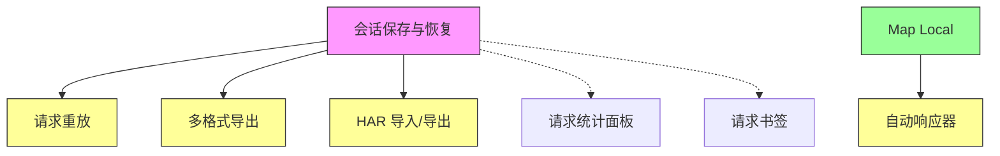

# PowerCatch 总体实施规划

> **更新日期**: 2026-06-27  
> **总功能数**: 32 | 已完成: 8 | 待实施: 24  
> **预估总工作量**: 约 40-50 人天

---

## 目录

1. [实施优先级矩阵](#1-实施优先级矩阵)
2. [阶段一：基础设施补齐](#2-阶段一基础设施补齐)
3. [阶段二：高价值功能完善](#3-阶段二高价值功能完善)
4. [阶段三：效率提升功能](#4-阶段三效率提升功能)
5. [阶段四：差异化特色功能](#5-阶段四差异化特色功能)
6. [阶段五：非功能性优化](#6-阶段五非功能性优化)
7. [依赖关系图](#7-依赖关系图)
8. [里程碑计划](#8-里程碑计划)

---

## 1. 实施优先级矩阵

### 按价值/工作量排序

| 优先级 | 功能 | 工作量 | 依赖 | 价值 | 阶段 |
|--------|------|--------|------|------|------|
| P0 | #3 会话保存与恢复 | 小 | 无 | 🔥 基础 | 一 |
| P0 | #4 大响应体处理 | 小 | 无 | 🔥 基础 | 一 |
| P1 | #10 自动响应器 | 小 | #7✅ | 🔥 高 | 二 |
| P1 | #16 DNS 覆盖 | 小 | 无 | 💡 中 | 二 |
| P1 | #19 单请求 AI 分析 | 小 | 无 | 🌟 亮点 | 二 |
| P2 | #8 请求重放 & 编辑重发 | 小 | #3 | 🔥 高 | 三 |
| P2 | #11 请求重写规则 | 中 | 无 | 🔥 高 | 三 |
| P2 | #21 多格式导出 | 小 | #3 | 🌟 中 | 三 |
| P2 | #22 HAR 导入/导出 | 小 | #3 | 🌟 中 | 三 |
| P2 | #23 GraphQL 感知 | 小 | 无 | 🌟 中 | 三 |
| P2 | #24 请求书签 / 收藏 | 小 | 无 | 🌟 中 | 三 |
| P3 | #13 带宽限流 / 网络节流 | 中 | 无 | 💡 中 | 四 |
| P3 | #15 WebSocket 抓包 | 中 | 无 | 💡 中 | 四 |
| P3 | #17 Cookie 管理器 | 中小 | 无 | 💡 中 | 四 |
| P3 | #18 上游代理链 | 中小 | 无 | 💡 中 | 四 |
| P3 | #20 请求统计面板 | 中 | 无 | 🌟 中 | 四 |
| P3 | #25 性能监控仪表盘 | 中 | 无 | 🌟 中 | 四 |
| P4 | #14 请求时间线 Waterfall | 中 | 打点 | 💡 中 | 五 |
| P4 | #26 多标签页 | 大 | 架构 | 🌟 中 | 五 |
| P5 | 搜索性能优化 | 中 | 无 | 🛠️ | 五 |
| P5 | 内存管理 | 中 | 无 | 🛠️ | 五 |
| P5 | 启动速度优化 | 中 | 无 | 🛠️ | 五 |
| P5 | 自动更新 | 中 | 无 | 🛠️ | 五 |
| P5 | SQLite 性能 | 中 | 无 | 🛠️ | 五 |
| P5 | 证书管理 UI | 中 | 无 | 🛠️ | 五 |

---

## 2. 阶段一：基础设施补齐（预计 2-3 天）

### #3 会话保存与恢复

**目标**: 用户可以保存当前抓包会话，下次打开时恢复

**具体步骤**:
1. **数据模型设计**
   - 在 `types.ts` 新增 `CaptureSession` 接口
   - 包含：sessionId, name, createdAt, requests[], filters, viewMode
   
2. **SQLite 扩展**
   - 在 `sqlite.ts` 新增 sessions 表
   - 实现 saveSession() / loadSession() / listSessions() / deleteSession()
   
3. **Store 扩展**
   - 在 `request-store.ts` 新增 session 相关 state 和 actions
   - 实现自动保存（可选）和手动保存
   
4. **UI 实现**
   - 新增 `SessionManager.vue` 组件
   - 在工具栏添加"会话"入口
   - 支持：保存、加载、删除、重命名

**预期目标**:
- 用户可手动保存当前会话
- 用户可从列表中加载历史会话
- 加载后恢复所有请求数据和过滤状态

**完成标准**:
- [ ] sessions 表创建成功
- [ ] 保存功能正常（包含所有请求数据）
- [ ] 加载功能正常（恢复请求列表和过滤状态）
- [ ] 会话列表 UI 正常显示
- [ ] 删除/重命名功能正常

---

### #4 大响应体处理

**目标**: 超过 5MB 的响应体自动截断，避免内存溢出

**具体步骤**:
1. **mitm-server.ts 修改**
   - 在响应拦截时检查 body 大小
   - 超过 5MB 时截断并标记 `isTruncated: true`
   - 保留前 5MB 数据 + 截断提示
   
2. **types.ts 扩展**
   - CaptureRequest 新增 `isTruncated: boolean`
   - 新增 `truncatedSize: number`
   
3. **RequestDetail.vue 修改**
   - 检测 `isTruncated` 状态
   - 显示截断提示："响应体过大（XX MB），仅显示前 5MB"
   - 添加"加载完整内容"按钮（按需加载）
   
4. **按需加载实现**
   - 新增 IPC 通道 `request:getFullBody`
   - 点击按钮时从数据库读取完整内容
   - 显示加载状态

**预期目标**:
- 大响应体不再导致内存溢出
- 用户可按需查看完整内容
- 列表滚动保持流畅

**完成标准**:
- [ ] 5MB 以上响应体自动截断
- [ ] 截断提示正确显示
- [ ] "加载完整内容"按钮可用
- [ ] 按需加载后显示完整内容
- [ ] 内存占用保持稳定

---

## 3. 阶段二：高价值功能完善（预计 3-4 天）

### #10 自动响应器（Auto Responder）

**目标**: 不请求真实服务器，直接返回本地规则配置的响应

**具体步骤**:
1. **数据模型**
   - 新增 `AutoResponderRule` 接口
   - 包含：id, name, enabled, matchPattern, responseType, responseBody, statusCode, delay
   
2. **匹配引擎**
   - 新增 `auto-responder-matcher.ts`
   - 支持 URL 通配符匹配
   - 支持正则表达式匹配
   
3. **mitm-server.ts 修改**
   - 在请求拦截流程中添加 Auto Responder 检查
   - 优先级：断点 > Auto Responder > Map Local > Map Remote
   - 匹配成功时直接返回配置的响应
   
4. **Store + UI**
   - 新增 `auto-responder-store.ts`
   - 新增 `AutoResponderRules.vue` 规则管理 UI
   - 入口：工具下拉菜单

**预期目标**:
- 用户可配置规则，匹配的请求不发送到服务器
- 支持自定义状态码、响应头、响应体
- 支持延迟模拟

**完成标准**:
- [ ] 规则匹配正确
- [ ] 自定义响应返回正确
- [ ] 延迟模拟生效
- [ ] 规则管理 UI 完整
- [ ] 规则持久化到 SQLite

---

### #16 DNS 覆盖

**目标**: 代理层域名指向自定义 IP，不改 hosts 文件

**具体步骤**:
1. **数据模型**
   - 新增 `DnsOverride` 接口
   - 包含：id, domain, targetIp, enabled
   
2. **mitm-server.ts 修改**
   - 在建立代理连接前检查 DNS 覆盖规则
   - 使用自定义 IP 替代 DNS 解析结果
   
3. **Store + UI**
   - 新增 `dns-override-store.ts`
   - 新增 `DnsOverrideRules.vue` 规则管理 UI
   - 入口：工具下拉菜单

**预期目标**:
- 用户可配置域名→IP 映射
- 代理请求使用自定义 IP
- 不影响系统 hosts 文件

**完成标准**:
- [ ] DNS 覆盖规则生效
- [ ] 请求确实发送到自定义 IP
- [ ] 规则管理 UI 完整
- [ ] 规则持久化到 SQLite

---

### #19 单请求 AI 分析

**目标**: 右键单个请求，一键调 AI 分析错误原因

**具体步骤**:
1. **Prompt 设计**
   - 新增 `single-request-analysis.md` prompt 模板
   - 输入：请求 URL、方法、Headers、Body、响应状态码、响应体
   - 输出：错误原因分析、修复建议、相关文档链接
   
2. **后端服务**
   - 在 `ai-analyze-service.ts` 新增 analyzeSingleRequest()
   - 复用现有 AI 配置（API Key、模型选择）
   
3. **前端集成**
   - 在 `RequestContextMenu.vue` 添加"AI 分析"菜单项
   - 在 `RequestDetail.vue` 添加"AI 分析"按钮
   - 新增分析结果弹窗/侧边栏
   
4. **结果展示**
   - 复用 AI 分析结果的 Markdown 渲染
   - 支持复制分析结果

**预期目标**:
- 右键即可分析单个请求
- AI 给出错误原因和修复建议
- 分析结果可复制

**完成标准**:
- [ ] 右键菜单显示"AI 分析"
- [ ] 点击后调用 AI 分析
- [ ] 分析结果正确显示
- [ ] 结果可复制
- [ ] 错误处理完善（无 API Key 等）

---

## 4. 阶段三：效率提升功能（预计 5-6 天）

### #8 请求重放 & 编辑重发

**依赖**: #3 会话保存与恢复

**目标**: 右键请求可直接重发，或编辑参数后重发

**具体步骤**:
1. **cURL 生成**
   - 新增 `curl-generator.ts`（已有基础）
   - 从 CaptureRequest 生成完整 cURL 命令
   
2. **重放引擎**
   - 新增 `replay-service.ts`
   - 使用 Node.js http/https 模块发送请求
   - 支持修改 URL、Headers、Body
   
3. **编辑 UI**
   - 新增 `ReplayDialog.vue`
   - 预填原始请求参数
   - 支持修改后发送
   
4. **入口集成**
   - 右键菜单："重放请求"、"编辑后重放"
   - RequestDetail 页面："重放"按钮

**预期目标**:
- 一键重放请求
- 可编辑参数后重发
- 显示重放结果对比

**完成标准**:
- [ ] cURL 生成正确
- [ ] 重放功能正常
- [ ] 编辑 UI 完整
- [ ] 重放结果正确显示

---

### #11 请求重写规则

**目标**: 持久化自动修改匹配请求的 URL/Header/Body/Status

**具体步骤**:
1. **数据模型**
   - 新增 `RewriteRule` 接口
   - 包含：id, name, enabled, location, match, action, value
   
2. **匹配引擎**
   - 新增 `rewrite-matcher.ts`
   - 支持 URL/Host/Path/Query/Header/Body 匹配
   - 支持 Add/Remove/Replace/Modify 操作
   
3. **mitm-server.ts 修改**
   - 在请求/响应处理流程中添加重写检查
   - 按规则顺序执行重写操作
   
4. **Store + UI**
   - 新增 `rewrite-store.ts`
   - 新增 `RewriteRules.vue` 规则管理 UI
   - 支持规则排序

**预期目标**:
- 自动重写匹配的请求
- 支持多种匹配位置和操作
- 规则可排序

**完成标准**:
- [ ] 规则匹配正确
- [ ] 重写操作生效
- [ ] 规则管理 UI 完整
- [ ] 规则持久化到 SQLite

---

### #21 多格式导出

**依赖**: #3

**目标**: 支持导出为 cURL、Postman Collection、JMeter 脚本

**具体步骤**:
1. **cURL 导出**（已有基础）
   - 完善 cURL 生成（处理特殊字符、编码）
   
2. **Postman Collection 导出**
   - 新增 `postman-exporter.ts`
   - 生成 Postman Collection v2.1 格式 JSON
   
3. **JMeter 导出**
   - 新增 `jmeter-exporter.ts`
   - 生成 JMX 格式文件
   
4. **UI 集成**
   - 在导出按钮下拉菜单中添加格式选项
   - 支持批量导出

**预期目标**:
- 支持 3 种导出格式
- 导出文件可直接使用
- 支持批量导出

**完成标准**:
- [ ] cURL 导出正确
- [ ] Postman Collection 可导入
- [ ] JMeter JMX 可运行
- [ ] 批量导出正常

---

### #22 HAR 导入/导出

**依赖**: #3

**目标**: 兼容 Chrome DevTools HAR 格式

**具体步骤**:
1. **HAR 导出**
   - 新增 `har-exporter.ts`
   - 生成 HAR 1.2 规范格式 JSON
   
2. **HAR 导入**
   - 新增 `har-importer.ts`
   - 解析 HAR 文件并转换为 CaptureRequest
   
3. **UI 集成**
   - 添加"导入 HAR"按钮
   - 添加"导出 HAR"选项

**预期目标**:
- 导出的 HAR 可在 Chrome DevTools 中打开
- 可导入 Chrome DevTools 导出的 HAR

**完成标准**:
- [ ] HAR 导出符合规范
- [ ] HAR 导入正确解析
- [ ] 导入后请求列表正确显示

---

### #23 GraphQL 感知

**目标**: 识别 GraphQL 请求，按 operation name 分组

**具体步骤**:
1. **检测引擎**
   - 新增 `graphql-detector.ts`
   - 检测 Content-Type: application/json
   - 解析 body 中的 query/operationName 字段
   
2. **tree-builder.ts 修改**
   - GraphQL 请求按 operationName 分组
   - 显示 operation 类型（query/mutation/subscription）
   
3. **RequestDetail.vue 增强**
   - GraphQL 请求显示专属 UI
   - 展示 query、variables、operationName

**预期目标**:
- 自动识别 GraphQL 请求
- 按 operation name 分组显示
- 详情页展示 GraphQL 特有信息

**完成标准**:
- [ ] GraphQL 请求正确识别
- [ ] 分组显示正确
- [ ] 详情页 GraphQL UI 正常

---

### #24 请求书签 / 收藏

**目标**: 标记常用接口快速定位

**具体步骤**:
1. **数据模型**
   - CaptureRequest 新增 `bookmarked: boolean`
   - 新增 `bookmarks` 表（SQLite）
   
2. **request-store.ts 扩展**
   - 新增 toggleBookmark() action
   - 新增 bookmarkedRequests getter
   
3. **UI 集成**
   - 请求列表添加书签图标
   - 过滤面板添加"仅显示书签"选项
   - 右键菜单添加"添加书签"

**预期目标**:
- 一键添加/取消书签
- 可过滤只显示书签请求
- 书签持久化

**完成标准**:
- [ ] 书签切换正常
- [ ] 过滤功能正常
- [ ] 书签持久化到 SQLite

---

## 5. 阶段四：效率与监控功能（预计 6-8 天）

### #13 带宽限流 / 网络节流

**目标**: 模拟 3G/4G/弱网环境

**具体步骤**:
1. **节流引擎**
   - 新增 `throttle-service.ts`
   - 实现延迟注入（通过 setTimeout）
   - 实现带宽限制（通过 chunk 控制）
   
2. **mitm-server.ts 修改**
   - 在请求/响应处理中应用节流配置
   - 支持按域名配置不同节流策略
   
3. **预设配置**
   - 3G: 750kbps, 100ms RTT
   - 4G: 4Mbps, 50ms RTT
   - WiFi: 30Mbps, 10ms RTT
   - Offline: 0kbps
   
4. **UI**
   - 新增 `ThrottleSettings.vue`
   - 在工具栏添加节流开关
   - 支持自定义配置

**预期目标**:
- 模拟不同网络环境
- 支持自定义带宽和延迟
- 按域名配置不同策略

**完成标准**:
- [ ] 节流生效（延迟可测）
- [ ] 预设配置正确
- [ ] 自定义配置可用
- [ ] 按域名配置正常

---

### #15 WebSocket 抓包

**目标**: 捕获 WS/WSS 消息（帧级别）

**具体步骤**:
1. **mitm-server.ts 扩展**
   - 拦截 WebSocket 升级请求
   - 捕获所有 WS 帧（text/binary/ping/pong/close）
   
2. **数据模型**
   - 新增 `WebSocketMessage` 接口
   - 包含：id, requestId, direction, type, data, timestamp
   
3. **UI**
   - 新增 `WebSocketViewer.vue`
   - 显示消息列表（按时间排序）
   - 支持过滤（按方向、类型）
   - 消息详情展示

**预期目标**:
- 捕获所有 WebSocket 消息
- 显示消息方向和内容
- 支持过滤和搜索

**完成标准**:
- [ ] WS 升级请求被捕获
- [ ] 消息帧正确记录
- [ ] UI 显示正确
- [ ] 过滤功能正常

---

### #17 Cookie 管理器

**目标**: 按域名查看/编辑/删除 Cookie

**具体步骤**:
1. **数据模型**
   - 新增 `CookieEntry` 接口
   - 包含：name, value, domain, path, expires, httpOnly, secure
   
2. **Cookie 提取**
   - 从请求/响应头中提取 Cookie
   - 按域名分组存储
   
3. **UI**
   - 新增 `CookieManager.vue`
   - 按域名树形展示
   - 支持查看/编辑/删除
   - 支持导入导出 Cookie Jar

**预期目标**:
- 按域名查看所有 Cookie
- 支持编辑和删除
- 支持导入导出

**完成标准**:
- [ ] Cookie 正确提取
- [ ] 按域名分组显示
- [ ] 编辑/删除功能正常
- [ ] 导入导出正常

---

### #18 上游代理链

**目标**: 转发到上级代理，串联双层抓包

**具体步骤**:
1. **配置模型**
   - 新增 upstream proxy 配置
   - 包含：host, port, auth（可选）
   
2. **mitm-server.ts 修改**
   - 代理请求时使用上游代理
   - 支持 HTTP/HTTPS/SOCKS5
   
3. **UI**
   - 在设置页添加上游代理配置
   - 支持开关和测试连接

**预期目标**:
- 请求通过上游代理转发
- 支持多种代理协议
- 可配置认证信息

**完成标准**:
- [ ] 上游代理转发正常
- [ ] 多协议支持
- [ ] 认证功能正常
- [ ] 配置 UI 完整

---

### #20 请求统计面板

**目标**: 域名/状态码/响应时间聚合图表

**具体步骤**:
1. **统计引擎**
   - 新增 `stats-service.ts`
   - 按域名、状态码、时间范围聚合
   - 计算平均响应时间、错误率等
   
2. **UI**
   - 新增 `StatsView.vue`（新路由 `/stats`）
   - 图表：域名分布饼图、状态码柱状图、响应时间折线图
   - 使用 Chart.js 或 ECharts
   
3. **入口**
   - 工具栏添加"统计"按钮
   - 或在主界面添加统计 Tab

**预期目标**:
- 可视化展示请求统计
- 支持多维度分析
- 图表可交互

**完成标准**:
- [ ] 统计数据正确
- [ ] 图表显示正常
- [ ] 交互功能正常
- [ ] 性能良好（大数据量）

---

### #25 性能监控仪表盘

**目标**: 监控应用内存/CPU/请求速率

**具体步骤**:
1. **数据采集**
   - 在主进程采集内存/CPU 使用率
   - 统计请求速率、数据库大小
   
2. **IPC 通信**
   - 新增 IPC 通道获取性能数据
   - 定时刷新（每秒）
   
3. **UI**
   - 新增 `PerformanceMonitor.vue`
   - 实时图表展示
   - 支持告警阈值配置

**预期目标**:
- 实时监控应用性能
- 可视化展示
- 告警功能

**完成标准**:
- [ ] 数据采集正确
- [ ] 实时刷新正常
- [ ] 图表显示正常
- [ ] 告警功能正常

---

## 6. 阶段五：架构级功能与非功能性优化（预计 8-10 天）

### #14 请求时间线（Waterfall）

**目标**: 瀑布图展示 DNS/TTFB/下载时间分布

**具体步骤**:
1. **数据采集**
   - 在 mitm-server.ts 打点记录各阶段时间
   - DNS 解析、TCP 连接、TLS 握手、TTFB、内容下载
   
2. **UI**
   - 新增 `WaterfallView.vue`
   - 瀑布图展示各阶段耗时
   - 支持缩放和筛选

**预期目标**:
- 清晰展示请求各阶段耗时
- 支持缩放查看详情
- 可对比多个请求

**完成标准**:
- [ ] 时间数据采集正确
- [ ] 瀑布图显示正常
- [ ] 交互功能正常

---

### #26 多标签页

**目标**: 多抓包会话 Tab 对比

**具体步骤**:
1. **架构改造**
   - Store 支持多实例
   - 每个 Tab 独立的请求列表和状态
   
2. **UI**
   - 标签栏组件
   - 标签切换逻辑
   - 标签拖拽排序

**预期目标**:
- 支持多个并行会话
- 标签可切换、关闭、拖拽
- 每个标签独立状态

**完成标准**:
- [ ] 多标签创建正常
- [ ] 标签切换正常
- [ ] 状态隔离正确
- [ ] 性能良好

---

### 非功能性需求

#### 搜索性能优化
- 实现万级请求索引
- 使用 Web Worker 进行搜索
- 搜索结果分页加载

#### 内存管理
- 长时间录制内存泄漏检测
- 自动清理过期请求
- 虚拟列表优化

#### 启动速度优化
- 冷启动 <3s
- 懒加载非关键模块
- 预加载常用资源

#### 自动更新
- 集成 Electron updater
- 后台下载更新包
- 提示用户安装

#### SQLite 性能
- WAL 模式优化
- 索引优化
- 批量插入优化

#### 证书管理 UI
- 一键安装 CA 证书
- 一键信任证书
- 导出证书文件

---

## 7. 依赖关系图

---

## 8. 里程碑计划

| 里程碑 | 包含功能 | 预计时间 | 累计完成 |
|--------|---------|---------|---------|
| v1.1 | #3, #4, #10, #16, #19 | 1 周 | 13/32 (41%) |
| v1.2 | #8, #11, #21, #22, #23, #24 | 2 周 | 19/32 (59%) |
| v1.3 | #13, #15, #17, #18, #20, #25 | 2 周 | 25/32 (78%) |
| v2.0 | #14, #26 + 非功能性 | 2 周 | 32/32 (100%) |

---

## 附录：实施建议

### 开发顺序建议

1. **先做 #3 会话保存** — 解锁 #8, #21, #22 三个功能
2. **再做 #4 大响应体** — 提升基础体验
3. **然后 #10, #16, #19** — 小工作量高价值
4. **批量实现 P2 功能** — 互相独立，可并行
5. **最后做架构级功能** — #14, #26 需要较多设计

### 技术风险提示

| 风险 | 影响 | 缓解措施 |
|------|------|----------|
| WebSocket 拦截复杂 | #15 延期 | 先实现基础文本帧 |
| 多标签页架构改造 | #26 延期 | 最后实现，充分设计 |
| 性能监控精度 | #25 不准 | 使用 Electron API |
