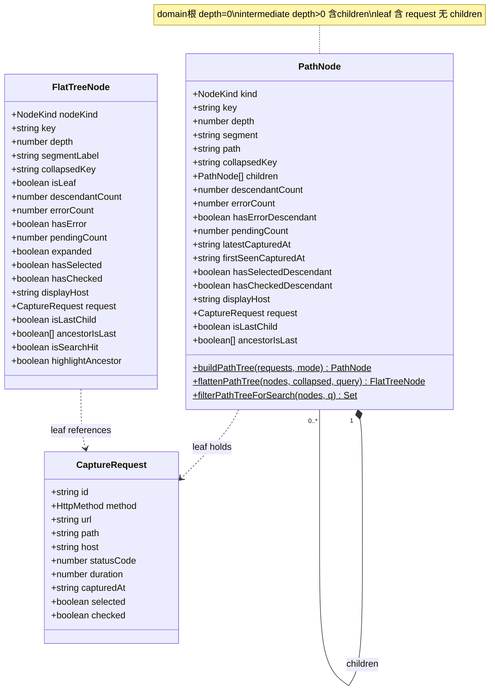
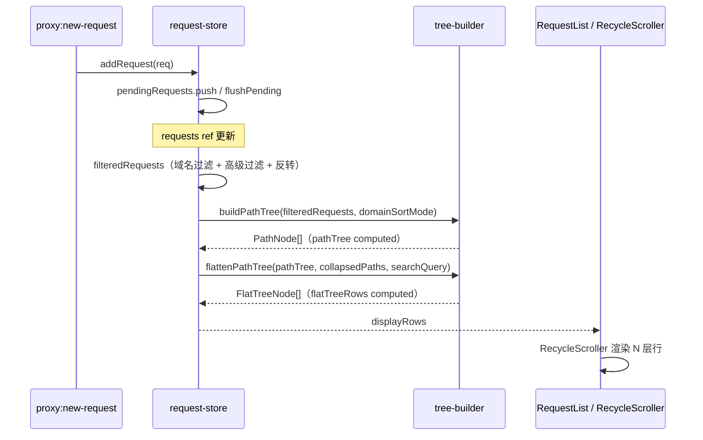
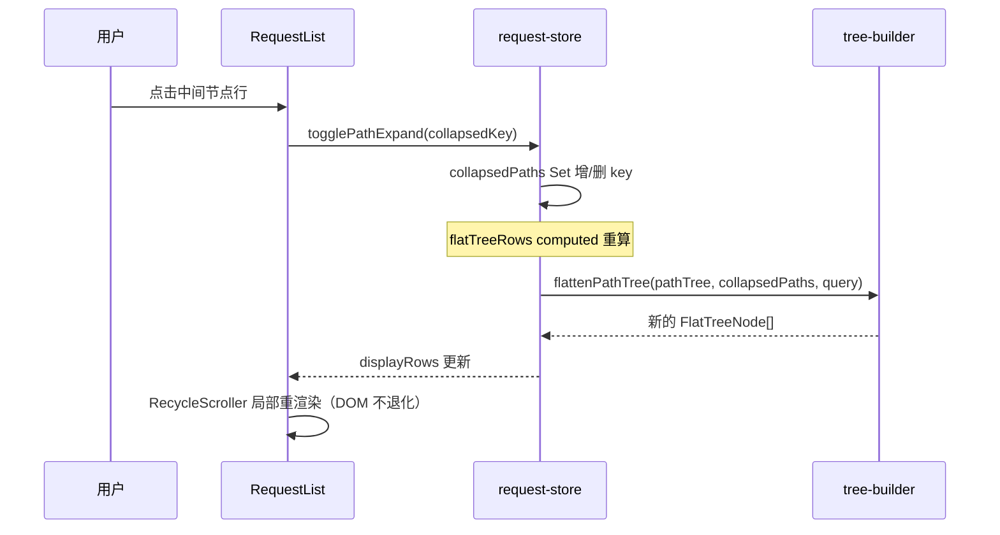
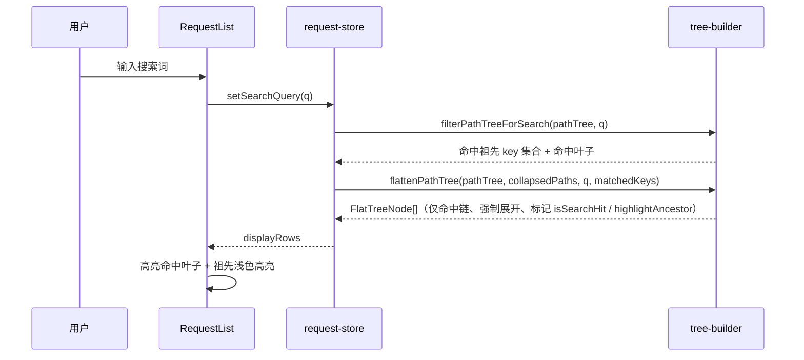
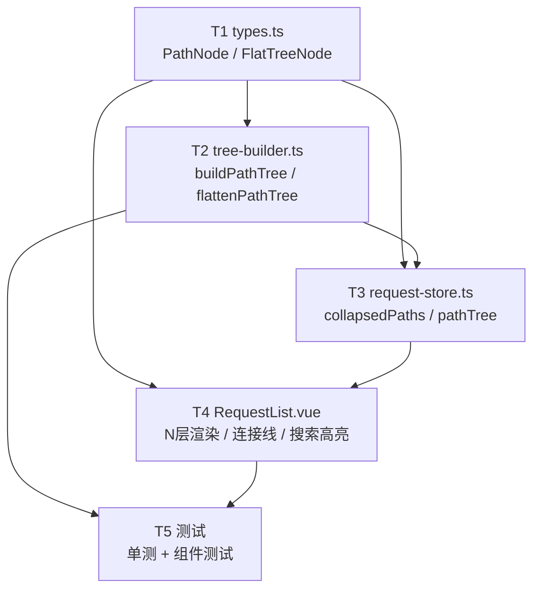

# PowerCatch「Structure 路径递归树」系统架构设计 + 任务分解

> 设计人：高见远（软件架构师） ｜ 范围：Structure（group）模式从「按域名 host 分组、同域名扁平请求列表」改为「按 URL 路径段递归展开的树状结构」
> 目标：先出实现方案与设计，**暂不编码**（下文仅含类型签名 / 伪代码示意，不落地业务源码）

---

## 1. 实现方案 + 框架选型

### 1.1 现有实现关键事实（已读源码确认）

| 文件 | 现状要点 |
|------|----------|
| `src/services/types.ts` | `DomainNode` 严格两层：`type:'domain'` + `children: CaptureRequest[]`；`FlatTreeNode.type: 'domain'\|'request'`、`depth`、`host`、`displayHost`、`count`、`hasError`、`pendingCount`、`expanded`、`hasSelected`、`hasChecked`、`request`。`TreeNodeType = 'domain'\|'request'`。 |
| `src/utils/tree-builder.ts` | `buildDomainTree(requests, sortMode)` 按 host 分组 + 单次遍历统计 + `sortDomains()`；`flattenTree(domains, collapsedDomains, searchQuery)` 仅 2 层（domain depth 0 / request depth 1）；`matchSearch(req, query)` 匹配 path/method/statusCode/host(带协议)。 |
| `src/stores/request-store.ts` | `collapsedDomains: Set<string>` **key=host**；`groupedTreeRequests` computed = `buildDomainTree(...)`；`flatTreeRows` computed = `flattenTree(groupedTreeRequests, collapsedDomains, searchQuery)`；`toggleDomainExpand(host)` / `isDomainExpanded(host)` / `expandAllDomains()` / `collapseAllDomains()`；`displayRows` 在 list/group 间切换。 |
| `src/components/RequestList.vue` | `RecycleScroller :items="displayRows"`；domain 行点击 → `toggleDomainExpand(item.host!)`；request 行 `:style="{ paddingLeft: item.depth * 20 + 8 }"`；行内含 checkbox + method 徽标 + path + 时间 + status + duration + deviceName + host（仅 depth 0）；右键菜单保留。 |

### 1.2 技术难点

1. `DomainNode` 仅两层，需升级为 **N 层递归**（`host → 路径段 → … → 叶子请求`）。
2. 虚拟滚动（`RecycleScroller`）只能消费**扁平数组**，故「递归树」必须再扁平化为 `FlatTreeNode[]`，且折叠集合要在扁平化阶段应用。
3. 折叠 key 从 `host` 升级为 **`host + 路径段组合`**，保证每一层中间节点都能独立折叠/展开。
4. 连接线（Charles 风格 `├─ / └─ / │`）在 N 层下要对齐 —— 字符在比例字体下易错位 → **倾向 CSS border 方案**。
5. 搜索时祖先链自动展开 + 高亮，且不能破坏虚拟滚动（DOM 不退化成整树）。
6. 排序语义收窄：根域名可排序，中间层固定字母序、叶子固定时间倒序。

### 1.3 框架选型

**沿用现有栈，不引入新依赖**：Vue3 + TypeScript + Tailwind CSS + `vue-virtual-scroller`（`RecycleScroller`）。

- **树构建**：纯函数 `buildPathTree()`（递归 trie 插入，自底向上聚合统计）+ `flattenPathTree()`（N 层 DFS 扁平化，应用折叠集合 + 搜索过滤）。
- **渲染**：保留 `RecycleScroller`，`displayRows` 改为 `FlatTreeNode[]`（N 层 `depth`）。
- **连接线**：**CSS border 方案（推荐）**；字符方案 `│ ├─ └─` 作为备选（仅当 CSS 对齐出现问题时）。
- **无需新增 npm 包**。

### 1.4 核心思路（一句话）

**递归构建 + 扁平化后虚拟滚动**（与现有「2 层」模式一致，仅把层数从 2 扩展为 N）。

```
CaptureRequest[]
  → buildPathTree()          // 递归 PathNode 树（host → segment → … → leaf）
  → flattenPathTree()        // 应用折叠集合 + 搜索过滤 → FlatTreeNode[]（N 层 depth）
  → RecycleScroller          // 虚拟滚动渲染
```

---

## 2. 文件列表及相对路径

| 操作 | 文件 | 说明 |
|------|------|------|
| 修改 | `src/services/types.ts` | 新增 `PathNode`、`NodeKind`、`PathSortMode`；扩展 `FlatTreeNode`、`TreeNodeType`；新增 `pathKey()` 工具类型 |
| 修改 | `src/utils/tree-builder.ts` | 新增 `buildPathTree()`、`flattenPathTree()`（N 层）、`filterPathTreeForSearch()`；保留 `buildDomainTree`/`flattenTree` 作兼容（确认无引用后可删除） |
| 新增 | `src/utils/url-segment-parser.ts` | `parsePathSegments(url)`：抽取路径段（处理 query / method 决策），供 tree-builder 调用 |
| 修改 | `src/stores/request-store.ts` | `collapsedPaths: Set<string>` 替换 `collapsedDomains`；`pathTree` computed 替换 `groupedTreeRequests`；`flatTreeRows` 改用 path 树；`togglePathExpand` / `isPathExpanded` / `expandAllPaths` / `collapseAllPaths`；`displayRows` 适配 |
| 修改 | `src/components/RequestList.vue` | N 层渲染、三种行（domain / intermediate / leaf）、连接线、搜索高亮祖先链；排序下拉语义收窄为「域名根排序」 |
| 新增 | `src/components/RequestTreeRow.vue` | （推荐）抽取单行渲染，承载三种节点 + 连接线，便于组件测试 |
| 新增 | `src/utils/__tests__/tree-builder.spec.ts` | tree-builder 单测 |
| 新增 | `src/components/__tests__/RequestTreeRow.spec.ts` | 组件测试 |

> 注：`DomainNode` / `buildDomainTree` / `flattenTree` / `collapsedDomains` 在迁移期保留，避免连带破坏；`RequestTreeRow.vue` 为可选项，但强烈建议抽取（见 §7 测试）。

---

## 3. 数据结构和接口

### 3.1 类型定义（签名示意，非实现）

```ts
// === 节点类型判别（统一字段，避免散落判断）===
export type NodeKind = 'domain' | 'intermediate' | 'leaf'

// 根域名排序语义（中间层固定字母序、叶子固定时间倒序，不受此影响）
export type PathSortMode = DomainSortMode // 复用 'latest' | 'count' | 'alphabetical' | 'firstSeen'

// === 递归路径树节点 ===
export interface PathNode {
  kind: NodeKind                 // 'domain' | 'intermediate' | 'leaf'
  key: string                    // 全局唯一：
                                  //   domain    = `domain:${host}`
                                  //   intermediate = `path:${host}/${segs}`
                                  //   leaf      = request.id
  depth: number                  // 0 = 域名根
  segment: string                // 展示标签：domain=host；intermediate=本段；leaf=末段路径
  path: string                   // 从根累计路径（如 host + '/sl/apps'），用于折叠 key
  collapsedKey: string           // = pathKey(host, segments)；domain 根 = host
  children: PathNode[]           // leaf 为空数组
  // —— 聚合统计（domain / intermediate）——
  descendantCount?: number      // 后代请求总数
  errorCount?: number            // 错误后代数（徽标）
  hasErrorDescendant?: boolean
  pendingCount?: number          // statusCode === null 的后代数
  latestCapturedAt?: string
  firstSeenCapturedAt?: string   // 首次出现顺序（新增请求不改变，保证稳定）
  hasSelectedDescendant?: boolean
  hasCheckedDescendant?: boolean
  displayHost?: string           // domain 根带协议前缀
  // —— 叶子独有 ——
  request?: CaptureRequest
  // —— 扁平化时计算（连接线用）——
  isLastChild?: boolean
  ancestorIsLast?: boolean[]     // 各祖先是否为末子，长度 = depth
}

// === 扁平化行（虚拟滚动消费）===
export interface FlatTreeNode {
  nodeKind: NodeKind
  key: string
  depth: number
  segmentLabel: string
  collapsedKey: string
  isLeaf: boolean
  // 聚合（domain / intermediate）
  descendantCount?: number
  errorCount?: number
  hasError?: boolean
  pendingCount?: number
  expanded?: boolean
  hasSelected?: boolean
  hasChecked?: boolean
  displayHost?: string
  // 叶子
  request?: CaptureRequest
  // 连接线（CSS 方案数据）
  isLastChild?: boolean
  ancestorIsLast?: boolean[]
  // 搜索
  isSearchHit?: boolean          // 自身命中
  highlightAncestor?: boolean    // 作为命中祖先被高亮
}

// === 折叠 key 生成（跨文件共享约定）===
export function pathKey(host: string, segments: string[]): string {
  return segments.length ? `${host}/${segments.join('/')}` : host
}
```

### 3.2 与现有 `DomainNode` 的关系（推荐路径）

**新增 `PathNode` 体系（`buildPathTree` / `flattenPathTree`），与 `DomainNode` 并存；Structure 模式切到 `PathNode` 树；`DomainNode` / `buildDomainTree` / `flattenTree` 保留至确认无引用后删除（或保留为「按域名聚合」备选视图）。**

- 理由：用户明确「改为」路径树；并存可做到零风险迁移，且若后续仍想提供「按域名」传统视图可复用 `DomainNode`。
- `FlatTreeNode` 通过新增 `nodeKind` / `segmentLabel` / `isLeaf` / `collapsedKey` 字段向后兼容；建议把 `TreeNodeType` 扩展为 `'domain' | 'intermediate' | 'leaf'`（原 `'request'` 语义并入 `'leaf'`）。`type` 字段可保留但不再作为主判别依据，统一用 `nodeKind`。

### 3.3 类图（Mermaid）



---

## 4. 程序调用流程（时序图）

### 4.1 新请求 → 树构建 → 渲染



### 4.2 展开 / 折叠



### 4.3 搜索（祖先链展开 + 高亮）



---

## 5. 任务列表（有序、含依赖关系）

> 约束对齐：按「≤5 任务」硬上限，将示例中的 T5（搜索祖先链展开+高亮）并入 **T4**（搜索高亮本就是渲染层职责）；测试独立为 **T5**。整体为分层依赖链，符合「数据层 → 存储层 → 视图层 → 测试」的自然顺序。

| 任务 | 名称 | 来源文件 | 依赖 | 优先级 |
|------|------|----------|------|--------|
| **T1** | `types.ts`：新增 `PathNode` / 扩展 `FlatTreeNode`（`nodeKind`/`segmentLabel`/`isLeaf`/`collapsedKey` 等）/ `NodeKind` / `pathKey()` | `src/services/types.ts` | — | P0 |
| **T2** | `tree-builder.ts`：新增 `buildPathTree()`（递归 trie + 自底向上聚合）+ `flattenPathTree()`（N 层 DFS 扁平化）+ `filterPathTreeForSearch()`；新增 `url-segment-parser.ts` | `src/utils/tree-builder.ts`、`src/utils/url-segment-parser.ts` | T1 | P0 |
| **T3** | `request-store.ts`：`collapsedPaths` 改造（key=host+path）+ `pathTree` computed（替换 `groupedTreeRequests`）+ `flatTreeRows` 改用 path 树 + `togglePathExpand` / `isPathExpanded` / `expandAllPaths` / `collapseAllPaths` + `displayRows` 适配 | `src/stores/request-store.ts` | T1, T2 | P0 |
| **T4** | `RequestList.vue` + `RequestTreeRow.vue`：N 层渲染 + 连接线（CSS）+ 三种行（domain/intermediate/leaf）+ 选中/勾选/右键 + **搜索祖先链自动展开与高亮** | `src/components/RequestList.vue`、`src/components/RequestTreeRow.vue` | T1, T3 | P0/P1 |
| **T5** | 测试：`tree-builder` 单测（`buildPathTree` / `flattenPathTree` / `filterPathTreeForSearch`）+ `RequestTreeRow` 组件测试（三种节点 / 连接线 / 折叠 / 选中勾选） | `src/utils/__tests__/tree-builder.spec.ts`、`src/components/__tests__/RequestTreeRow.spec.ts` | T2, T4 | P1 |

### 5.1 任务依赖图（Mermaid）



---

## 6. 依赖包列表

- **本次无需新增 npm 包。**
- 沿用现有依赖：`vue`、`vue-virtual-scroller`、`pinia`、`tailwindcss`、`typescript`。
- 连接线用 **CSS border** 实现（或字符 `│ ├─ └─`），**不引入第三方树组件**（如 `vue-tree`、`element-plus tree`），以保持与现有 `RecycleScroller` 虚拟滚动一致。

---

## 7. 共享知识（跨文件约定）

1. **节点类型判别（单一事实来源）**：`nodeKind === 'leaf'` ⟺ 存在 `request`（或 `children.length === 0`）；`depth === 0` 为 `domain` 根；`depth > 0 且含 children` 为 `intermediate`。全代码统一用 `nodeKind` 字段判别，禁止散落 `type === 'request'` 等旧判断。
2. **depth → 缩进映射**：`padding-left = 8px + depth * 20px`（与现有 `depth*20+8` 对齐）。连接线 gutter 占前 `depth * 20px`，内容再加 `8px` base padding。
3. **连接线渲染（推荐 CSS）**：每个节点渲染 `depth` 个连接单元；对第 `i` 层（0..depth-1）：
   - 非父层（`i < depth-1`）：祖先是末子 → 留空；否则画竖线 `│`（CSS `border-left`）。
   - 父层（`i === depth-1`）：本节点是末子 → `└─`（横 tick + 无下竖）；否则 `├─`（横 tick + 下竖）。
   - 数据由 `ancestorIsLast: boolean[]` + `isLastChild` 在 **扁平化阶段** 计算提供。
   - 备选：直接渲染字符 `│` / `├─` / `└─`（比例字体下需等宽处理，不推荐为主方案）。
4. **折叠 key 生成规则（全局统一）**：`host + '/' + pathSegments.join('/')`（见 `pathKey()`）。域名根 key = `host`。持久化键名建议 `powercatch-collapsed-paths`（替代旧 `powercatch-collapsed-domains`）；旧格式不兼容，升级时直接清空（可接受，用户折叠态重置一次）。
5. **排序语义（树模式）**：
   - **域名根**：由 `domainSortMode`（latest / count / alphabetical / firstSeen）控制（下拉仅作用于根，文案改「域名根排序」）。
   - **中间层**：固定 **字母序**（asc）。
   - **叶子层**：固定 **捕获时间倒序**（newest first）。
   - 聚合统计（`descendantCount` / `hasErrorDescendant` / `errorCount` / `pendingCount` / `latestCapturedAt` / `firstSeenCapturedAt` / `hasSelectedDescendant` / `hasCheckedDescendant`）在 `buildPathTree` 中**自底向上**计算一次。
6. **叶子 key 唯一性**：叶子 `key = request.id`（非路径），同路径不同 method / query 的请求为同父下两个独立叶子行（label 相同、method 徽标不同），不冲突。
7. **搜索匹配复用 `matchSearch`**（path / method / statusCode / host 带协议）仅用于判定叶子是否命中；树结构维度只看 path 段（query / method 不入树，见 §8-3）。

---

## 8. 待明确事项（架构师推荐默认值 + 理由，最终由用户拍板）

| # | PRD 待确认问题 | 架构师推荐 | 理由 |
|---|----------------|-----------|------|
| 1 | 替换 vs 新增模式 | **替换为路径树**（Structure 模式 = `PathNode` 树）；`DomainNode` 暂留作兼容 / 备选「按域名」视图 | 用户明确「改为」；并存可零风险迁移，确认无引用后删除 |
| 2 | 默认展开层级 | **默认展开到 depth=1**（域名根 + 首层路径段可见），更深层折叠；**新捕获请求自动展开其完整祖先链**（保证可见，Charles 风格） | 避免深路径树初始爆炸；新请求自动 reveal 提升可用性 |
| 3 | query / method 是否入树 | **不入树**：树仅由 path 段构成；method 仅作叶子徽标；query 完全不入结构 | 同 path 不同 method 应并排而非分叉；query 多变，入树会极度碎片化 |
| 4 | 排序下拉保留与否 | **保留**，文案改为「域名根排序」；中间层 / 叶子层排序固定（见 §7-5） | 用户只需控制根排序；中间 / 叶子排序固定最直观 |
| 5 | 同 path 不同 method 区分 | 叶子以 `request.id` 为 key，同一父下多个叶子行并排展示（label 同、method 徽标异） | 不合并、不冲突，符合「同一接口不同动作」直觉 |
| 6 | 动态 ID 段通配折叠 | **默认不通配**（仅精确段合并）；「合并数字段」作为可选设置（P2 / 未来） | 自动通配会意外合并语义不同路径（如 `/orders/123` 与 `/orders/456`）；默认精确更安全 |
| 7 | 搜索行为 | 命中叶子 → **自动展开完整祖先链** + 高亮命中叶子；祖先链节点加浅色高亮；无命中分支整体隐藏 | 与现有 domain 搜索行为一致；祖先展开保证命中可见，高亮降低定位成本 |

### 8.1 额外架构建议（非 PRD 提问，但值得确认）

- **`buildPathTree` 性能**：每次 `filteredRequests` 变化都重建树，建议复用 `request.id` 稳定特征，仅在「新增 / 删除 / 响应更新」时增量更新（参考现有 `requestIndexMap` 思路）。首版可全量重建（请求量 ≤5000，trie 插入 O(n·平均段数) 可接受），后续按需增量。
- **`expandAllPaths` / `collapseAllPaths` 语义**：展开/折叠**所有中间节点**（含深层），而不仅是域名根——这与 P1「展开/折叠全部」一致。
- **右键菜单**：保留现有 `RequestContextMenu`，仅在叶子行触发（domain / intermediate 节点无右键菜单，或仅提供「复制路径」「折叠子树」等）。
- **对比勾选（≤2）**：沿用 `checkedRequests` + `toggleCheck()`，逻辑完全不变，仅入口从叶子行 checkbox 触发。
