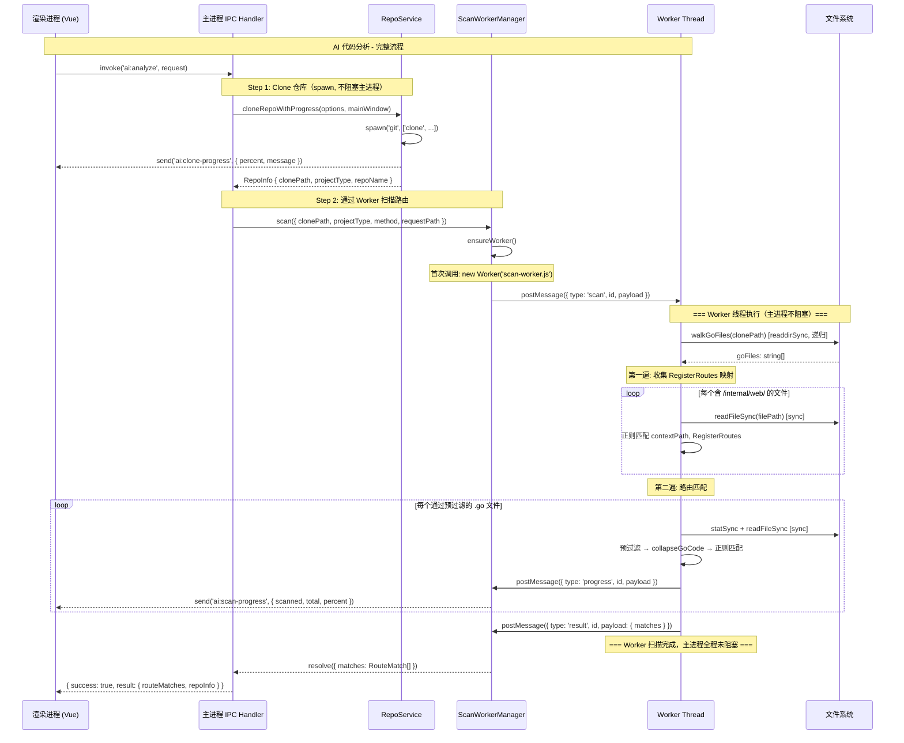
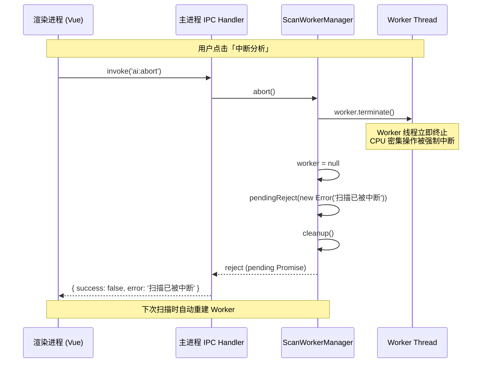
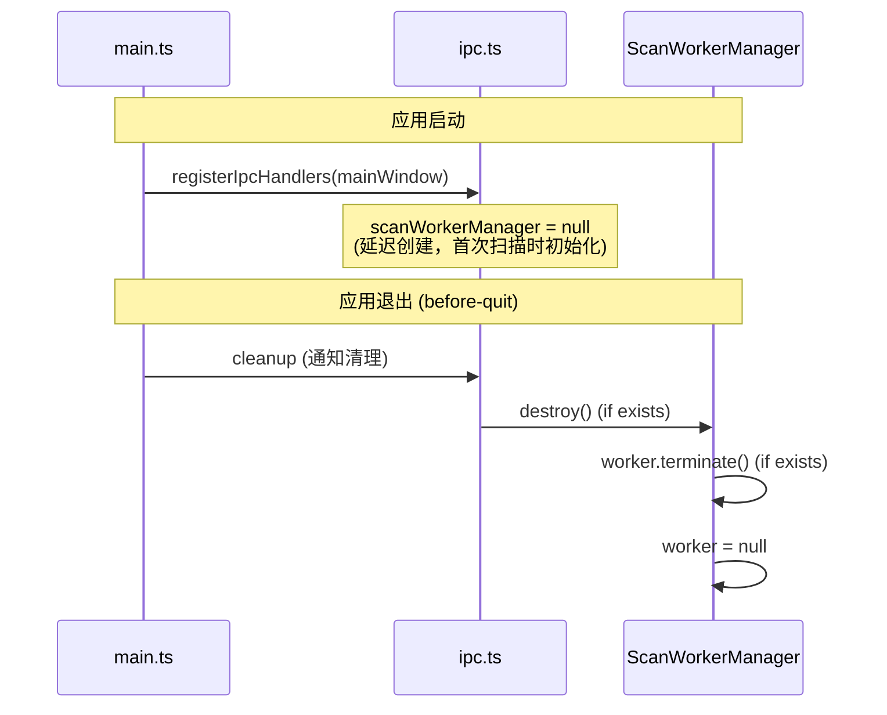
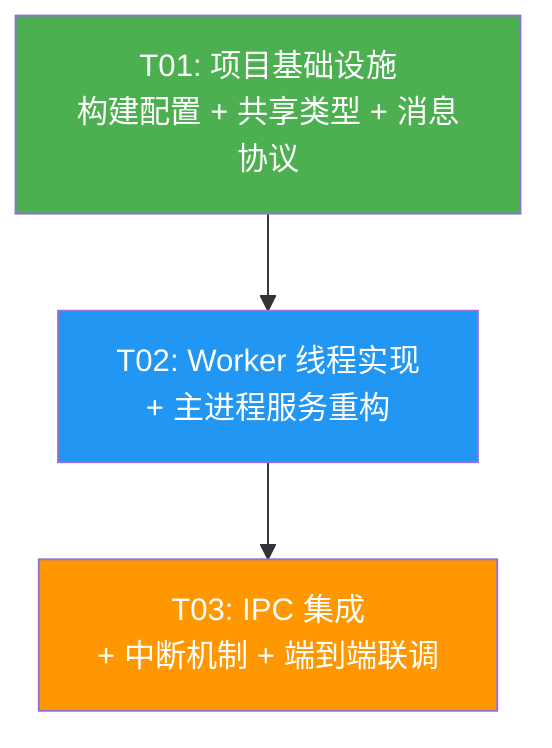

# PowerCatch Worker Thread 扫描架构设计

> 解决 AI 代码分析功能扫描过程中 UI 卡死问题  
> 架构师：Bob | 日期：2025-06-23

---

## Part A: System Design

### 1. 实现方案

#### 1.1 核心技术挑战

| 挑战 | 根因 | 影响 |
|------|------|------|
| CPU 密集型操作阻塞主进程 | `collapseGoCode` + 多个复杂正则在大字符串上执行，单次操作可达数十毫秒，期间主进程事件循环完全阻塞 | UI 卡死、鼠标繁忙、无法点击 |
| `setTimeout(0)` 让出无效 | 只在文件之间让出，单次 collapseGoCode + 正则匹配本身不可中断 | 增量修复 3 轮仍无法解决 |
| `findHandlerFile` 未 await | `walkGoFiles` 是 async 函数返回 Promise，但调用处未 await，`for...of` 遍历 Promise 对象 | 功能性 bug，遍历不执行 |
| `extractCallChain` 同步 I/O | 使用 `fs.readFileSync`、`fs.readdirSync`、`fs.statSync` 在主进程 | 加剧主进程阻塞 |
| 两遍扫描 | 第一遍收集 RegisterRoutes 映射，第二遍做路由匹配，每个通过预过滤的文件都做全文 collapseGoCode + 多正则 | CPU 开销翻倍 |

#### 1.2 方案选型：Node.js Worker Thread

**为什么选 Worker Thread 而非其他方案：**

| 方案 | 优点 | 缺点 | 结论 |
|------|------|------|------|
| Worker Thread (`worker_threads`) | Node.js 内置零依赖、真正隔离 CPU、可 `terminate()` 中断、可与主进程双向通信 | 需要处理消息序列化 | ✅ **选定** |
| Child Process | 完全隔离 | 进程创建开销大、通信复杂（stdin/stdout）、不适合频繁调用 | ❌ |
| 继续 `setTimeout(0)` 优化 | 改动小 | 已验证 3 轮无效，CPU 密集操作不可被事件循环让出中断 | ❌ |
| Web Worker（渲染进程） | 不影响主进程 | 渲染进程无 Node.js fs 模块访问权限、需要额外的 IPC 中转 | ❌ |

#### 1.3 架构模式

采用 **调度器-工作者（Dispatcher-Worker）模式**：

```
┌─────────────────────────────────────────────────────────┐
│                    渲染进程 (Vue3)                        │
│  AiAnalysisView.vue ←→ ai-analysis-store.ts (Pinia)     │
│         ↕ IPC (preload.ts)                              │
├─────────────────────────────────────────────────────────┤
│                  Electron 主进程                         │
│                                                         │
│  ┌─────────────┐   ┌──────────────────┐                │
│  │  ipc.ts     │   │  repo-service.ts │                │
│  │ AI_ANALYZE  │──→│  cloneRepo()     │ (spawn, 不阻塞) │
│  │ AI_ABORT    │   │  checkGit()      │                │
│  └──────┬──────┘   └──────────────────┘                │
│         │                                              │
│         ▼                                              │
│  ┌────────────────────────────┐                        │
│  │  ScanWorkerManager         │  ← 调度器              │
│  │  - create Worker           │                        │
│  │  - postMessage / onMessage │                        │
│  │  - forward progress        │                        │
│  │  - terminate (abort)       │                        │
│  └───────────┬────────────────┘                        │
│              │ postMessage / terminate                  │
├──────────────┼──────────────────────────────────────────┤
│              ▼          Worker Thread                   │
│  ┌──────────────────────────────────────────┐           │
│  │  scan-worker.ts                           │           │
│  │  - walkGoFiles (sync I/O, 不阻塞主进程)   │           │
│  │  - scanRouteFiles (CPU 密集)              │           │
│  │  - findHandlerFile (修复 await bug)       │           │
│  │  - extractCallChain (sync I/O, OK in worker) │       │
│  │  - collapseGoCode / matchRequestPath      │           │
│  │  - parentPort.postMessage (progress)      │           │
│  └──────────────────────────────────────────┘           │
└─────────────────────────────────────────────────────────┘
```

**关键设计决策：**

1. **Worker 中使用同步 I/O**：Worker 线程中同步 I/O 不影响主进程，且更简单高效。`walkGoFiles` 从 async 改为 sync，天然修复 `findHandlerFile` 未 await 的 bug。
2. **单 Worker 复用 + terminate 中断**：首次扫描时创建 Worker，扫描完成后保持存活供下次使用。中断时调用 `worker.terminate()` 立即杀死线程，下次扫描重建。
3. **渲染进程零感知**：IPC 接口（`AI_ANALYZE`、`AI_ABORT`、`AI_SCAN_PROGRESS`）完全不变，仅主进程内部实现改变。
4. **Vite 多入口构建**：Worker 脚本作为 vite-plugin-electron 的第三个入口，编译到 `dist-electron/scan-worker.js`。

---

### 2. 文件列表

| 文件路径 | 操作 | 说明 |
|---------|------|------|
| `vite.config.ts` | **修改** | 添加 worker 构建入口 |
| `src/services/types.ts` | **修改** | 添加缺失的 `CodeFile` 类型定义 |
| `electron/workers/scan-worker-protocol.ts` | **新增** | Worker 消息协议类型定义（主进程与 worker 共享） |
| `electron/workers/scan-worker.ts` | **新增** | Worker 线程入口，包含所有 CPU 密集型扫描逻辑 |
| `electron/services/scan-worker-manager.ts` | **新增** | Worker 生命周期管理器（创建、通信、中断） |
| `electron/services/repo-service.ts` | **修改** | 移除迁移到 worker 的 CPU 函数，保留非 CPU 函数 |
| `electron/ipc.ts` | **修改** | `AI_ANALYZE` 改用 `ScanWorkerManager`，`AI_ABORT` 改用 `terminate()` |
| `electron/main.ts` | **修改** | 应用退出时清理 worker 资源 |

---

### 3. 数据结构与接口

#### 3.1 类图

```mermaid
classDiagram
    class ScanWorkerManager {
        -worker: Worker | null
        -mainWindow: BrowserWindow
        -currentRequestId: string | null
        -pendingResolve: ((value: any) => void) | null
        -pendingReject: ((reason: any) => void) | null
        +constructor(mainWindow: BrowserWindow)
        -ensureWorker(): Worker
        -handleWorkerMessage(msg: WorkerResponseMessage): void
        -forwardProgress(payload: ProgressPayload): void
        -sendRequest(type: string, payload: any): Promise~any~
        +scan(payload: ScanPayload): Promise~ScanResultPayload~
        +findHandler(payload: FindHandlerPayload): Promise~FindHandlerResultPayload~
        +extractCallChain(payload: ExtractCallChainPayload): Promise~ExtractCallChainResultPayload~
        +abort(): void
        -cleanup(): void
        +destroy(): void
    }

    class ScanWorker {
        -parentPort: MessagePort
        -walkGoFiles(dir: string, maxFiles: number): string[]
        -collapseGoCode(content: string): string
        -matchRequestPath(routePath: string, requestPath: string): boolean
        -classifyGoFile(filePath: string, content: string): FileType
        -scanRouteFiles(clonePath: string, projectType: string, method: string, requestPath: string, requestId: string): RouteMatch[]
        -findHandlerFile(clonePath: string, handlerPkg: string, handlerFunc: string): string | null
        -extractCallChain(clonePath: string, projectType: string, handlerFile: CodeFile): CodeFile[]
        +onMessage(msg: WorkerRequestMessage): void
    }

    class WorkerProtocol {
        <<types>>
        +WorkerRequestMessage: DiscriminatedUnion
        +WorkerResponseMessage: DiscriminatedUnion
        +ScanPayload
        +FindHandlerPayload
        +ExtractCallChainPayload
        +ProgressPayload
        +ScanResultPayload
        +FindHandlerResultPayload
        +ExtractCallChainResultPayload
    }

    class RepoService {
        +checkGitAvailability(): Promise~GitAvailabilityResult~
        +fetchBranches(repoUrl: string, token: string, authMethod: string): Promise~string[]~
        +checkDiskSpace(dirPath: string): Promise~DiskSpaceResult~
        +cloneRepoWithProgress(options: CloneOptions, mainWindow: BrowserWindow): Promise~RepoInfo~
        +detectProjectType(clonePath: string): ProjectType
        +cleanupRepo(clonePath: string): Promise~void~
        +cleanupOldRepos(cloneDir: string, maxAgeDays: number): Promise~CleanupResult~
    }

    class IpcHandler {
        +registerIpcHandlers(mainWindow: BrowserWindow): void
        -scanWorkerManager: ScanWorkerManager | null
        -handleAIAnalyze(request: any): Promise~any~
        -handleAIAbort(): Promise~any~
    }

    class CodeFile {
        +filePath: string
        +content: string
        +fileType: FileType
    }

    class RouteMatch {
        +filePath: string
        +content: string
        +routePattern: string
        +handlerName: string
        +lineNumber: number
    }

    type FileType = "handler" | "model" | "service" | "other"

    ScanWorkerManager --> ScanWorker : creates and manages via Worker API
    ScanWorkerManager ..> WorkerProtocol : uses message types
    ScanWorker ..> WorkerProtocol : uses message types
    ScanWorker ..> CodeFile : produces
    ScanWorker ..> RouteMatch : produces
    IpcHandler --> ScanWorkerManager : delegates scan operations
    IpcHandler --> RepoService : delegates clone / git operations
    RepoService ..> RouteMatch : type reference (removed)
```

#### 3.2 Worker 消息协议（核心数据结构）

```typescript
// ===== 请求消息 (主进程 → Worker) =====

/** 扫描请求载荷 */
interface ScanPayload {
  clonePath: string
  projectType: string
  method: string
  requestPath: string
}

/** 查找 Handler 文件请求载荷 */
interface FindHandlerPayload {
  clonePath: string
  handlerPkg: string
  handlerFunc: string
}

/** 提取调用链请求载荷 */
interface ExtractCallChainPayload {
  clonePath: string
  projectType: string
  handlerFile: CodeFile
}

/** 主进程 → Worker 消息（判别联合） */
type WorkerRequestMessage =
  | { type: 'scan'; id: string; payload: ScanPayload }
  | { type: 'findHandler'; id: string; payload: FindHandlerPayload }
  | { type: 'extractCallChain'; id: string; payload: ExtractCallChainPayload }

// ===== 响应消息 (Worker → 主进程) =====

/** 进度推送载荷 */
interface ProgressPayload {
  scanned: number
  total: number
  percent: number
}

/** 扫描结果载荷 */
interface ScanResultPayload {
  matches: RouteMatch[]
}

/** 查找 Handler 结果载荷 */
interface FindHandlerResultPayload {
  filePath: string | null
}

/** 提取调用链结果载荷 */
interface ExtractCallChainResultPayload {
  codeFiles: CodeFile[]
}

/** Worker → 主进程消息（判别联合） */
type WorkerResponseMessage =
  | { type: 'ready' }
  | { type: 'progress'; id: string; payload: ProgressPayload }
  | { type: 'result'; id: string; payload: ScanResultPayload | FindHandlerResultPayload | ExtractCallChainResultPayload }
  | { type: 'error'; id: string; payload: { message: string } }
```

#### 3.3 ScanWorkerManager 接口

```typescript
class ScanWorkerManager {
  /**
   * 创建 Worker 管理器
   * @param mainWindow Electron 主窗口引用，用于转发进度到渲染进程
   */
  constructor(mainWindow: BrowserWindow)

  /**
   * 执行路由扫描（在 Worker 线程中运行）
   * 如果当前有正在进行的扫描，会先中断再开始新的
   */
  scan(payload: ScanPayload): Promise<ScanResultPayload>

  /**
   * 查找 Handler 函数所在文件（在 Worker 线程中运行）
   */
  findHandler(payload: FindHandlerPayload): Promise<FindHandlerResultPayload>

  /**
   * 提取调用链（在 Worker 线程中运行）
   */
  extractCallChain(payload: ExtractCallChainPayload): Promise<ExtractCallChainResultPayload>

  /**
   * 中断当前操作
   * 调用 worker.terminate() 立即终止 Worker 线程
   * 正在等待的 Promise 会被 reject
   */
  abort(): void

  /**
   * 销毁管理器，清理 Worker 资源
   * 在应用退出时调用
   */
  destroy(): void
}
```

#### 3.4 CodeFile 类型定义（新增到 types.ts）

```typescript
/** 代码文件类型分类 */
export type FileType = 'handler' | 'model' | 'service' | 'other'

/** 代码文件（用于 AI 分析上下文） */
export interface CodeFile {
  filePath: string
  content: string
  fileType: FileType
}
```

---

### 4. 程序调用流程

#### 4.1 完整扫描流程时序图



#### 4.2 中断扫描流程时序图



#### 4.3 初始化与退出清理流程



---

### 5. 待明确事项

| # | 问题 | 当前假设 | 影响范围 |
|---|------|---------|---------|
| 1 | Worker 线程是否能在 Electron 打包后正确定位 | 假设 vite-plugin-electron 将 worker 编译到 `dist-electron/scan-worker.js`，与 main.js 同目录，`path.join(__dirname, 'scan-worker.js')` 可定位 | 若不可行，需要改用 `app.getAppPath()` 拼接路径 |
| 2 | `CodeFile` 类型当前未在 `types.ts` 中定义但已被引用 | 假设是历史遗留遗漏，需要补充定义 | 若已有其他定义方式，需对齐 |
| 3 | Worker 是否需要支持 Electron 的 `nativeImage` 等 API | Worker 不使用任何 Electron API，纯 Node.js 环境 | 无影响 |
| 4 | 多次连续扫描是否复用同一 Worker | 设计为复用（扫描完成后 Worker 保持存活），中断后销毁重建 | 若内存泄漏可改为每次创建新 Worker |
| 5 | `findHandlerFile` 和 `extractCallChain` 当前未在 IPC 层调用 | 仍然迁移到 Worker 并暴露接口，供未来 AI 分析阶段使用 | 无影响，向前兼容 |

---

## Part B: Task Decomposition

### 6. Required Packages

```
无新增第三方依赖。

使用 Node.js 内置模块：
- worker_threads: Worker 线程（创建、通信、终止）
- fs: 文件系统操作（Worker 内同步 I/O）
- path: 路径处理

现有依赖不变：
- electron: Electron 框架
- vite: 构建工具
- vite-plugin-electron: Electron + Vite 集成
- vue: 前端框架
- pinia: 状态管理
```

---

### 7. Task List

#### T01: 项目基础设施（构建配置 + 共享类型 + 消息协议）

- **Task ID**: T01
- **Task Name**: 项目基础设施
- **Source Files**:
  - `vite.config.ts`（修改 — 添加 worker 构建入口，第三个 electron entry）
  - `electron/workers/scan-worker-protocol.ts`（新增 — Worker 消息协议类型，主进程与 Worker 共享）
  - `src/services/types.ts`（修改 — 添加缺失的 `CodeFile` 和 `FileType` 类型定义）
- **Dependencies**: 无
- **Priority**: P0
- **Description**:
  1. 在 `vite.config.ts` 的 `electron([...])` 配置数组中添加第三个 entry：`electron/workers/scan-worker.ts`，输出到 `dist-electron/scan-worker.js`，rollupOptions external 设为 `['electron']`
  2. 创建 `electron/workers/scan-worker-protocol.ts`，定义所有 Worker 消息类型（`WorkerRequestMessage`、`WorkerResponseMessage` 及各 Payload 类型）
  3. 在 `src/services/types.ts` 中添加 `FileType` 类型和 `CodeFile` 接口（当前被引用但未定义）
- **Verification**: `npm run build` 成功且 `dist-electron/scan-worker.js` 存在（此时 worker 文件内容可为空壳）

---

#### T02: Worker 线程实现 + 主进程服务重构

- **Task ID**: T02
- **Task Name**: Worker 线程实现 + 主进程服务重构
- **Source Files**:
  - `electron/workers/scan-worker.ts`（新增 — Worker 入口，迁移所有 CPU 密集型扫描逻辑）
  - `electron/services/repo-service.ts`（修改 — 移除迁移的 CPU 函数，保留非 CPU 函数）
  - `electron/services/scan-worker-manager.ts`（新增 — Worker 生命周期管理器）
- **Dependencies**: T01
- **Priority**: P0
- **Description**:

  **`electron/workers/scan-worker.ts`（新增）**:
  - 从 `repo-service.ts` 迁移以下函数（改为同步 I/O 版本）：
    - `walkGoFiles` — 从 async 改为 sync（`fs.readdirSync`），天然修复 `findHandlerFile` 未 await 的 bug
    - `collapseGoCode` — 原样迁移
    - `matchRequestPath` — 原样迁移
    - `classifyGoFile` — 原样迁移
    - `scanRouteFiles` — 改为同步版本，通过 `parentPort.postMessage` 报告进度，移除 `yieldEventLoop`
    - `findHandlerFile` — 修复 bug（`walkGoFiles` 现在是 sync，不再需要 await）
    - `extractCallChain` — 原样迁移（已经是同步 I/O）
  - 迁移常量：`SKIP_DIRS`、`SKIP_FILE_PATTERNS`、`GO_ROUTE_EXTRACT_REGEX`、`GO_GENERIC_ROUTE_REGEX`、`GO_ROUTE_SCAN_REGEX`
  - 实现 `parentPort.on('message', ...)` 消息处理，根据 `msg.type` 分发到对应函数
  - 启动时发送 `{ type: 'ready' }` 消息
  - 进度报告：每处理 N 个文件通过 `parentPort.postMessage({ type: 'progress', id, payload })` 推送

  **`electron/services/repo-service.ts`（修改）**:
  - **移除**：`walkGoFiles`、`yieldEventLoop`、`collapseGoCode`、`scanRouteFiles`、`matchRequestPath`、`findHandlerFile`、`extractCallChain`、`classifyGoFile`
  - **移除**：`SKIP_DIRS`、`SKIP_FILE_PATTERNS`、`GO_ROUTE_SCAN_REGEX`、`GO_ROUTE_EXTRACT_REGEX`、`GO_GENERIC_ROUTE_REGEX` 常量
  - **保留**：`checkGitAvailability`、`fetchBranches`、`checkDiskSpace`、`buildCloneUrl`、`extractRepoName`、`parseGitProgress`、`parseGitError`、`cloneRepoWithProgress`、`detectProjectType`、`cleanupRepo`、`cleanupOldRepos`、`getDirSize`、`getDefaultCloneDir`
  - **保留**：`CloneOptions`、`RepoInfo`、`CleanupResult` 接口导出

  **`electron/services/scan-worker-manager.ts`（新增）**:
  - 实现 `ScanWorkerManager` 类
  - `ensureWorker()`：延迟创建 Worker，注册 `message`/`error`/`exit` 事件监听
  - `handleWorkerMessage()`：根据消息类型（`ready`/`progress`/`result`/`error`）分发处理
  - `forwardProgress()`：通过 `mainWindow.webContents.send` 转发进度到渲染进程
  - `sendRequest()`：生成唯一 ID，创建 Promise，postMessage 到 Worker
  - `scan()`/`findHandler()`/`extractCallChain()`：公开方法，封装 `sendRequest`
  - `abort()`：调用 `worker.terminate()`，reject pending Promise，置 `worker = null`
  - `destroy()`：终止 Worker 并清理
  - Worker 文件路径：`path.join(__dirname, 'scan-worker.js')`

- **Verification**: TypeScript 编译无错误；`dist-electron/scan-worker.js` 包含扫描逻辑

---

#### T03: IPC 集成 + 中断机制 + 端到端联调

- **Task ID**: T03
- **Task Name**: IPC 集成 + 中断机制 + 端到端联调
- **Source Files**:
  - `electron/ipc.ts`（修改 — `AI_ANALYZE` 改用 `ScanWorkerManager`，`AI_ABORT` 改用 `terminate()`）
  - `electron/main.ts`（修改 — 应用退出时清理 Worker 资源）
  - `src/stores/ai-analysis-store.ts`（验证 — 确认进度处理兼容，无代码修改）
  - `src/views/AiAnalysisView.vue`（验证 — 确认 UI 进度显示兼容，无代码修改）
- **Dependencies**: T02
- **Priority**: P0
- **Description**:

  **`electron/ipc.ts`（修改）**:
  - 导入 `ScanWorkerManager`，移除对 `scanRouteFiles` 的导入
  - 在 `registerIpcHandlers` 作用域内声明 `let scanWorkerManager: ScanWorkerManager | null = null`
  - `AI_ANALYZE` handler 改为：
    1. `cloneRepoWithProgress` （不变）
    2. 懒初始化 `scanWorkerManager`（`if (!scanWorkerManager) scanWorkerManager = new ScanWorkerManager(mainWindow)`）
    3. 调用 `scanWorkerManager.scan({ clonePath, projectType, method, requestPath })`
    4. 处理结果（逻辑不变）
  - `AI_ABORT` handler 改为：调用 `scanWorkerManager?.abort()`
  - 移除 `abortAnalysisFlag` 变量和 `onProgress` 回调（进度由 Manager 直接转发）

  **`electron/main.ts`（修改）**:
  - 在 `before-quit` / `cleanupBeforeQuit` 中添加 Worker 清理逻辑
  - 方案：通过 IPC 导出 `cleanupScanWorker` 函数或在 `registerIpcHandlers` 中返回清理函数

  **`src/stores/ai-analysis-store.ts`（验证）**:
  - 确认 `onScanProgress` 回调签名 `{ scanned, total, percent }` 与 Worker 推送的 `ProgressPayload` 一致
  - 确认 `abortAnalysis` 调用 `ipc.aiCodeAnalysis.abort()` 后行为正确（中断后 error 状态处理）

  **`src/views/AiAnalysisView.vue`（验证）**:
  - 确认扫描进度 UI 显示正常
  - 确认中断按钮交互正常

- **Verification**:
  1. 启动应用 → 进入 AI 代码分析 → 配置仓库 → 开始分析
  2. 扫描过程中 UI 可交互（鼠标不繁忙、可点击其他元素）
  3. 扫描进度正常推送
  4. 点击中断按钮 → 扫描立即停止 → 可重新开始分析
  5. 扫描结果与重构前一致（路由匹配结果正确）

---

### 8. Shared Knowledge

```
### Worker 消息协议
- 所有主进程 → Worker 的消息使用 WorkerRequestMessage 判别联合类型
- 所有 Worker → 主进程的消息使用 WorkerResponseMessage 判别联合类型
- 每个请求携带唯一 `id`（格式：`{timestamp}-{random}`），响应该 `id` 匹配
- 进度消息的 `id` 必须与触发扫描的请求 `id` 一致

### Worker 线程约束
- Worker 运行在纯 Node.js 环境，不可使用任何 Electron API
- Worker 内使用同步 I/O（fs.readFileSync 等）是安全的，不阻塞主进程
- CPU 密集操作在 Worker 内不可被消息中断，只能通过 worker.terminate() 强制终止
- terminate() 后 Worker 实例不可复用，需要重新 new Worker()

### 主进程调度规则
- ScanWorkerManager 懒初始化：首次扫描时创建 Worker
- 扫描完成后 Worker 保持存活，下次扫描复用
- abort() 调用 terminate()，Worker 被销毁，下次扫描时重建
- 应用退出时必须调用 destroy() 清理 Worker

### 渲染进程无感知
- IPC 接口（AI_ANALYZE, AI_ABORT, AI_SCAN_PROGRESS, AI_CLONE_PROGRESS）完全不变
- preload.ts 不需要修改
- ai-analysis-store.ts 不需要修改
- AiAnalysisView.vue 不需要修改

### 进度推送路径
- Clone 进度：repo-service.ts → mainWindow.webContents.send('ai:clone-progress') （不变）
- 扫描进度：Worker → parentPort.postMessage → ScanWorkerManager.forwardProgress → mainWindow.webContents.send('ai:scan-progress')

### Worker 文件定位
- 开发环境：dist-electron/scan-worker.js（vite-plugin-electron 编译输出）
- 生产环境：与 main.js 同目录（Electron 打包后）
- 路径拼接：path.join(__dirname, 'scan-worker.js')
```

---

### 9. Task Dependency Graph



**依赖说明**：
- T01 → T02：Worker 文件需要消息协议类型（T01 定义），repo-service 重构需要知道哪些函数要移除
- T02 → T03：IPC 集成需要 ScanWorkerManager（T02 实现）已就绪
- T01 和 T02 不可并行：T02 的 worker.ts 导入 T01 的 protocol 类型
- T03 依赖 T02 完成：需要 Manager 和 Worker 都可用才能集成测试
