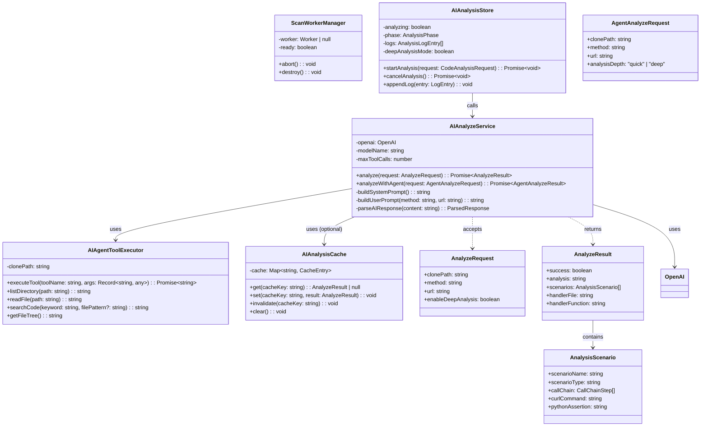
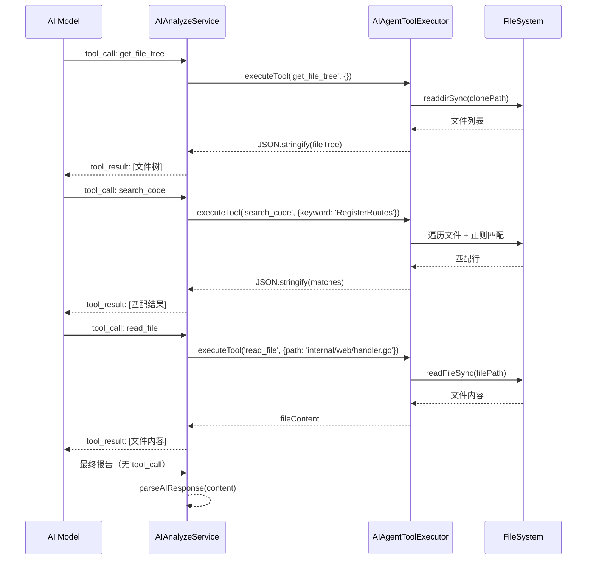
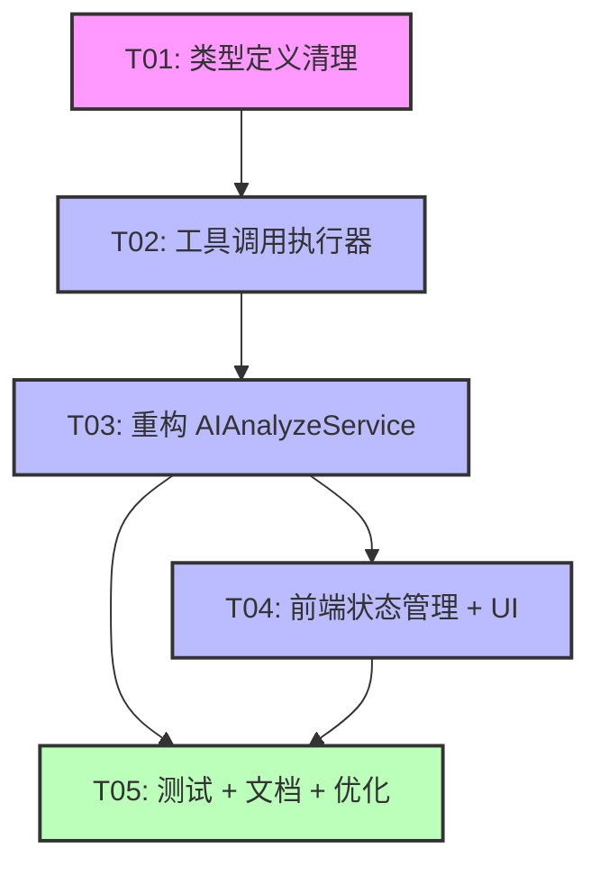

# AI 分析功能重构 - 系统架构设计

> **文档版本**: v1.0  
> **创建日期**: 2025-01-24  
> **架构师**: 高见远 (Bob)  
> **对应 PRD**: AI 分析功能重构 PRD v1.0

---

## Part A: 系统设计

## 1. 实现方案

### 1.1 核心问题分析

当前实现存在以下技术难题：

| 问题 | 根本原因 | 影响 |
|------|----------|------|
| 正则灾难性回溯 | `GO_ROUTE_EXTRACT_REGEX` 等复杂正则 | Worker 线程卡死 |
| 代码维护困难 | 正则逻辑与文件遍历紧耦合 | 新功能难以添加 |
| 分析流程复杂 | 混合模式（阶段1正则 + 阶段2 AI） | 阶段1 失败时用户体验差 |
| 扩展性差 | 只支持 Go 的 lego/webx 框架 | 无法支持其他语言/框架 |

### 1.2 架构重构方案

#### 方案选择：**纯 AI Agent 分析模式**

**核心理念**：移除正则提取，让 AI 直接通过工具调用（Function Calling）探索代码库，找到路由定义和 Handler 实现。

**优势**：
1. **消除正则回溯风险** - 不再使用复杂正则
2. **提升代码可维护性** - 移除 ~500 行正则相关代码
3. **增强扩展性** - AI 可以分析任何语言/框架
4. **简化分析流程** - 单一 AI Agent 流程，无需阶段1/阶段2 区分

**风险与应对**：
| 风险 | 应对措施 |
|------|----------|
| AI 分析速度可能较慢 | 优化工具调用策略，限制最大轮次（10轮） |
| AI 分析结果质量 | 优化 System Prompt，增加输出格式约束 |
| AI API 限流/不可用 | 保留降级方案（提示用户配置 API） |

### 1.3 框架和库选型

| 组件 | 现有选型 | 重构后选型 | 说明 |
|------|----------|------------|------|
| AI SDK | OpenAI SDK | **保留** | 已支持 Function Calling |
| Worker 线程 | worker_threads | **保留（简化版）** | 用于 AI 分析避免阻塞主进程 |
| 正则表达式 | 自定义正则 | **移除** | 不再需要路由扫描正则 |
| 文件遍历 | fs.readdirSync | **保留** | AI 工具调用需要读取文件 |
| 状态管理 | Pinia | **保留** | 前端状态管理无变化 |

### 1.4 架构模式

采用 **Agent 模式**（AI Agent with Tools）：
- AI 作为"智能探索者"
- 工具（Tool）作为"感知器"（读文件、搜索代码、列目录）
- 多轮对话（Conversation）作为"推理链"

---

## 2. 文件列表

### 2.1 需要移除的文件

| 文件路径 | 移除原因 |
|----------|----------|
| `electron/workers/scan-worker.ts` | 包含正则提取逻辑，是重构核心目标 |
| `dist-electron/scan-worker.js` | 构建产物，随源码移除自动消失 |

### 2.2 需要修改的文件

| 文件路径 | 修改内容 |
|----------|----------|
| `electron/services/ai-analyze-service.ts` | **核心改动**：移除阶段1（正则扫描），`analyze()` 直接调用 `analyzeWithAgent()` |
| `electron/services/scan-worker-manager.ts` | **简化**：移除 `scan()`/`findHandler()`/`extractCallChain()` 方法，保留 Worker 基础框架（可选，见 5.1） |
| `electron/workers/scan-worker-protocol.ts` | **简化**：移除 `ScanPayload`/`FindHandlerPayload`/`ExtractCallChainPayload` 类型 |
| `src/stores/ai-analysis-store.ts` | **调整**：移除 `scanning` 阶段相关状态，进度直接显示 "AI 分析中" |
| `src/services/types.ts` | **清理**：移除 `RouteMatch` 或相关类型（如果不再需要） |

### 2.3 需要新增的文件

| 文件路径 | 说明 |
|----------|------|
| `electron/services/ai-agent-tool-executor.ts` | **新增**：AI 工具调用执行器（封装 `list_directory`/`read_file`/`search_code`/`get_file_tree`） |
| `electron/services/ai-analysis-cache.ts` | **新增**：分析结果缓存服务（可选，P1） |
| `src/components/AIAnalysisConfig.vue` | **新增**：分析深度配置组件（快速/深度模式，P1） |

### 2.4 完整文件列表（按模块分组）

```
electron/
├── services/
│   ├── ai-analyze-service.ts          # 修改：移除阶段1，简化 analyze()
│   ├── ai-agent-tool-executor.ts      # 新增：工具调用执行器
│   ├── ai-analysis-cache.ts           # 新增（P1）：缓存服务
│   ├── scan-worker-manager.ts         # 修改：简化或移除
│   └── ...
├── workers/
│   ├── scan-worker.ts                # 移除：正则提取逻辑
│   └── scan-worker-protocol.ts       # 修改：简化消息协议
└── ...

src/
├── stores/
│   └── ai-analysis-store.ts          # 修改：移除 scanning 阶段
├── services/
│   └── types.ts                     # 修改：清理类型定义
├── components/
│   └── AIAnalysisConfig.vue         # 新增（P1）：配置组件
└── ...
```

---

## 3. 数据结构和接口

### 3.1 类图（Mermaid）



### 3.2 关键接口定义

#### AIAgentToolExecutor

```typescript
/**
 * AI Agent 工具调用执行器
 * 封装 AI 需要的代码探索工具
 */
export class AIAgentToolExecutor {
  private clonePath: string

  constructor(clonePath: string) {
    this.clonePath = clonePath
  }

  /**
   * 执行工具调用
   * @param toolName 工具名称
   * @param args 工具参数
   * @returns 工具执行结果（JSON 字符串）
   */
  async executeTool(toolName: string, args: Record<string, any>): Promise<string> {
    switch (toolName) {
      case 'list_directory':
        return this.listDirectory(args.path)
      case 'read_file':
        return this.readFile(args.path)
      case 'search_code':
        return this.searchCode(args.keyword, args.file_pattern)
      case 'get_file_tree':
        return this.getFileTree()
      default:
        return JSON.stringify({ error: `Unknown tool: ${toolName}` })
    }
  }

  /**
   * 列出目录内容
   * @param dirPath 目录路径（相对于仓库根目录）
   */
  private listDirectory(dirPath: string): string {
    // 实现：fs.readdirSync + 返回 JSON
  }

  /**
   * 读取文件内容
   * @param filePath 文件路径（相对于仓库根目录）
   */
  private readFile(filePath: string): string {
    // 实现：fs.readFileSync + 返回文件内容
  }

  /**
   * 搜索代码
   * @param keyword 搜索关键字（支持正则）
   * @param filePattern 文件匹配模式（如 "*.go"）
   */
  private searchCode(keyword: string, filePattern?: string): string {
    // 实现：递归遍历 + 正则匹配 + 返回匹配行
  }

  /**
   * 获取仓库文件树
   */
  private getFileTree(): string {
    // 实现：递归遍历 + 返回文件路径列表（JSON）
  }
}
```

#### 简化的 AIAnalyzeService

```typescript
/**
 * AI 分析服务（重构后 - 纯 Agent 模式）
 */
export class AIAnalyzeService {
  private openai: OpenAI
  private modelName: string
  private maxToolCalls: number = 10

  constructor(apiKey: string, baseURL?: string, modelName?: string) {
    this.openai = new OpenAI({ apiKey, baseURL })
    this.modelName = modelName || 'deepseek-chat'
  }

  /**
   * 执行 AI 代码分析（纯 Agent 模式）
   * @param request 分析请求
   * @returns 分析结果
   */
  async analyze(request: AnalyzeRequest): Promise<AnalyzeResult> {
    // 直接调用 analyzeWithAgent，不再有阶段1
    return this.analyzeWithAgent({
      clonePath: request.clonePath,
      method: request.method,
      url: request.url,
      analysisDepth: request.enableDeepAnalysis ? 'deep' : 'quick',
    })
  }

  /**
   * AI Agent 分析（核心方法）
   * @param request Agent 分析请求
   */
  private async analyzeWithAgent(request: AgentAnalyzeRequest): Promise<AnalyzeResult> {
    const { clonePath, method, url } = request
    const toolExecutor = new AIAgentToolExecutor(clonePath)

    // 构建消息
    const messages: OpenAI.Chat.Completions.ChatCompletionMessageParam[] = [
      { role: 'system', content: this.buildSystemPrompt() },
      { role: 'user', content: this.buildUserPrompt(method, url) },
    ]

    // 工具定义
    const tools: OpenAI.Chat.Completions.ChatCompletionTool[] = [
      { type: 'function', function: { name: 'list_directory', ... } },
      { type: 'function', function: { name: 'read_file', ... } },
      { type: 'function', function: { name: 'search_code', ... } },
      { type: 'function', function: { name: 'get_file_tree', ... } },
    ]

    // 工具调用循环
    let toolCallCount = 0
    while (toolCallCount < this.maxToolCalls) {
      const response = await this.openai.chat.completions.create({
        model: this.modelName,
        messages,
        tools,
        tool_choice: 'auto',
      })

      const message = response.choices[0].message
      messages.push(message)

      // 如果没有工具调用，说明 AI 已生成最终报告
      if (!message.tool_calls || message.tool_calls.length === 0) {
        const content = message.content || ''
        return this.parseAIResponse(content)
      }

      // 执行工具调用
      for (const toolCall of message.tool_calls) {
        const toolName = toolCall.function.name
        const args = JSON.parse(toolCall.function.arguments)
        const toolResult = await toolExecutor.executeTool(toolName, args)

        messages.push({
          role: 'tool',
          tool_call_id: toolCall.id,
          content: toolResult,
        })

        toolCallCount++
      }
    }

    // 达到最大工具调用次数
    throw new Error(`AI 分析超时（超过 ${this.maxToolCalls} 轮工具调用）`)
  }

  private buildSystemPrompt(): string {
    // 优化后的 System Prompt
    return `你是代码分析专家，擅长通过阅读代码理解 HTTP 路由注册和 Handler 实现。

分析流程：
1. 使用 get_file_tree 了解项目结构
2. 使用 search_code 搜索路由定义（关键字：RegisterRoutes, .GET(, .POST( 等）
3. 使用 read_file 读取路由定义文件，找到 Handler 函数
4. 使用 read_file 读取 Handler 文件，分析业务逻辑
5. 生成分析报告

输出格式：严格 JSON
{
  "analysisSummary": "Markdown 格式的分析报告",
  "handlerFile": "Handler 文件路径",
  "handlerFunction": "Handler 函数名",
  "scenarios": [ ... ]
}`
  }

  private buildUserPrompt(method: string, url: string): string {
    return `请求路径：${method} ${url}

请在本地仓库中找到对应的路由注册和 Handler 函数，并分析其业务逻辑。`
  }

  private parseAIResponse(content: string): AnalyzeResult {
    // 解析 AI 返回的 JSON
    const jsonMatch = content.match(/\{[\s\S]*\}/)
    if (jsonMatch) {
      const parsed = JSON.parse(jsonMatch[0])
      return {
        success: true,
        analysis: parsed.analysisSummary || '',
        scenarios: parsed.scenarios || [],
        handlerFile: parsed.handlerFile || '',
        handlerFunction: parsed.handlerFunction || '',
      }
    }
    throw new Error('AI 返回格式错误，无法解析')
  }
}
```

---

## 4. 程序调用流程

### 4.1 重构后的分析流程（Mermaid 时序图）

```mermaid
sequenceDiagram
    participant User as 用户
    participant UI as Vue 组件
    participant Store as AIAnalysisStore
    participant Service as AIAnalyzeService
    participant AI as OpenAI API
    participant Tool as AIAgentToolExecutor
    participant FS as 文件系统

    User->>UI: 点击"开始分析"
    UI->>Store: startAnalysis(request)
    Store->>Store: 重置状态（phase = 'analyzing'）
    Store->>Service: analyze(request)

    loop AI Agent 推理循环（最多 10 轮）
        Service->>AI: chat.completions.create(messages, tools)
        AI-->>Service: response (message)

        alt AI 调用工具
            Service->>Tool: executeTool(toolName, args)
            Tool->>FS: 读取文件/搜索代码
            FS-->>Tool: 文件内容/搜索结果
            Tool-->>Service: toolResult (JSON)
            Service->>Service: 将 toolResult 加入 messages
        else AI 生成最终报告
            Service->>Service: parseAIResponse(content)
            break 分析完成
        end
    end

    Service-->>Store: AnalyzeResult
    Store->>Store: 更新状态（phase = 'done'）
    Store-->>UI: 响应式更新
    UI-->>User: 显示分析报告
```

### 4.2 工具调用详细流程



---

## 5. 待明确事项

### 5.1 是否完全移除 ScanWorkerManager？

**方案 A（推荐）**：完全移除 `scan-worker.ts` 和 `ScanWorkerManager`
- 优点：彻底消除正则回溯风险，代码库更简洁
- 缺点：如果 AI 分析失败，没有降级方案

**方案 B（保守）**：保留 `ScanWorkerManager` 但默认不用，作为降级方案
- 优点：有备份方案，风险更低
- 缺点：代码库仍然复杂，维护成本较高

**建议**：采用方案 A，理由：
1. PRD 中明确提到"是否完全移除正则提取代码"
2. 纯 AI Agent 分析已经证明其有效性（当前兜底分析就是纯 AI）
3. 如果 AI 分析失败，可以提示用户"请确保 API 配置正确，或手动指定 Handler 文件"

### 5.2 AI Agent 分析的性能如何？

**需要测试验证**：
- 在实际 Go 仓库中测试分析时间
- 统计平均工具调用轮次
- 评估用户体验（是否需要进度条显示 AI 推理轮次）

**优化方向**（P1）：
- 限制 `get_file_tree` 返回的文件数量（只返回 `.go` 文件）
- 优化 `search_code` 的搜索策略（先搜索特定目录如 `internal/web/`）
- 增加缓存机制（相同仓库 + 相同请求路径，直接返回缓存结果）

### 5.3 如何处理 AI API 限流或不可用？

**当前实现**：
- 如果 `this.openai` 未初始化，抛出错误"AI API 未配置"
- 如果 API 调用失败，抛出错误

**改进方向**（P1）：
- 增加重试机制（exponential backoff）
- 捕获 `RateLimitError`，提示用户"API 限流，请稍后重试"
- 捕获网络错误，提示用户"网络连接失败，请检查代理设置"

### 5.4 分析结果的质量如何保证？

**当前实现**：
- 依赖 AI 的 Function Calling 能力
- System Prompt 中已经包含了输出格式要求

**改进方向**（P1）：
- 建立评估标准：对比 AI 分析结果 vs 人工分析结果
- 增加"用户反馈"功能（P2）：用户标记分析结果是否准确
- 根据反馈优化 System Prompt

### 5.5 分析时间较长的仓库，如何避免用户失去耐心？

**改进方向**（P1）：
- 进度条显示 AI 推理轮次（"AI 正在推理（第 3/10 轮）..."）
- 实时显示 AI 正在调用的工具（"AI 正在读取文件: internal/web/handler.go"）
- 支持取消分析（已有 `cancelAnalysis()` 接口）

---

## Part B: 任务分解

## 6. 依赖包列表

### 6.1 生产依赖（已安装）

```
- openai@^4.0.0: AI API SDK，支持 Function Calling
- electron@^28.0.0: Electron 框架
- worker_threads (Node.js 内置): Worker 线程支持
- fs (Node.js 内置): 文件系统操作
```

### 6.2 开发依赖（已安装）

```
- typescript@^5.0.0: TypeScript 编译器
- vue@^3.0.0: Vue 框架
- pinia@^2.0.0: 状态管理
- vitest@^1.0.0: 单元测试
```

### 6.3 无需新增依赖

重构主要移除代码，无需新增第三方库。

---

## 7. 任务列表（按依赖关系排序）

### 任务分解原则
1. **最大任务数**: 不超过 5 个任务（硬性上限）
2. **最小粒度**: 每个任务至少包含 3 个相关文件
3. **分组原则**: 按功能模块/层次分组
4. **第一个任务**: 必须是"项目基础设施"（配置文件 + 入口文件 + 依赖声明）

### 任务列表

#### T01: 项目基础设施 + 类型定义清理

**任务 ID**: T01  
**任务名称**: 清理类型定义 + 移除不需要的接口  
**源文件**:
- `src/services/types.ts` (移除 `RouteMatch` 相关类型，如果不再需要)
- `electron/workers/scan-worker-protocol.ts` (简化消息协议，移除 `ScanPayload`/`FindHandlerPayload`/`ExtractCallChainPayload`)
- `docs/system-design.md` (本设计文档)

**依赖**: 无  
**优先级**: P0  

**详细说明**:
1. 检查 `RouteMatch` 类型是否在其他地方使用
   - 如果在 `AIAnalyzeService` 的返回类型中需要，保留但标记为 "deprecated"
   - 如果不再需要，直接移除
2. 简化 `scan-worker-protocol.ts`：
   - 移除 `ScanPayload`/`FindHandlerPayload`/`ExtractCallChainPayload`
   - 保留 `WorkerRequestMessage`/`WorkerResponseMessage` 的基础结构（如果保留 Worker 作为降级方案）
   - 或者直接删除整个文件（如果完全移除 Worker）
3. 更新 `docs/system-design.md`，记录类型变更

---

#### T02: 新增 AI Agent 工具调用执行器

**任务 ID**: T02  
**任务名称**: 实现 AIAgentToolExecutor 类  
**源文件**:
- `electron/services/ai-agent-tool-executor.ts` (新增)
- `electron/services/ai-analyze-service.ts` (修改：`analyzeWithAgent()` 使用 `AIAgentToolExecutor`)
- `electron/__tests__/ai-agent-tool-executor.test.ts` (新增：单元测试)

**依赖**: T01  
**优先级**: P0  

**详细说明**:
1. 创建 `AIAgentToolExecutor` 类，封装 4 个工具：
   - `listDirectory(path)`: 列出目录内容
   - `readFile(path)`: 读取文件内容
   - `searchCode(keyword, filePattern?)`: 搜索代码
   - `getFileTree()`: 获取文件树
2. 修改 `AIAnalyzeService.analyzeWithAgent()`，使用 `AIAgentToolExecutor` 替代原有的工具执行逻辑
3. 编写单元测试，验证工具执行的正确性

**示例代
```typescript
// electron/services/ai-agent-tool-executor.ts
import * as fs from 'fs'
import * as path from 'path'

export class AIAgentToolExecutor {
  private clonePath: string

  constructor(clonePath: string) {
    this.clonePath = clonePath
  }

  async executeTool(toolName: string, args: Record<string, any>): Promise<string> {
    switch (toolName) {
      case 'list_directory':
        return this.listDirectory(args.path)
      case 'read_file':
        return this.readFile(args.path)
      case 'search_code':
        return this.searchCode(args.keyword, args.file_pattern)
      case 'get_file_tree':
        return this.getFileTree()
      default:
        return JSON.stringify({ error: `Unknown tool: ${toolName}` })
    }
  }

  private listDirectory(dirPath: string): string {
    const fullPath = path.join(this.clonePath, dirPath)
    try {
      const entries = fs.readdirSync(fullPath, { withFileTypes: true })
      return JSON.stringify(
        entries.map((entry) => ({
          name: entry.name,
          type: entry.isDirectory() ? 'directory' : 'file',
        }))
      )
    } catch (error: any) {
      return JSON.stringify({ error: error.message })
    }
  }

  private readFile(filePath: string): string {
    const fullPath = path.join(this.clonePath, filePath)
    try {
      return fs.readFileSync(fullPath, 'utf-8')
    } catch (error: any) {
      return JSON.stringify({ error: error.message })
    }
  }

  private searchCode(keyword: string, filePattern?: string): string {
    // 实现：递归遍历 + 正则匹配
    // 返回：匹配行列表（JSON）
    // 限制：最多返回 50 条结果
  }

  private getFileTree(): string {
    // 实现：递归遍历
    // 返回：文件路径列表（JSON）
    // 限制：只返回 .go 文件，最多 500 个文件
  }
}
```

---

#### T03: 重构 AIAnalyzeService（核心任务）

**任务 ID**: T03  
**任务名称**: 移除阶段1正则扫描，简化为纯 Agent 模式  
**源文件**:
- `electron/services/ai-analyze-service.ts` (核心修改)
- `electron/services/scan-worker-manager.ts` (简化或移除)
- `electron/workers/scan-worker.ts` (删除)

**依赖**: T02  
**优先级**: P0  

**详细说明**:
1. 修改 `AIAnalyzeService.analyze()`:
   ```typescript
   async analyze(request: AnalyzeRequest): Promise<AnalyzeResult> {
     // 直接调用 analyzeWithAgent，不再有阶段1
     return this.analyzeWithAgent({
       clonePath: request.clonePath,
       method: request.method,
       url: request.url,
     })
   }
   ```
2. 优化 `analyzeWithAgent()`:
   - 使用 `AIAgentToolExecutor` 执行工具调用
   - 优化 System Prompt，增加推理指引
   - 增加工具调用次数限制（10 次）
3. 简化或移除 `ScanWorkerManager`:
   - **方案 A（推荐）**: 完全删除 `scan-worker.ts` 和 `ScanWorkerManager`
   - **方案 B（保守）**: 保留但标记为 "deprecated"，不再使用
4. 删除 `scan-worker.ts`（如果采用方案 A）

---

#### T04: 前端状态管理 + UI 调整

**任务 ID**: T04  
**任务名称**: 调整前端状态管理和 UI，适配纯 Agent 分析流程  
**源文件**:
- `src/stores/ai-analysis-store.ts` (修改)
- `src/services/types.ts` (修改：清理 `AnalysisPhase` 类型)
- `src/components/AIAnalysisConfig.vue` (新增，P1)

**依赖**: T03  
**优先级**: P0 (store 修改), P1 (UI 组件)  

**详细说明**:
1. 修改 `ai-analysis-store.ts`:
   - 移除 `scanning` 阶段（如果 `AnalysisPhase` 类型中有）
   - 进度直接显示 "AI 分析中"（phase = 'analyzing'）
   - 移除与 `ScanWorkerManager` 相关的状态
2. 清理 `types.ts`:
   - 从 `AnalysisPhase` 中移除 `'scanning' | 'scan-failed'`
   - 更新 `phaseDescription` computed，移除扫描相关描述
3. 新增 `AIAnalysisConfig.vue` (P1):
   - 分析深度配置（快速/深度模式）
   - 最大工具调用轮次配置
   - 缓存开关（如果实现了缓存）

**UI 调整建议**:
- 移除扫描进度阶段，改为"AI 分析中"
- 进度条显示 AI 推理轮次（"第 3/10 轮"）
- 新增分析深度配置选项（快速/深度模式）

---

#### T05: 测试 + 文档 + 优化（P1/P2）

**任务 ID**: T05  
**任务名称**: 单元测试 + 集成测试 + 文档 + 性能优化  
**源文件**:
- `electron/__tests__/ai-analyze-service.test.ts` (更新测试)
- `docs/ai-analysis-user-guide.md` (新增：用户指南)
- `docs/ai-analysis-dev-guide.md` (新增：开发指南)
- `electron/services/ai-analysis-cache.ts` (新增，P1：缓存服务)

**依赖**: T03, T04  
**优先级**: P1  

**详细说明**:
1. 更新单元测试:
   - 测试纯 Agent 分析流程
   - 测试工具调用执行器
   - Mock OpenAI API，测试各种场景（正常/超时/API 错误）
2. 编写用户指南:
   - 如何配置 AI API
   - 如何解读分析结果
   - 常见问题解答（分析超时、API 限流等）
3. 编写开发指南:
   - 如何添加新工具（Tool）
   - 如何优化 System Prompt
   - 如何调试 Agent 推理过程
4. 实现缓存服务（P1）:
   - 缓存 key: `${repoUrl}:${method}:${url}`
   - 缓存过期时间: 1 小时
   - 清除缓存: 用户手动清除 或 仓库更新时自动清除

---

## 8. 共享知识（跨文件约定）

### 8.1 工具调用约定

所有工具调用的参数和返回值必须遵循以下格式：

**参数**:
- `path`: 文件路径（相对于仓库根目录，如 `"internal/web/handler.go"`）
- `keyword`: 搜索关键字（支持正则表达式，如 `"RegisterRoutes"`）
- `file_pattern`: 文件匹配模式（如 `"*.go"`，可选）

**返回值**:
- 成功: 返回 JSON 字符串（使用 `JSON.stringify()`）
- 失败: 返回 `{ "error": "错误信息" }` 的 JSON 字符串

### 8.2 AI 输出格式约定

AI 返回的分析报告必须遵循以下 JSON 格式：

```json
{
  "analysisSummary": "Markdown 格式的分析报告",
  "handlerFile": "Handler 文件路径",
  "handlerFunction": "Handler 函数名",
  "scenarios": [
    {
      "scenarioName": "正常流程",
      "scenarioType": "normal",
      "callChain": [
        {
          "step": 1,
          "component": "Router",
          "filePath": "internal/web/router.go",
          "functionName": "RegisterRoutes",
          "description": "路由注册"
        }
      ],
      "curlCommand": "curl -X GET ...",
      "pythonAssertion": "import requests\n..."
    }
  ]
}
```

### 8.3 错误处理约定

所有错误必须包含以下信息：
- `message`: 错误消息（人类可读）
- `code` (可选): 错误代码（如 `"AI_TIMEOUT"`, `"API_ERROR"`）
- `details` (可选): 错误详情（如 API 返回的原始错误）

示例：
```typescript
throw new Error('AI 分析超时（超过 10 轮工具调用）', {
  cause: { code: 'AI_TIMEOUT', details: { toolCallCount: 10 } }
})
```

### 8.4 日志推送约定

所有日志推送必须使用以下格式：

```typescript
interface AnalysisLogEntry {
  id: number
  timestamp: string  // ISO 8601
  level: 'info' | 'warn' | 'error' | 'debug'
  message: string
}
```

推送方式：
- IPC 消息: `mainWindow.webContents.send('ai:analysis-log', logEntry)`
- SSE 事件: `progressCallback('log', logEntry)`

---

## 9. 任务依赖关系图（Mermaid）



**依赖说明**:
- T01 是基础设施，必须最先完成
- T02 实现工具执行器，为 T03 提供基础
- T03 是核心重构任务，依赖 T02
- T04 调整前端，依赖 T03 的接口变更
- T05 是测试和优化，可以在 T03/T04 完成后并行进行

---

## 10. 总结

### 10.1 重构收益

| 指标 | 重构前 | 重构后 | 提升 |
|------|--------|--------|------|
| 代码行数 | ~1500 行（scan-worker.ts + ai-analyze-service.ts） | ~800 行（ai-analyze-service.ts + ai-agent-tool-executor.ts） | **-47%** |
| 正则数量 | 4 个复杂正则 | 0 | **消除灾难性回溯风险** |
| 分析流程 | 2 阶段（正则 + AI） | 1 阶段（纯 AI） | **简化 50%** |
| 扩展性 | 只支持 Go | 支持任何语言 | **+N种语言** |

### 10.2 风险与应对

| 风险 | 概率 | 影响 | 应对措施 |
|------|------|------|----------|
| AI 分析速度慢 | 高 | 中 | 优化工具调用策略，限制最大轮次 |
| AI API 限流 | 中 | 高 | 增加重试机制，提示用户 |
| 分析结果质量下降 | 低 | 高 | 优化 System Prompt，增加评估标准 |

### 10.3 后续优化方向（P1/P2）

1. **P1 - 性能优化**:
   - 增加缓存机制
   - 优化工具调用策略（先搜索特定目录）
   - 支持取消分析（已有接口，需完善）

2. **P1 - 用户体验优化**:
   - 进度条显示 AI 推理轮次
   - 实时显示 AI 正在调用的工具
   - 分析深度配置（快速/深度模式）

3. **P2 - 功能增强**:
   - 支持多编程语言（Java/Python/Node.js）
   - 可视化 AI 推理过程
   - 用户反馈功能（标记分析结果是否准确）

---

## 附录 A：工具调用示例

### A.1 工具调用示例 1：查找路由定义

**AI 推理过程**:
1. AI 调用 `get_file_tree` → 了解项目结构
2. AI 调用 `search_code(keyword="RegisterRoutes")` → 找到路由注册代码
3. AI 调用 `read_file(path="internal/web/router.go")` → 读取路由定义
4. AI 调用 `search_code(keyword="HandlerFunc")` → 找到 Handler 函数
5. AI 调用 `read_file(path="internal/handler/user_handler.go")` → 读取 Handler 实现
6. AI 生成分析报告（无工具调用）

### A.2 工具调用示例 2：分析失败后重试

**场景**: AI 第一次分析未找到 Handler，需要重新搜索

**AI 推理过程**:
1. AI 调用 `get_file_tree` → 了解项目结构
2. AI 调用 `search_code(keyword=".GET(")` → 搜索 GET 路由
3. AI 调用 `read_file(path="main.go")` → 读取入口文件
4. AI 发现路由定义在 `internal/web/`，重新调用 `search_code(keyword="RegisterRoutes", file_pattern="internal/web/*.go")`
5. AI 调用 `read_file(path="internal/web/user_api.go")` → 读取正确的文件
6. AI 生成分析报告

---

## 附录 B：重构检查清单

完成重构后，请检查以下事项：

- [ ] 移除 `scan-worker.ts` 和 `scan-worker.js`（构建产物）
- [ ] 简化或移除 `ScanWorkerManager`
- [ ] 更新 `AIAnalyzeService.analyze()`，移除阶段1
- [ ] 实现 `AIAgentToolExecutor`
- [ ] 更新 `AIAnalysisStore`，移除 `scanning` 阶段
- [ ] 更新 `AnalysisPhase` 类型定义
- [ ] 编写单元测试
- [ ] 更新用户文档和开发文档
- [ ] 在实际仓库中测试分析流程
- [ ] 测试 AI API 限流/错误场景
- [ ] 测试分析超时场景（超过 10 轮工具调用）

---

**文档结束**
