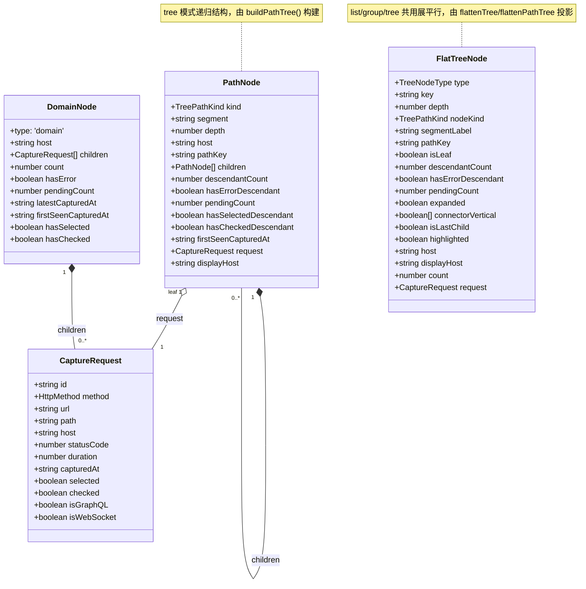
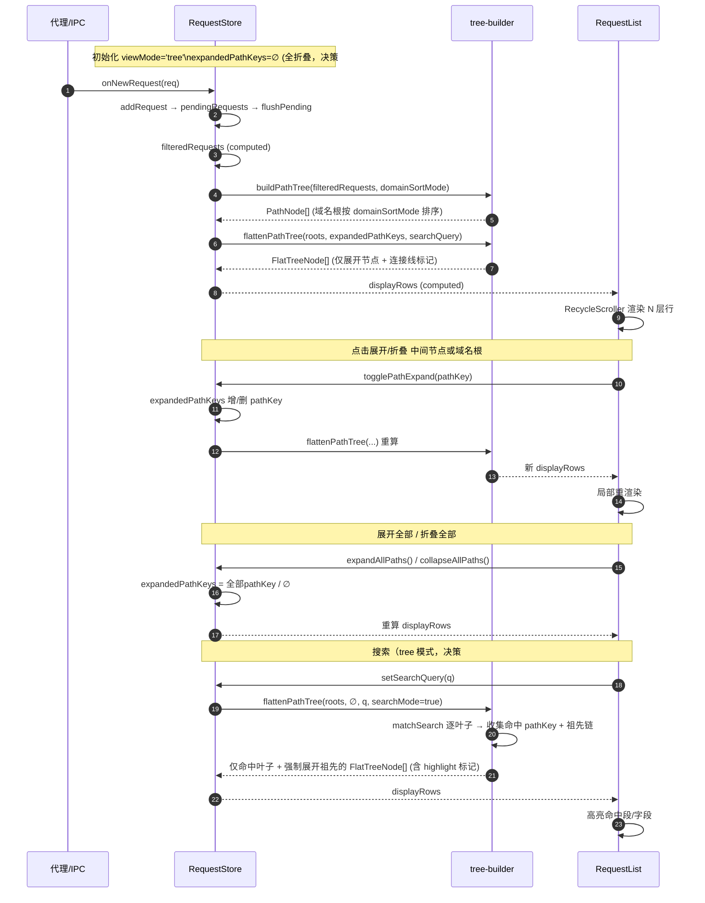
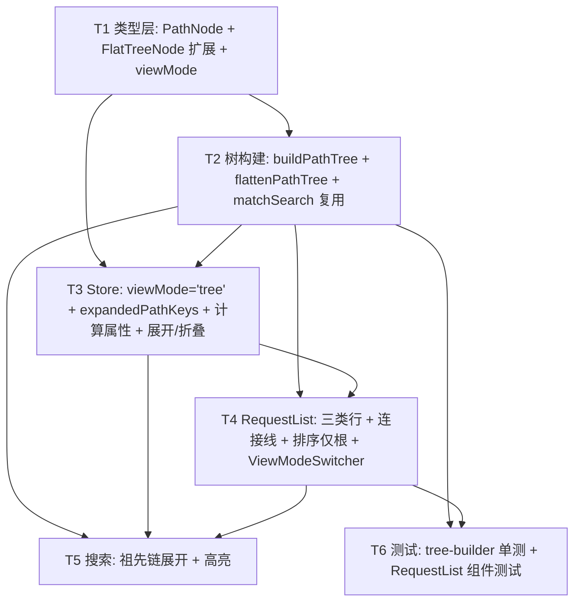

# PowerCatch — Structure 树状化模式：系统架构设计 + 任务分解

> **设计者**：高见远（架构师 Bob）｜**阶段**：架构设计 + 任务分解（暂不编码）
> **技术栈**：Electron + Vue 3 + TypeScript + Tailwind CSS + `vue-virtual-scroller`
> **依据**：`docs/prd-structure-tree.md` + 用户已拍板的 7 个决策
> **示例 URL**：`https://retailceshi002.preview.myshopline.com/sl/apps/pos/app/close-account/detail`
> **期望树形**：域名根 → `sl` → `apps` → `pos` → `app` → `close-account` → `detail`（每层嵌套、可折叠）

---

# Part A：系统设计

## 1. 实现方案与框架选型

### 1.1 核心难点

| 难点 | 说明 | 策略 |
|---|---|---|
| 路径分段递归建树 | 同一域名下大量请求需按 path 段逐层归并，且同末段不同 method 不拆（决策#5） | 构建 **Path 前缀树（trie）**，叶子为 `CaptureRequest`，中间段为 `intermediate` 节点 |
| N 层虚拟滚动 | 现有 `flattenTree` 只支持 domain(0)/request(1) 两层；树深不固定 | 展平算法改写为 **N 层递归展平**，仅输出「已展开节点」的 `FlatTreeNode`，`RecycleScroller` 复用不变 |
| 连接线绘制 | 需 Charles 风格 `├─/└─/│` 层级引导线 | 展平阶段计算每层 `isLastChild` 栈，输出 `connectorVertical[]` + `isLastChild`，渲染层用字符 glyph（可 CSS 着色） |
| 默认全折叠 + 新请求不自动展开（决策#2） | 现有 `collapsedDomains` 是「存已折叠、默认空=全展开」语义，与决策#2 相反 | 树模式新增 `expandedPathKeys: Set<string>`（**存已展开**，默认空=全折叠），与 group 模式 `collapsedDomains` 并行保留 |
| 排序语义收窄（决策#4） | 排序下拉仅作用于根；树内部按首次出现顺序稳定排序 | 域名根复用 `domainSortMode`；中间/叶子节点按 `firstSeenCapturedAt` 升序（稳定），同值按 segment 字母序兜底 |

### 1.2 框架与库选型

- **沿用现有栈，不引入新框架**：Vue 3 `<script setup>` + TypeScript + Tailwind CSS + `vue-virtual-scroller`（`RecycleScroller`）。
- **不新增 npm 包**：连接线用字符 glyph + CSS `text-gray-300` 着色实现，无需引入树组件库（如 `vue3-treeview`/`treetable`）。
- **架构模式**：Store（Pinia）持有数据与折叠状态；`tree-builder` 为纯函数（`buildPathTree` / `flattenPathTree` / `matchSearch`），无副作用、易单测；`RequestList.vue` 仅做「数据→展平行→虚拟滚动行」的投影渲染。

### 1.3 核心思路（数据流）

```
CaptureRequest[] (filteredRequests)
   │  buildPathTree(requests, domainSortMode)
   ▼
PathNode[]  (域名根 → intermediate → leaf，递归结构，带 descendantCount / firstSeenCapturedAt 等聚合字段)
   │  flattenPathTree(roots, expandedPathKeys, searchQuery [, searchMode])
   ▼
FlatTreeNode[]  (N 层展平行，仅含已展开节点 + 连接线标记 + highlight 标记)
   │  displayRows (computed 按 viewMode 分发)
   ▼
RecycleScroller  (item-size=48, key-field="key"，渲染 domain/intermediate/leaf 三类行)
```

**建树伪代码（示意，非落地实现）**：

```ts
// buildPathTree: 按 host 分组 → 每组内按 path 切片递归建 trie
function buildPathTree(requests, sortMode): PathNode[] {
  const byHost = groupBy(requests, r => r.host || '(unknown)')
  const roots: PathNode[] = []
  for (const [host, reqs] of byHost) {
    const root: PathNode = { kind:'domain', segment:host, depth:0, host, pathKey:host, children:[], ... }
    for (const req of reqs) {
      const segs = req.path.split('/').filter(Boolean)         // ['sl','apps',...] 或 ['sl'] 或 []
      let parent = root
      // 中间段：segs[0..n-2] 建/取 intermediate
      for (let i = 0; i < segs.length - 1; i++) {
        parent = findOrCreateChild(parent, segs[i], depth=i+1)
      }
      // 叶子：末段作为 leaf（携带 CaptureRequest），同末段多 method 自然并列（决策#5）
      const leafSeg = segs.length ? segs[segs.length-1] : '(root)'
      parent.children.push(makeLeaf(leafSeg, segs, req))
    }
    computeAggregatesPostOrder(root)   // descendantCount / firstSeenCapturedAt / hasErrorDescendant ...
    roots.push(root)
  }
  return sortDomainsLike(roots, sortMode)   // 复用现有 sortDomains 思路
}
```

**展平伪代码（示意）**：

```ts
function flattenPathTree(roots, expanded, query, searchMode=false): FlatTreeNode[] {
  const rows = []
  const q = query.trim().toLowerCase()
  const matchedKeys = searchMode ? collectMatchedAndAncestors(roots, q) : null  // pathKey 集合
  for (const domain of roots) {
    if (searchMode && !subtreeHasMatch(domain)) continue        // 搜索：无命中子树的域名整棵隐藏
    const dExpanded = searchMode ? true : expanded.has(domain.pathKey)
    const dIsLast = domain === last(roots)
    rows.push(domainRow(domain, [], dIsLast))
    if (dExpanded) recurse(domain, 1, [dIsLast])                 // 祖先 isLast 栈
  }
  return rows

  function recurse(node, depth, ancestorLastStack) {
    node.children.forEach((child, i) => {
      const isLast = i === node.children.length - 1
      if (child.kind === 'leaf') {
        if (searchMode && !matchedKeys.has(child.pathKey)) return   // 搜索：仅显示命中叶子
        rows.push(leafRow(child, ancestorLastStack, isLast))
      } else {
        if (searchMode && !matchedKeys.has(child.pathKey)) return   // 搜索：仅展开含命中的祖先段
        const cExpanded = searchMode ? true : expanded.has(child.pathKey)
        rows.push(intermediateRow(child, ancestorLastStack, isLast))
        if (cExpanded) recurse(child, depth+1, [...ancestorLastStack, isLast])
      }
    })
  }
}
```

---

## 2. 文件列表（相对路径，含新增/修改）

| 文件 | 动作 | 本次改动要点 |
|---|---|---|
| `src/services/types.ts` | **修改** | 新增 `TreePathKind`、`PathNode`；扩展 `FlatTreeNode`（`nodeKind`/`segmentLabel`/`pathKey`/`connectorVertical`/`isLastChild`/`descendantCount`/`hasErrorDescendant`/`hasSelectedDescendant`/`hasCheckedDescendant` 等）；`viewMode` 联合类型扩展为 `'list'\|'group'\|'tree'`；`CaptureSession.viewMode` 同步扩展 |
| `src/utils/tree-builder.ts` | **修改** | 新增 `buildPathTree()`（递归 trie）；新增 `flattenPathTree()`（N 层展平 + 连接线 + 搜索模式）；复用并导出 `matchSearch()`；新增 `getPathKey(host, segments)` 辅助；保留 `buildDomainTree`/`sortDomains`/`flattenTree` 供 group 模式 |
| `src/stores/request-store.ts` | **修改** | `viewMode` 默认 `'tree'`；新增 `expandedPathKeys: Set<string>`（树模式折叠状态，默认空=全折叠）；新增 `pathTreeRequests` / `flatPathRows` computed；`displayRows` 按 viewMode 分发到 list/group/tree 三套展平行；`togglePathExpand`/`isPathExpanded`/`expandAllPaths`/`collapseAllPaths`；`setViewMode` 支持三态；`searchQuery` 驱动树搜索 |
| `src/components/RequestList.vue` | **修改** | 新增 tree 模式渲染分支（domain/intermediate/leaf 三类行）；连接线渲染（`connectorVertical` + `├─/└─`）；排序下拉在 tree 模式显示且仅作用于根；搜索高亮命中段；`viewMode` 切换入口 |
| `src/components/ViewModeSwitcher.vue` | **新增** | `list / group / tree` 三态分段控件，置于搜索栏左侧，调用 `store.setViewMode()`；复用现有 `viewMode` store 字段 |
| `src/utils/url-formatter.ts` | 不改 | 复用 `formatHostWithProtocol(host, url)` 生成 `displayHost` |

> **不改**：`CaptureRequest`、`DomainNode` 结构、`vue-virtual-scroller` 用法、右键菜单（`RequestContextMenu`）、重放弹窗（`ReplayDialog`）、过滤面板（`FilterPanel`）均复用。

---

## 3. 数据结构与接口（类型签名）

### 3.1 与现有 `DomainNode` 的关系（建议）

- **并存而非替换**：`group` 模式继续用现有 `DomainNode`（两层 domain→request，零回归风险）；`tree` 模式新增平行结构 `PathNode`（递归 N 层）。两者均由 `filteredRequests` 派生，互不影响。
- **统一展平行**：`FlatTreeNode` 作为 list/group/tree 三种模式的**唯一渲染数据格式**，新增字段全部为**可选**（`nodeKind?` 等），保证对现有 list/group 渲染零破坏。
- **`type` vs `nodeKind`**：`type: 'domain'|'request'`（既有，向后兼容 list/group）保留；tree 模式用 `nodeKind: 'domain'|'intermediate'|'leaf'` 区分三类节点（`leaf` 对应既有 `request` 语义）。

### 3.2 类型签名（示意）

```ts
/** 树节点种类（tree 模式展平行用） */
export type TreePathKind = 'domain' | 'intermediate' | 'leaf'

/** 递归路径树节点（tree 模式结构来源） */
export interface PathNode {
  kind: TreePathKind            // 'domain' | 'intermediate' | 'leaf'
  segment: string              // 层级标签：domain=host；intermediate=段名；leaf=末段名
  depth: number                // 从 0 起（domain=0，第一层段=1 …）
  host: string                 // 所属域名（便于构造安全 key）
  pathKey: string              // 逻辑路径标识：domain=`host`；intermediate=`host::seg1/seg2`；leaf=`host::seg1/.../末段`
  children: PathNode[]         // 中间/根含子节点；叶子为空数组
  descendantCount: number      // 后代 request 叶子总数（叶子自身=1）
  hasErrorDescendant: boolean  // 子树是否含 4xx/5xx
  pendingCount: number         // 子树内 statusCode=null 的数量
  hasSelectedDescendant: boolean
  hasCheckedDescendant: boolean
  firstSeenCapturedAt: string  // 子树最早请求 capturedAt（稳定排序锚）
  // —— leaf-only ——
  request?: CaptureRequest     // 叶子绑定的请求
  // —— domain-only ——
  displayHost?: string         // 带协议域名（如 https://api.example.com）
}

/** 展平行（在现有 FlatTreeNode 基础上扩展，全部可选，向后兼容） */
export interface FlatTreeNode {
  // —— 既有字段（list/group 沿用）——
  type: TreeNodeType           // 'domain' | 'request'
  key: string                  // scroller 唯一标识：domain=`domain:host`；intermediate=`pathKey`；leaf=`request.id`
  depth: number
  host?: string
  displayHost?: string
  count?: number
  totalCount?: number
  hasError?: boolean
  pendingCount?: number
  expanded?: boolean
  hasSelected?: boolean
  hasChecked?: boolean
  request?: CaptureRequest
  // —— tree 模式新增字段（可选）——
  nodeKind?: TreePathKind      // 'domain' | 'intermediate' | 'leaf'
  segmentLabel?: string        // 行首显示的路径段（domain=host，intermediate=段名，leaf=末段名）
  pathKey?: string             // 逻辑路径标识（折叠 set / 祖先链计算用，叶子亦带以便高亮）
  isLeaf?: boolean
  descendantCount?: number     // 中间节点徽标「N 条」
  hasErrorDescendant?: boolean
  hasSelectedDescendant?: boolean
  hasCheckedDescendant?: boolean
  // —— 连接线（展平阶段计算）——
  connectorVertical?: boolean[] // 长度=depth，connectorVertical[i]=祖先 i 是否有后续兄弟（true=画 │）
  isLastChild?: boolean        // 自身是否父节点最后一个子（true=└─，false=├─）
  highlighted?: boolean        // 搜索命中高亮标记
}

/** viewMode 联合类型扩展 */
export type ViewMode = 'list' | 'group' | 'tree'

/** CaptureSession.viewMode 同步扩展为 ViewMode */
```

### 3.3 类图（Mermaid）



---

## 4. 程序调用流程（时序图，Mermaid）



---

## 5. 待明确事项（含推荐默认值，不推翻已拍板决策）

| # | 待明确点 | 推荐默认值（假设，待确认） |
|---|---|---|
| U1 | **搜索命中高亮的精确落点**：匹配字段可能是 path 段 / method / statusCode / host（决策#7）。高亮应落在哪个视觉元素？ | 叶子行整行加 `bg-yellow-50` 底色；若 query 命中 `segmentLabel` 则加粗该段文本；命中 method/statusCode 时其徽标额外描边。域名根若因 host 命中被展开，其 `displayHost` 也加粗。 |
| U2 | **搜索模式是否隐藏非命中兄弟**：决策#7 只说「展开命中节点的祖先链 + 高亮」，未明确是否过滤掉未命中叶子。 | 默认**聚焦式**：仅输出「命中叶子 + 其祖先链」，同级非命中叶子不显示（Charles 过滤风格）。若团队偏好「保留兄弟仅高亮」，可改 `searchMode` 开关——列为待确认。 |
| U3 | **连接线实现**：字符 glyph 还是纯 CSS border？ | 默认**字符 glyph**（`├─`/`└─`/`│`，等宽 span + `text-gray-300`），跨平台一致、易着色；CSS border 方案作为备选。 |
| U4 | **折叠状态是否跨会话持久化**：决策#2 要求默认全折叠，P2-2 才是可选持久化。 | v1 **不持久化**树展开态：`expandedPathKeys` 仅内存态，每次进入 tree 模式/刷新均为全折叠；不读 localStorage。后续若做 P2-2 再用 `host::segments` 键写入。 |
| U5 | **`firstSeenCapturedAt` 对中间节点的定义**：用于稳定排序（决策#4）。 | 取子树所有叶子 `capturedAt` 的 **min（最早）**；同值兜底按 `segment` 字母序，保证确定性、不跳动。 |
| U6 | **viewMode 切换后展开态保留**：从 tree 切到 group 再切回 tree，`expandedPathKeys` 是否重置？ | 不重置（内存态保留），用户切回时维持上次展开位置；符合「默认 tree」主路径体验。如需每次进 tree 都全折叠，改为切换时清空——待确认。 |
| U7 | **`expandAllPaths`/`collapseAllPaths` 作用域**：是否含中间节点？ | 含全部域名根 + 全部中间节点（整树展开/折叠）。工具条按钮复用现有「展开全部/折叠全部」位置。 |
| U8 | **空 path 或根路径 `/` 的请求**：如 `GET /` | 归入域名根下，叶子 `segmentLabel='(root)'`，depth=1，按普通叶子处理。 |

---

# Part B：任务分解

## 6. 依赖包列表

**本次无需新增任何 npm 包。**

| 包 | 版本/状态 | 用途 |
|---|---|---|
| `vue` | 现有 | 组件框架 |
| `typescript` | 现有 | 类型系统 |
| `tailwindcss` | 现有 | 样式（连接线着色、状态高亮） |
| `vue-virtual-scroller` | 现有 | `RecycleScroller` 虚拟滚动（N 层展平行复用） |
| `pinia` | 现有 | `useRequestStore` 状态管理 |

> 连接线、状态徽标、缩进均由现有 Tailwind + 字符 glyph 实现，无需引入树组件库。

---

## 7. 任务列表（有序、含依赖关系、按实现顺序）

> 说明：下表按用户要求的 T1–T6 粒度拆解。若需压缩到「≤5 个任务」（通用脚手架约束），可将 **T5 并入 T4**、**T6 并入 T2/T4**（测试随对应模块落地）。本设计保留 T1–T6 以便评审逐条确认。

| 任务 ID | 任务名称 | 源文件 | 依赖 | 优先级 |
|---|---|---|---|---|
| **T1** | 类型层改造：新增 `PathNode` / `TreePathKind`，扩展 `FlatTreeNode`（`nodeKind`/`segmentLabel`/`pathKey`/`connectorVertical`/`isLastChild`/`descendantCount`/`hasErrorDescendant`/`hasSelectedDescendant`/`hasCheckedDescendant`/`highlighted`），`viewMode` 扩展为 `'list'\|'group'\|'tree'`，`CaptureSession.viewMode` 同步 | `src/services/types.ts` | 无 | **P0** |
| **T2** | 树构建器：新增 `buildPathTree()`（host 分组→path 切片递归 trie→后序聚合 `descendantCount`/`firstSeenCapturedAt`/`hasErrorDescendant` 等）；新增 `flattenPathTree()`（N 层展平 + 连接线栈 + 搜索模式）；新增 `getPathKey(host, segments)`；复用并导出 `matchSearch()` | `src/utils/tree-builder.ts` | T1 | **P0** |
| **T3** | Store 改造：`viewMode` 默认 `'tree'`；新增 `expandedPathKeys: Set<string>`（默认空=全折叠）；新增 `pathTreeRequests` / `flatPathRows` computed；`displayRows` 按 viewMode 分发 list/group/tree；新增 `togglePathExpand`/`isPathExpanded`/`expandAllPaths`/`collapseAllPaths`；`setViewMode` 支持三态 | `src/stores/request-store.ts`、`src/services/types.ts`(类型引用) | T1, T2 | **P0** |
| **T4** | RequestList tree 模式渲染：三类行（domain/intermediate/leaf）+ 连接线（`connectorVertical`+`├─/└─`）+ 选中/勾选/右键（沿用既有）；排序下拉在 tree 模式显示且**仅作用于根**；新增 `ViewModeSwitcher.vue` 三态切换 | `src/components/RequestList.vue`、`src/components/ViewModeSwitcher.vue`(新增) | T1, T2, T3 | **P0** |
| **T5** | 搜索祖先链展开 + 高亮：`flatPathRows` 在 `searchQuery` 非空时以 `searchMode=true` 调 `flattenPathTree`，收集命中叶子 + 祖先 pathKey 强制展开；RequestList 按 `highlighted`/`segmentLabel` 命中渲染高亮 | `src/stores/request-store.ts`、`src/utils/tree-builder.ts`、`src/components/RequestList.vue` | T2, T3, T4 | **P1** |
| **T6** | 测试：`buildPathTree`/`flattenPathTree` 单元测试（分段、同末段多 method 不拆、折叠/展开、连接线 `isLastChild`、搜索祖先链）；`RequestList` 组件测试（三类行渲染、勾选、viewMode 切换） | `tests/tree-builder.spec.ts`、`tests/RequestList.tree.spec.ts` | T2, T4 | **P1** |

---

## 8. 共享知识（跨文件约定）

1. **节点类型判别规则**
   - `nodeKind === 'leaf'` ⟺ `request` 存在且 `children.length === 0`；
   - `nodeKind === 'domain'` ⟺ `depth === 0`，无 parent；
   - `nodeKind === 'intermediate'` ⟺ 有 `children` 且无 `request`（含末段多 method 的父节点）。

2. **depth → 缩进映射（复用现有）**
   - 行 `paddingLeft = depth * 20 + 8` px（与现有 `depth*20+8` 对齐，降低回归风险）；
   - 连接线槽位（gutter）在每段前用等宽字符占位，不额外增加 padding。

3. **连接线渲染策略（决策：字符 glyph）**
   - 展平阶段维护「祖先 `isLastChild` 栈」；
   - 每个祖先层：`connectorVertical[i] === true` 渲染 `│ `（灰），`false` 渲染 `  `（两空格）；
   - 当前节点：`isLastChild === true` → `└─ `，否则 `├─ `；
   - 域名根（`depth=0`）不画连接线，仅渲染 `▶/▼` 展开箭头。

4. **折叠状态 key 生成规则**
   - `domain`: `pathKey = host`
   - `intermediate`: `pathKey = host + '::' + segments.join('/')`（用 `::` 分隔避免与 path 斜杠歧义）
   - `leaf`: `pathKey = host + '::' + segments.join('/')`（用于祖先链/高亮），但 scroller `key = request.id`（保证唯一）
   - 折叠语义：**`expandedPathKeys` 存「已展开」的 pathKey**，默认空 → 全折叠（决策#2）；新请求到达**不**写入该 set → 不自动展开。

5. **排序语义（决策#4）**
   - 域名根：复用 `domainSortMode`（默认 `firstSeen`）；
   - 树内部（中间段 + 叶子同级）：按 `firstSeenCapturedAt` **升序（最早在前）**，稳定不跳动；同值兜底按 `segment` 字母序；
   - 同末段不同 method（决策#5）：**不拆**，作为同一父节点下的并列叶子，按各自 `firstSeenCapturedAt` 排序，用 method 彩色徽章区分（复用现有 `methodClass`）。

6. **默认全折叠初始化（决策#2）**
   - Store 初始化 `expandedPathKeys = new Set()`；group 模式沿用既有 `collapsedDomains`（不改动）；
   - 不读/不写 localStorage（v1，见 U4）。

7. **搜索行为（决策#7）**
   - `matchSearch(req, query)` 复用现有：匹配 `path` / `method` / `statusCode` / `host(带协议)`；
   - tree 模式 `searchMode=true`：仅输出命中叶子 + 其祖先链（祖先强制展开），命中行带 `highlighted=true`；
   - 非搜索态：折叠态由 `expandedPathKeys` 决定。

8. **状态视觉（沿用既有，tree 模式一致）**
   - 错误（4xx/5xx）：状态码红 + 整行偏红 + 左侧 2px 红条 + `⚠`；
   - 选中：浅蓝底 `bg-blue-50` + 左侧 2px 蓝条；
   - 已勾选：checkbox 勾选 + 蓝紫 tint（与 selected 区分色阶）；
   - pending（statusCode=null）：黄色 `⏳` + 灰显；
   - GraphQL/WebSocket：复用既有彩色标签。

9. **虚拟滚动约束**
   - 沿用 `RecycleScroller`：`item-size=48`、`key-field="key"`、`v-slot` 按 `item.nodeKind` 渲染三类行；
   - 中间节点单行（段名 + 计数徽标 + ⚠/⏳），保持 `item-size=48` 不变，避免重排抖动。

10. **中间节点徽标（P1-3）**
    - 显示「后代总数 `N 条`」（`descendantCount`）；
    - 含错显示 `⚠`（`hasErrorDescendant`）；
    - pending 显示 `⏳N`（`pendingCount`）；
    - 子树含勾选/选中显示右侧 accent（`hasCheckedDescendant`/`hasSelectedDescendant`）。

---

## 9. 任务依赖图（Mermaid）


