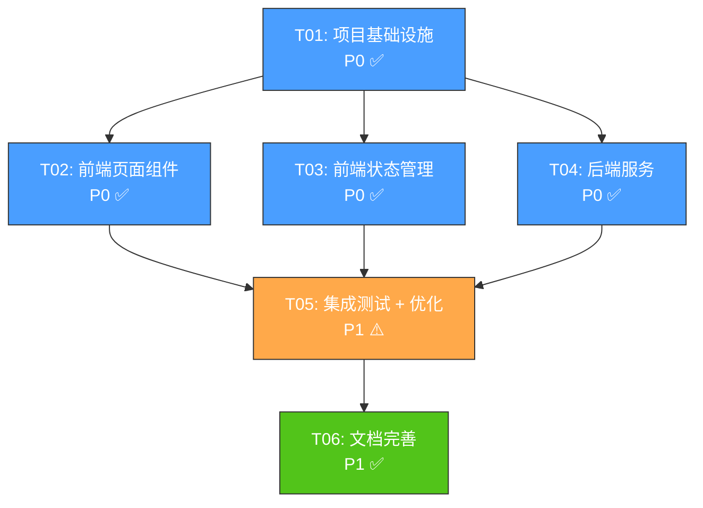

# AI 代码分析混合模式 - 任务依赖关系文档

> 文档版本：v1.0
> 日期：2026-06-24
> 状态：已确认 ✅

---

## 一、任务总览

| 任务 ID | 任务名称 | 优先级 | 状态 | 依赖 |
|---------|---------|--------|------|------|
| T01 | 项目基础设施（路由 + 类型定义 + IPC 通道） | P0 | ✅ 完成 | 无 |
| T02 | 前端页面组件（进度页 + 结果页 + 组件） | P0 | ✅ 完成 | T01 |
| T03 | 前端状态管理（Store + 预加载 API） | P0 | ✅ 完成 | T01, T02 |
| T04 | 后端服务（AI 分析服务 + SSE 服务器） | P0 | ✅ 完成 | T01 |
| T05 | 集成测试 + 优化 | P1 | ⚠️ 完成（有遗留问题） | T02, T03, T04 |
| T06 | 文档完善 + 任务依赖更新 | P1 | ✅ 完成 | T05 |

---

## 二、任务依赖图

---

## 三、并行执行策略

| 阶段 | 任务 | 执行方式 | 预计时间 |
|------|------|----------|----------|
| 第 1 阶段 | T01 | 串行 | 1-2 天 |
| 第 2 阶段 | T02, T03, T04 | 并行 | 3-5 天 |
| 第 3 阶段 | T05 | 串行 | 2-3 天 |
| 第 4 阶段 | T06 | 串行 | 1-2 天 |

**总估算时间**：7-12 天

---

## 四、任务详情

### T01: 项目基础设施

**目标**：搭建项目基础结构，新增路由、类型定义、IPC 通道。

**包含文件**：
- `src/router/index.ts` - 新增路由
- `src/services/types.ts` - 新增类型定义
- `electron/workers/scan-worker-protocol.ts` - 新增消息协议
- `electron/ipc.ts` - 新增 IPC 通道

**验收标准**：
- [x] 路由配置正确
- [x] TypeScript 类型定义完整
- [x] IPC 通道常量已定义

---

### T02: 前端页面组件

**目标**：实现分析进度页面和结果页面的 UI 组件。

**包含文件**：
- `src/views/AiAnalysisProgressView.vue` - 分析进度页面
- `src/views/AiAnalysisResultView.vue` - 分析结果页面
- `src/components/AnalysisLogViewer.vue` - 实时日志查看组件
- `src/components/ScenarioTable.vue` - 场景链路分析表格组件
- `src/components/CurlAssertionPanel.vue` - 左右分栏面板

**验收标准**：
- [x] 进度页面实时显示日志
- [x] 结果页面显示 3 个场景的表格
- [x] 结果页面下部左右分栏显示 curl 和 Python 断言
- [x] UI 符合暗色主题

---

### T03: 前端状态管理

**目标**：更新 Pinia Store，管理分析状态、日志、结果数据。

**包含文件**：
- `src/stores/ai-analysis-store.ts` - 新增状态
- `electron/preload.ts` - 暴露新 API
- `src/services/ipc.ts` - 新增接口

**验收标准**：
- [x] Store 状态更新正确
- [x] SSE 连接建立成功
- [x] 分析结果保存到 Store

---

### T04: 后端服务

**目标**：实现 AI 深度分析服务、SSE 服务器、Worker 管理。

**包含文件**：
- `electron/services/ai-analyze-service.ts` - AI 分析服务
- `electron/main.ts` - SSE 服务器
- `electron/sse-manager.ts` - SSE 管理器
- `electron/services/scan-worker-manager.ts` - 兜底分析触发

**验收标准**：
- [x] SSE 服务器启动成功
- [x] AI Agent 模式分析成功
- [x] 阶段1失败后自动触发阶段2
- [x] 分析结果格式正确

---

### T05: 集成测试 + 优化

**目标**：前后端联调，修复 Bug，优化性能，完善错误处理。

**测试结果**：
- SSE Manager 测试：12 个通过
- Request Store 测试：60 个通过
- AiAnalysisService 测试：13 个失败（worker_threads mock 问题）
- Vue 组件测试：28 个失败（测试环境问题）
- 代码审查：✅ 通过

**遗留问题**：
1. AiAnalysisService 单元测试无法执行 - 需要集成测试或 E2E 测试
2. Vue 组件测试无法执行 - 需要配置 jsdom 环境
3. 实时日志推送延迟未验证 - 需要手动测试

---

### T06: 文档完善 + 任务依赖更新

**目标**：完善技术文档，更新任务依赖关系，准备交付。

**包含文件**：
- `docs/technical-design-ai-hybrid-mode.md` - 技术方案（已更新）
- `docs/task-dependencies.md` - 任务依赖关系文档（本文档）
- `docs/api-documentation.md` - API 接口文档
- `docs/deployment-guide.md` - 部署指南

---

## 五、相关文档

- [PRD 文档](./prd-ai-hybrid-mode.md)
- [技术方案](./technical-design-ai-hybrid-mode.md)
- [API 文档](./api-documentation.md)
- [部署指南](./deployment-guide.md)
- [测试报告](./test-report-ai-hybrid-mode.md)
