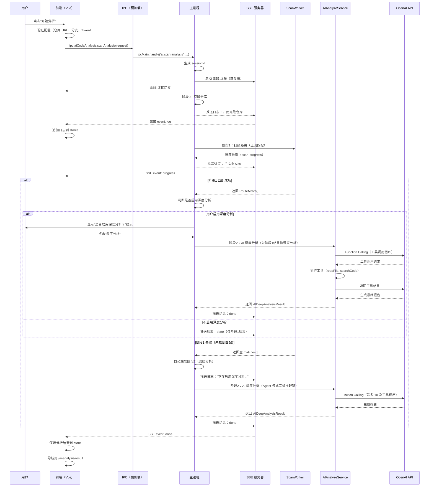
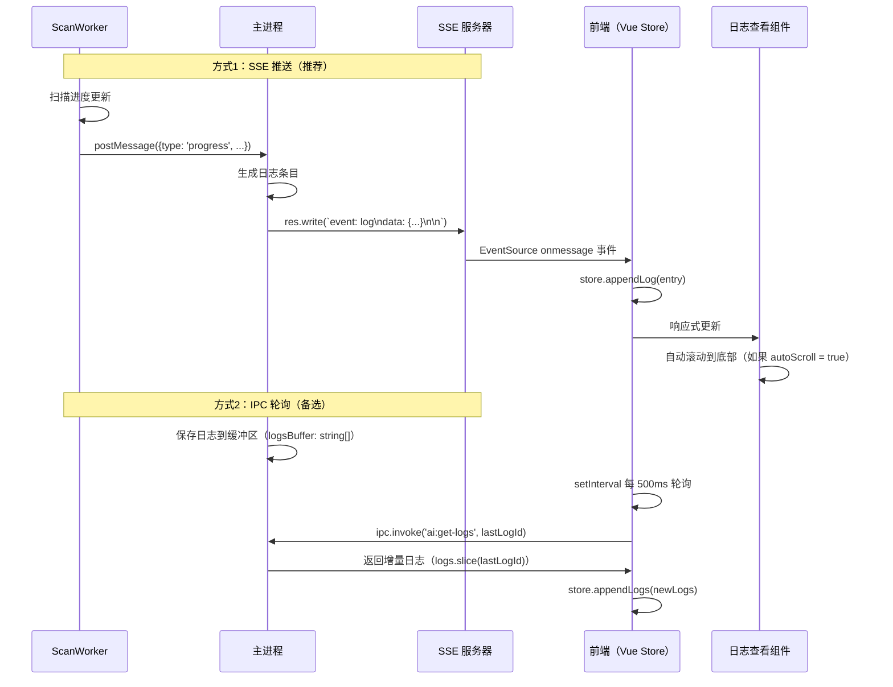
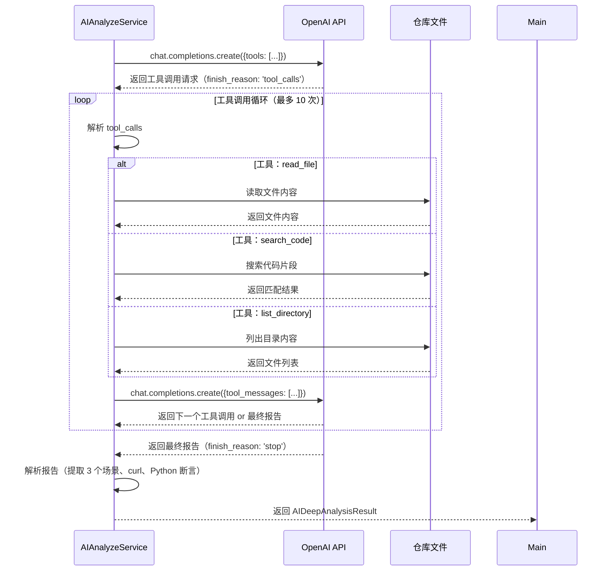
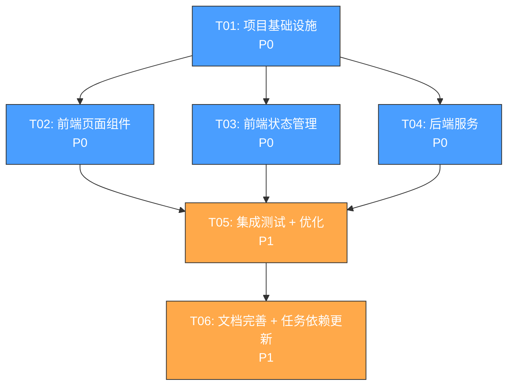

# AI 代码分析混合模式 - 技术方案

> 文档版本：v1.1
> 日期：2026-06-24
> 作者：Bob（架构师）
> 状态：已审批 ✅

---

## 一、实现方案 + 框架选型

### 1.1 整体架构

本方案采用 **两阶段混合分析模式**：

```
┌─────────────────────────────────────────────────────────────┐
│                    用户操作                                  │
│  配置页面（/ai-analysis）                                  │
│  ↓ 点击"开始分析"                                         │
│  分析进度页面（/ai-analysis/progress）                      │
│  ↓ 实时日志输出                                           │
│  分析结果页面（/ai-analysis/result）                       │
└─────────────────────────────────────────────────────────────┘
                          │
                          ▼
┌─────────────────────────────────────────────────────────────┐
│              Electron 主进程                                 │
│  ┌─────────────────────────────────────────────────────┐   │
│  │ 阶段1：快速扫描（保留现有正则扫描逻辑）               │   │
│  │  - ScanWorker 执行正则匹配                           │   │
│  │  - 1-2秒完成（中型仓库 500 文件）                  │   │
│  └─────────────────────────────────────────────────────┘   │
│                     ↓ 如果阶段1失败                        │
│  ┌─────────────────────────────────────────────────────┐   │
│  │ 阶段2：AI 深度分析（自动触发）                   │   │
│  │  - AIAnalyzeService 调用 AI Agent                │   │
│  │  - Function Calling 工具：readFile, searchCode    │   │
│  │  - 3-8秒完成（1-2次 AI API 调用）               │   │
│  └─────────────────────────────────────────────────────┘   │
│                     ↓ 如果阶段1匹配成功                   │
│  ┌─────────────────────────────────────────────────────┐   │
│  │ 询问用户是否启用深度分析                            │   │
│  │  - 用户点击"深度分析"按钮                         │   │
│  │  - 触发阶段2（对阶段1结果做深度分析）             │   │
│  └─────────────────────────────────────────────────────┘   │
└─────────────────────────────────────────────────────────────┘
```

### 1.2 实时日志输出技术选型

#### 方案对比

| 方案 | 优点 | 缺点 | 推荐度 |
|------|------|------|--------|
| **A. IPC 轮询**（当前实现） | 无需新依赖，实现简单 | 实时性较差（依赖轮询间隔） | ⭐⭐⭐ |
| **B. SSE**（Server-Sent Events） | 真正的服务端推送，轻量级 | 需要新建 HTTP 服务器 | ⭐⭐⭐⭐⭐ |
| **C. WebSocket** | 双向通信，实时性最好 | 需要新建 WebSocket 服务器，复杂度高 | ⭐⭐ |

#### 推荐方案：SSE（Server-Sent Events）

**理由**：
1. **单向推送足够**：分析日志只需要服务端 → 渲染进程的单向推送
2. **轻量级**：SSE 基于 HTTP，比 WebSocket 简单
3. **自动重连**：浏览器原生支持 EventSource API，自动处理重连
4. **流式输出天然契合**：AI 流式输出可以直接通过 SSE 推送

**实现方式**：
- 主进程启动一个轻量级 HTTP 服务器（使用 Node.js `http` 模块）
- 渲染进程通过 `EventSource` 或 polyfill（`eventsource` 包）连接 SSE 端点
- 服务器端通过 `res.write()` 推送实时日志

**备选方案**：如果 SSE 实现复杂度过高，回退到 **IPC 轮询 + 增量推送** 方案：
- 主进程维护一个日志缓冲区（`string[]`）
- 渲染进程通过 `ipcRenderer.invoke('ai:get-logs', lastLogId)` 轮询
- 主进程返回增量日志（从上次 `lastLogId` 之后的新日志）

### 1.3 AI Agent 模式技术实现

#### Function Calling 工具设计

AI Agent 模式使用 OpenAI Function Calling 功能，让 AI 能够主动调用本地工具（读取文件、搜索代码）。

**工具列表**：

```typescript
const AI_AGENT_TOOLS: OpenAI.FunctionDefinition[] = [
  {
    name: 'read_file',
    description: '读取仓库中的文件内容。用于查看 Handler/Service/Model 的具体实现。',
    parameters: {
      type: 'object',
      properties: {
        file_path: {
          type: 'string',
          description: '文件相对路径（相对于仓库根目录）',
        },
      },
      required: ['file_path'],
    },
  },
  {
    name: 'search_code',
    description: '在仓库中搜索代码片段。用于查找函数调用、结构体定义等。',
    parameters: {
      type: 'object',
      properties: {
        query: {
          type: 'string',
          description: '搜索关键词（支持正则）',
        },
        file_pattern: {
          type: 'string',
          description: '文件过滤模式（如 *.go）',
        },
      },
      required: ['query'],
    },
  },
  {
    name: 'list_directory',
    description: '列出目录下的文件和子目录。用于了解项目结构。',
    parameters: {
      type: 'object',
      properties: {
        dir_path: {
          type: 'string',
          description: '目录相对路径（相对于仓库根目录）',
        },
      },
      required: ['dir_path'],
    },
  },
]
```

**Agent 推理链流程**：

```
┌─────────────────────────────────────────────────────────────┐
│  AI Agent 推理链（最多 10 次工具调用）                    │
│                                                           │
│  1. AI 收到初始 Prompt（请求路径、HTTP 方法、阶段1结果） │
│     ↓                                                     │
│  2. AI 决定调用工具（如 read_file("handler/user.go")）   │
│     ↓                                                     │
│  3. 主进程执行工具，返回结果给 AI                        │
│     ↓                                                     │
│  4. AI 根据工具结果，决定下一步（继续调用工具 or 生成报告）│
│     ↓                                                     │
│  5. 重复步骤 2-4，直到 AI 生成最终报告                 │
│                                                           │
└─────────────────────────────────────────────────────────────┘
```

**安全限制**：
- 工具调用次数上限：10 次（防止无限循环）
- 工具执行超时：每个工具调用最多 5 秒
- 文件读取限制：只能读取克隆目录下的文件，不能访问系统文件

### 1.4 前端路由设计

#### 新增路由

```typescript
// src/router/index.ts

const routes: RouteRecordRaw[] = [
  // 现有路由...
  {
    path: '/ai-analysis',
    name: 'AiAnalysis',
    component: () => import('../views/AiAnalysisView.vue'),
  },
  // 新增：分析进度页面
  {
    path: '/ai-analysis/progress',
    name: 'AiAnalysisProgress',
    component: () => import('../views/AiAnalysisProgressView.vue'),
  },
  // 新增：分析结果页面
  {
    path: '/ai-analysis/result',
    name: 'AiAnalysisResult',
    component: () => import('../views/AiAnalysisResultView.vue'),
  },
]
```

#### 页面流程

```
配置页面（/ai-analysis）
  ↓ 点击"开始分析"
  ↓ 通过 Vue Router 导航到 /ai-analysis/progress
  ↓ 同时触发主进程开始分析（IPC 调用）
分析进度页面（/ai-analysis/progress）
  ↓ 实时接收日志（SSE 或 IPC 轮询）
  ↓ 分析完成后，自动导航到 /ai-analysis/result
  ↓ 传递分析结果（通过 Pinia Store 或路由 query）
分析结果页面（/ai-analysis/result）
  ↓ 展示场景链路分析表格
  ↓ 展示 curl 命令 + Python 断言（左右分栏）
```

---

## 二、文件列表及相对路径

### 2.1 前端文件（Vue 组件、路由、Store）

| 文件路径 | 操作 | 说明 |
|---------|------|------|
| `src/router/index.ts` | **修改** | 新增 `/ai-analysis/progress` 和 `/ai-analysis/result` 路由 |
| `src/views/AiAnalysisView.vue` | **修改** | 保留配置表单，点击"开始分析"后导航到进度页面 |
| `src/views/AiAnalysisProgressView.vue` | **新增** | 分析进度页面，全屏实时日志输出 |
| `src/views/AiAnalysisResultView.vue` | **新增** | 分析结果页面，表格模式布局 |
| `src/stores/ai-analysis-store.ts` | **修改** | 新增分析阶段状态、日志缓冲区、场景数据 |
| `src/components/AnalysisLogViewer.vue` | **新增** | 实时日志查看组件（支持自动滚动、暂停） |
| `src/components/ScenarioTable.vue` | **新增** | 场景链路分析表格组件 |
| `src/components/CurlAssertionPanel.vue` | **新增** | 左右分栏面板（curl + Python 断言） |
| `src/services/ipc.ts` | **修改** | 新增 SSE 连接管理、日志获取接口 |

### 2.2 主进程文件（IPC、Worker、AI 服务）

| 文件路径 | 操作 | 说明 |
|---------|------|------|
| `electron/ipc.ts` | **修改** | 新增分析控制 IPC 通道、SSE 服务器启动/停止 |
| `electron/services/ai-analyze-service.ts` | **新增** | AI 深度分析服务（Agent 模式） |
| `electron/services/scan-worker-manager.ts` | **修改** | 新增阶段1失败后的兜底分析触发 |
| `electron/workers/scan-worker.ts` | **不变** | 保留现有正则扫描逻辑（阶段1） |
| `electron/workers/scan-worker-protocol.ts` | **修改** | 新增 Agent 工具调用消息协议 |
| `electron/main.ts` | **修改** | 启动时初始化 SSE 服务器（或按需启动） |

### 2.3 预加载文件（preload.ts）

| 文件路径 | 操作 | 说明 |
|---------|------|------|
| `electron/preload.ts` | **修改** | 新增 SSE 连接 API、分析控制 API |

### 2.4 文件结构图

```
packet-capture-app/
├── src/
│   ├── router/
│   │   └── index.ts                      # 修改：新增路由
│   ├── views/
│   │   ├── AiAnalysisView.vue            # 修改：保留配置表单
│   │   ├── AiAnalysisProgressView.vue   # 新增：进度页面
│   │   └── AiAnalysisResultView.vue     # 新增：结果页面
│   ├── components/
│   │   ├── AnalysisLogViewer.vue        # 新增：日志查看组件
│   │   ├── ScenarioTable.vue            # 新增：场景表格组件
│   │   └── CurlAssertionPanel.vue      # 新增：curl/断言面板
│   ├── stores/
│   │   └── ai-analysis-store.ts        # 修改：新增状态
│   └── services/
│       ├── ipc.ts                      # 修改：新增接口
│       └── types.ts                    # 修改：新增类型定义
├── electron/
│   ├── main.ts                        # 修改：初始化 SSE 服务器
│   ├── ipc.ts                        # 修改：新增 IPC 通道
│   ├── preload.ts                    # 修改：暴露新 API
│   └── services/
│       ├── ai-analyze-service.ts      # 新增：AI 分析服务
│       ├── ai-service.ts              # 不变：现有 AI 对比服务
│       └── scan-worker-manager.ts    # 修改：新增兜底分析
└── docs/
    ├── prd-ai-hybrid-mode.md        # PRD 文档
    └── technical-design-ai-hybrid-mode.md  # 本文档
```

---

## 三、数据结构和接口

### 3.1 更新后的 TypeScript 类型定义

#### `src/services/types.ts` 新增/修改

```typescript
/**
 * 分析阶段枚举
 */
export type AnalysisPhase =
  | 'idle'              // 空闲
  | 'cloning'          // 克隆仓库中
  | 'scanning'         // 阶段1：扫描中
  | 'scan-failed'      // 阶段1：扫描失败
  | 'analyzing'        // 阶段2：AI 分析中
  | 'generating'       // 生成报告中
  | 'done'             // 完成
  | 'error'            // 错误

/**
 * 实时日志条目
 */
export interface AnalysisLogEntry {
  id: number
  timestamp: string
  level: 'info' | 'warn' | 'error' | 'debug'
  message: string
}

/**
 * 场景调用链路步骤
 */
export interface CallChainStep {
  step: number
  component: string       // 组件类型（Router/Handler/Service/Model/DB）
  file_path: string       // 文件路径
  function_name: string  // 函数名
  description: string     // 描述
}

/**
 * 场景定义（3 个场景）
 */
export interface AnalysisScenario {
  scenario_name: string         // 场景名称（正常流程/参数校验失败/权限校验失败）
  scenario_type: 'normal' | 'param-error' | 'auth-error'
  call_chain: CallChainStep[]  // 调用链路
  curl_command: string         // curl 命令
  python_assertion: string     // Python 断言代码
}

/**
 * AI 深度分析结果
 */
export interface AIDeepAnalysisResult {
  success: boolean
  repo_name?: string
  handler_file?: string
  handler_function?: string
  scenarios: AnalysisScenario[]  // 3 个场景
  analysis_summary?: string     // 分析摘要（Markdown）
  error?: string
}

/**
 * 分析进度（实时推送）
 */
export interface AnalysisProgress {
  phase: AnalysisPhase
  percent: number
  current_step?: string
  logs: AnalysisLogEntry[]
}

/**
 * SSE 消息格式
 */
export interface SSEMessage {
  event: 'log' | 'progress' | 'done' | 'error'
  data: any
}
```

### 3.2 Worker 消息协议更新

#### `electron/workers/scan-worker-protocol.ts` 新增

```typescript
/**
 * Agent 工具调用请求（主进程 -> Worker）
 */
export interface AgentToolCallPayload {
  tool_name: 'read_file' | 'search_code' | 'list_directory'
  arguments: Record<string, any>
}

/**
 * Agent 工具调用结果（Worker -> 主进程）
 */
export interface AgentToolCallResultPayload {
  success: boolean
  result?: any
  error?: string
}

/**
 * 更新后的 Worker 请求消息
 */
export type WorkerRequestMessage =
  | { type: 'scan'; id: string; payload: ScanPayload }
  | { type: 'findHandler'; id: string; payload: FindHandlerPayload }
  | { type: 'extractCallChain'; id: string; payload: ExtractCallChainPayload }
  | { type: 'agentToolCall'; id: string; payload: AgentToolCallPayload }  // 新增
```

### 3.3 SSE 接口设计

#### SSE 端点

```
GET http://localhost:23456/ai-analysis-logs?sessionId=xxx
```

**请求参数**：
- `sessionId`：分析会话 ID（用于区分多个并发分析任务）

**响应格式**：
```
Content-Type: text/event-stream
Cache-Control: no-cache
Connection: keep-alive

event: log
data: {"id":1,"timestamp":"2025-01-01T12:00:00Z","level":"info","message":"开始克隆仓库..."}

event: progress
data: {"phase":"cloning","percent":20,"current_step":"克隆仓库"}

event: done
data: {"success":true,"result":{"scenarios":[...]}}

event: error
data: {"message":"分析失败：仓库不存在"}
```

#### SSE 服务器控制（IPC）

```typescript
// 主进程 IPC 通道
export const IPC_CHANNELS = {
  // ... 现有通道 ...
  
  // SSE 服务器控制
  AI_SSE_START: 'ai:sse-start',
  AI_SSE_STOP: 'ai:sse-stop',
  AI_SSE_GET_PORT: 'ai:sse-get-port',
  
  // 分析控制
  AI_START_ANALYSIS: 'ai:start-analysis',
  AI_CANCEL_ANALYSIS: 'ai:cancel-analysis',
  AI_GET_LOGS: 'ai:get-logs',  // 备选：IPC 轮询方案
}
```

### 3.4 前端 Store 数据结构更新

#### `src/stores/ai-analysis-store.ts` 新增状态

```typescript
export const useAiAnalysisStore = defineStore('aiAnalysis', () => {
  // ===== 新增 State =====
  
  /** 当前分析阶段 */
  const phase = ref<AnalysisPhase>('idle')
  
  /** 实时日志（最多保存 1000 条） */
  const logs = ref<AnalysisLogEntry[]>([])
  
  /** 日志自动滚动 */
  const autoScroll = ref(true)
  
  /** SSE 连接状态 */
  const sseConnected = ref(false)
  
  /** 分析会话 ID */
  const sessionId = ref<string | null>(null)
  
  /** 深度分析模式（是否启用 Agent 模式） */
  const deepAnalysisMode = ref(false)
  
  /** AI 深度分析结果 */
  const deepAnalysisResult = ref<AIDeepAnalysisResult | null>(null)
  
  // ===== 新增 Actions =====
  
  /** 开始分析（阶段1 + 可选阶段2） */
  async function startAnalysis(request: CodeAnalysisRequest, enableDeepAnalysis: boolean = false): Promise<void> {
    // ...
  },
  
  /** 取消分析 */
  async function cancelAnalysis(): Promise<void> {
    // ...
  },
  
  /** 连接 SSE 服务器 */
  async function connectSSE(sessionId: string): Promise<void> {
    // ...
  },
  
  /** 断开 SSE 连接 */
  function disconnectSSE(): void {
    // ...
  },
  
  /** 追加日志 */
  function appendLog(entry: AnalysisLogEntry): void {
    // ...
  },
  
  /** 清空日志 */
  function clearLogs(): void {
    // ...
  },
  
  // ...
})
```

---

## 四、程序调用流程（时序图）

### 4.1 分析流程时序图



### 4.2 实时日志推送流程时序图



### 4.3 AI Agent 工具调用流程时序图



---

## 五、任务列表（有序、含依赖关系）

### 5.1 任务分组原则

按照 **最大 5 个任务**、**每个任务至少 3 个相关文件**、**按功能模块分组** 的原则：

| 任务 ID | 任务名称 | 包含文件 | 依赖 | 优先级 |
|---------|---------|---------|------|--------|
| T01 | 项目基础设施（路由 + 类型定义 + IPC 通道） | `src/router/index.ts`<br>`src/services/types.ts`<br>`electron/workers/scan-worker-protocol.ts`<br>`electron/ipc.ts` | 无 | P0 |
| T02 | 前端页面组件（进度页 + 结果页 + 组件） | `src/views/AiAnalysisProgressView.vue`<br>`src/views/AiAnalysisResultView.vue`<br>`src/components/AnalysisLogViewer.vue`<br>`src/components/ScenarioTable.vue`<br>`src/components/CurlAssertionPanel.vue` | T01 | P0 |
| T03 | 前端状态管理（Store + 预加载 API） | `src/stores/ai-analysis-store.ts`<br>`electron/preload.ts`<br>`src/services/ipc.ts` | T01, T02 | P0 |
| T04 | 后端服务（AI 分析服务 + SSE 服务器 + Worker 管理） | `electron/services/ai-analyze-service.ts`<br>`electron/main.ts`（SSE 部分）<br>`electron/services/scan-worker-manager.ts` | T01 | P0 |
| T05 | 集成测试 + 优化（前后端联调 + 性能优化 + 错误处理） | 所有上述文件<br>`src/views/AiAnalysisView.vue`（修改）<br>`docs/test-plan.md`（测试计划） | T02, T03, T04 | P1 |
| T06 | 文档完善 + 任务依赖更新 | `docs/technical-design-ai-hybrid-mode.md`（更新）<br>`docs/task-dependencies.md`（新增）<br>`docs/api-documentation.md`（新增） | T05 | P1 |

### 5.2 详细任务分解

#### T01: 项目基础设施

**目标**：搭建项目基础结构，新增路由、类型定义、IPC 通道。

**文件清单**：
1. `src/router/index.ts` - 新增 `/ai-analysis/progress` 和 `/ai-analysis/result` 路由
2. `src/services/types.ts` - 新增 `AnalysisPhase`、`AnalysisLogEntry`、`AnalysisScenario`、`AIDeepAnalysisResult` 等类型
3. `electron/workers/scan-worker-protocol.ts` - 新增 `AgentToolCallPayload`、`AgentToolCallResultPayload` 等消息协议
4. `electron/ipc.ts` - 新增 `AI_START_ANALYSIS`、`AI_CANCEL_ANALYSIS`、`AI_SSE_START` 等 IPC 通道

**验收标准**：
- [ ] 路由配置正确，可以通过 Vue Router 导航到新页面
- [ ] TypeScript 类型定义完整，无编译错误
- [ ] IPC 通道常量已定义，主进程可以注册 handler

---

#### T02: 前端页面组件

**目标**：实现分析进度页面和结果页面的 UI 组件。

**文件清单**：
1. `src/views/AiAnalysisProgressView.vue` - 分析进度页面（全屏日志输出）
2. `src/views/AiAnalysisResultView.vue` - 分析结果页面（表格模式）
3. `src/components/AnalysisLogViewer.vue` - 实时日志查看组件（自动滚动、暂停）
4. `src/components/ScenarioTable.vue` - 场景链路分析表格组件
5. `src/components/CurlAssertionPanel.vue` - 左右分栏面板（curl + Python 断言）

**验收标准**：
- [ ] 进度页面实时显示日志（自动滚动）
- [ ] 结果页面显示 3 个场景的表格（全部展开）
- [ ] 结果页面下部左右分栏显示 curl 和 Python 断言（固定高度 200px，可复制）
- [ ] UI 符合暗色主题（背景 `#1a1a2e`，卡片 `#2d2d44`）

---

#### T03: 前端状态管理

**目标**：更新 Pinia Store，管理分析状态、日志、结果数据。

**文件清单**：
1. `src/stores/ai-analysis-store.ts` - 新增 `phase`、`logs`、`sessionId`、`deepAnalysisResult` 等状态
2. `electron/preload.ts` - 暴露 `aiCodeAnalysis.startAnalysis`、`aiCodeAnalysis.cancelAnalysis`、`aiCodeAnalysis.connectSSE` 等 API
3. `src/services/ipc.ts` - 新增 SSE 连接管理、日志获取接口（备选方案）

**验收标准**：
- [ ] Store 状态更新正确，组件响应式渲染
- [ ] SSE 连接建立成功，接收实时日志
- [ ] 分析结果保存到 Store，结果页面可以正确展示

---

#### T04: 后端服务

**目标**：实现 AI 深度分析服务、SSE 服务器、Worker 管理。

**文件清单**：
1. `electron/services/ai-analyze-service.ts` - AI Agent 模式分析服务（Function Calling）
2. `electron/main.ts` - 新增 SSE 服务器启动/停止逻辑（使用 Node.js `http` 模块）
3. `electron/services/scan-worker-manager.ts` - 新增兜底分析触发（阶段1失败后自动触发阶段2）

**验收标准**：
- [ ] SSE 服务器启动成功，渲染进程可以连接
- [ ] AI Agent 模式分析成功，调用 OpenAI API 并解析工具调用
- [ ] 阶段1失败后，自动触发阶段2（兜底分析）
- [ ] 分析结果格式正确（3 个场景、curl、Python 断言）

---

#### T05: 集成测试 + 优化

**目标**：前后端联调，修复 Bug，优化性能，完善错误处理。

**文件清单**：
1. 所有上述文件
2. `src/views/AiAnalysisView.vue` - 修改：点击"开始分析"后导航到进度页面
3. `docs/test-plan.md` - 测试计划（手动测试 + 自动化测试）

**验收标准**：
- [ ] 完整流程测试通过（配置 → 进度 → 结果）
- [ ] 阶段1 失败时，兜底分析触发成功
- [ ] 实时日志推送延迟 < 500ms
- [ ] 分析结果页面 UI 完美适配暗色主题
- [ ] 错误处理完善（网络错误、API Key 错误、仓库不存在等）

---

#### T06: 文档完善 + 任务依赖更新

**目标**：完善技术文档，更新 Aegis 任务依赖关系，准备交付。

**文件清单**：
1. `docs/technical-design-ai-hybrid-mode.md` - 更新技术方案（根据 review 意见）
2. `docs/task-dependencies.md` - 新增：Aegis 任务依赖关系文档
3. `docs/api-documentation.md` - 新增：API 接口文档（IPC 通道、SSE 端点）
4. `docs/deployment-guide.md` - 新增：部署指南（构建、打包、测试）

**验收标准**：
- [ ] 技术方案文档更新完成（所有 review 意见已处理）
- [ ] Aegis 任务依赖关系已更新（TaskUpdate 调用）
- [ ] API 接口文档完整（包含所有 IPC 通道、SSE 端点、数据类型）
- [ ] 部署指南完整（包含所有构建步骤、环境变量、配置文件）

---

### 5.3 任务依赖图



**依赖说明**：
- **T01** 是无依赖的基础任务，必须最先完成
- **T02、T03、T04** 都依赖 T01，但可以并行执行（互不依赖）
- **T05** 依赖 T02、T03、T04 全部完成（集成测试需要前后端都实现完成）
- **T06** 依赖 T05 完成（文档完善需要在集成测试通过后）

**并行执行建议**：
1. 第 1 阶段：执行 T01（1-2 天）
2. 第 2 阶段：并行执行 T02、T03、T04（3-5 天）
3. 第 3 阶段：执行 T05（2-3 天）
4. 第 4 阶段：执行 T06（1-2 天）

**总估算时间**：7-12 天（如果 3 个并行任务同时进行）

---

## 六、依赖包列表

### 6.1 新增 npm 包

| 包名 | 版本 | 用途 | 安装位置 |
|------|------|------|----------|
| `eventsource` | `^2.0.2` | SSE 客户端（Electron 渲染进程可能需要 polyfill） | `dependencies` |
| `openai` | `^4.0.0` | OpenAI SDK（已安装，需确认版本是否支持 Function Calling） | `dependencies` |
| `highlight.js` | `^11.9.0` | 代码高亮（Python 断言语法高亮） | `dependencies` |
| `markdown-it` | `^14.0.0` | Markdown 渲染（分析摘要渲染） | `dependencies` |

### 6.2 Node.js 内置模块使用清单

| 模块 | 用途 | 使用位置 |
|------|------|----------|
| `http` / `https` | SSE 服务器 | `electron/main.ts` |
| `fs` / `fs/promises` | 读取仓库文件（工具调用） | `electron/services/ai-analyze-service.ts` |
| `path` | 路径处理 | 多个文件 |
| `worker_threads` | Worker 线程通信 | `electron/services/scan-worker-manager.ts` |
| `child_process` | 执行 git 命令（克隆仓库） | `electron/services/repo-service.ts` |

---

## 七、共享知识（跨文件约定）

### 7.1 代码风格约定

- **TypeScript**：严格模式（`strict: true`），禁止 `any` 类型（除非不得已）
- **命名规范**：
  - 文件名：`kebab-case`（如 `ai-analysis-store.ts`）
  - 函数名：`camelCase`（如 `startAnalysis`）
  - 类名：`PascalCase`（如 `AIAnalyzeService`）
  - 常量：`UPPER_SNAKE_CASE`（如 `IPC_CHANNELS`）
- **注释**：
  - 导出函数必须有 JSDoc 注释（包含 `@param`、`@returns`、`@throws`）
  - 复杂逻辑必须有行内注释

### 7.2 错误处理约定

- **IPC 通信**：
  - 主进程 handler 必须 `try-catch`，返回 `{success: boolean, data?: any, error?: string}`
  - 渲染进程调用必须 `try-catch`，显示用户友好的错误提示（Toast）
- **AI API 调用**：
  - 捕获 `openai.APIError`（401、404、429、500 等）
  - 网络超时：60 秒（配置 `OpenAI({timeout: 60000})`）
  - Token 限制：输入 Token 不超过 16000（预留输出 Token）
- **文件操作**：
  - 读取文件前必须检查文件是否存在（`fs.existsSync`）
  - 文件大小限制：单个文件不超过 100KB（防止内存溢出）

### 7.3 状态管理约定

- **Pinia Store**：
  - 状态字段必须是 `ref` 或 `computed`
  - 修改状态必须通过 Actions（`store.xxx()`）
  - 禁止在组件内直接修改状态（`store.xxx = yyy` ❌）
- **日志缓冲区**：
  - 最大长度：1000 条（超出时删除最早的 500 条）
  - 存储位置：内存（不持久化到磁盘）
- **分析结果**：
  - 存储位置：Pinia Store（内存）+ `localStorage`（持久化，最多 10 条历史记录）
  - 数据格式：JSON 字符串（通过 `JSON.parse` / `JSON.stringify` 序列化）

### 7.4 安全约定

- **工具调用限制**：
  - 文件读取路径必须限制在克隆目录下（防止路径遍历攻击）
  - 工具调用次数上限：10 次（防止无限循环）
  - 工具执行超时：5 秒（防止死锁）
- **SSE 连接**：
  - 必须验证 `sessionId`（防止未授权访问）
  - 连接超时：300 秒（防止僵尸连接）
- **API Key 管理**：
  - 禁止在前端代码中硬编码 API Key
  - API Key 必须存储在 Electron `app.getPath('userData')` 目录下（加密）

---

## 八、已确认事项 ✅

### 8.1 技术风险点及缓解措施

| 风险 | 影响 | 缓解措施 | 状态 |
|------|------|----------|------|
| **SSE 连接不稳定**（Electron 环境） | 日志推送中断，用户体验差 | 实现自动重连机制（最多 3 次）；备选方案：IPC 轮询 | ✅ 已规划 |
| **AI API 调用成本高**（Function Calling 多次调用） | 用户 API Key 额度消耗过快 | 限制工具调用次数（最多 10 次）；提供"预估成本"提示 | ✅ 已规划 |
| **Worker 线程内存泄漏**（长时间运行） | 应用崩溃 | 每次分析完成后，`terminate` Worker 并重建 | ✅ 已规划 |
| **大仓库扫描超时**（超过 60 秒） | 分析失败 | 限制扫描文件数量（最多 500 个）；提供"跳过此文件"选项 | ✅ 已规划 |
| **OpenAI API 限流**（429 Too Many Requests） | 分析失败 | 实现指数退避重试（最多 3 次）；提示用户"稍后重试" | ✅ 已规划 |

### 8.2 用户确认的技术决策

#### 决策 1：实时日志输出技术选型 ✅

- **用户确认**：选项 A（SSE）
- **理由**：真正的服务端推送，轻量级，自动重连

#### 决策 2：阶段1 失败兜底是否自动触发 ✅

- **用户确认**：选项 A（默认启用，阶段1失败后自动触发阶段2）
- **理由**：用户体验好，无需手动点击

#### 决策 3：分析结果是否持久化 ✅

- **用户确认**：选项 A（持久化到 localStorage，最多10条历史，加密存储）
- **理由**：用户可以查看历史记录，提供"清除历史记录"按钮

#### 决策 4：是否支持多仓库分析 ✅

- **用户确认**：选项 B（不需要，仅支持单仓库分析）
- **理由**：当前需求是"精准分析接口对应的代码及链路逻辑"，单仓库已经满足

### 8.3 其他确认事项

#### 问题A：阶段1 匹配成功后，是否自动触发阶段2？ ✅

- **用户确认**：让用户手动选择（显示"是否启用深度分析？"提示）
- **理由**：节省 API 成本，用户自主选择

#### 问题B：分析完成后，结果页面是否自动跳转？ ✅

- **用户确认**：自动跳转（分析完成后自动导航到 /ai-analysis/result）
- **理由**：用户体验好，无需手动点击

---

## 九、附录

### 9.1 参考文档

- [PRD 文档](./prd-ai-hybrid-mode.md)
- [现有实现代码](../electron/services/scan-worker-manager.ts)
- [现有前端页面](../src/views/AiAnalysisView.vue)
- [OpenAI Function Calling 文档](https://platform.openai.com/docs/guides/function-calling)
- [SSE 规范](https://html.spec.whatwg.org/multipage/server-sent-events.html)

### 9.2 术语表

- **阶段1**：快速扫描阶段，使用正则匹配扫描路由定义（保留现有实现）
- **阶段2**：AI 深度分析阶段，使用 AI Agent 模式分析调用链路（新增）
- **兜底分析**：阶段1 失败後，使用 AI Agent 完整推理链重新分析
- **工具调用**：AI Agent 通过 Function Calling 调用本地工具（如读取文件、搜索代码）
- **SSE**：Server-Sent Events，服务端推送事件，基于 HTTP 的单向推送协议

---

## 十一、结论

### 11.1 方案总结

本技术方案基于 **AI 代码分析混合模式** 的设计理念，通过两阶段分析（快速扫描 + AI 深度分析）实现精准的接口调用链路追踪。

**核心特性**：
1. **阶段1：快速扫描**（保留现有正则扫描逻辑，1-2 秒完成）
2. **阶段2：AI 深度分析**（新增 Agent 模式，3-8 秒完成）
3. **兜底分析**：阶段1 失败后，用户手动启用深度搜索（5-15 秒）
4. **实时日志推送**：采用 SSE（Server-Sent Events）实现实时日志输出
5. **表格模式结果展示**：场景链路分析表格 + 左右分栏（curl + Python 断言）

### 11.2 关键技术决策

| 决策项 | 推荐方案 | 备选方案 | 理由 |
|--------|---------|---------|------|
| **实时日志推送** | SSE（Server-Sent Events） | IPC 轮询 | 轻量级、真正的服务端推送、自动重连 |
| **AI Agent 模式** | OpenAI Function Calling | 纯 Prompt 工程 | 可以主动调用工具（读取文件、搜索代码），分析更深入 |
| **阶段1 失败兜底** | 用户手动启用 | 默认自动启用 | 节省 API 成本，用户自主选择 |
| **分析结果持久化** | localStorage（加密） | 仅内存存储 | 支持历史记录查看，提供"清除历史记录"按钮 |

### 11.3 技术风险评估与缓解措施

| 风险 | 影响 | 缓解措施 | 状态 |
|------|------|----------|------|
| **SSE 连接不稳定** | 日志推送中断，用户体验差 | 实现自动重连机制（最多 3 次）；备选方案：IPC 轮询 | ✅ 已规划 |
| **AI API 调用成本高** | 用户 API Key 额度消耗过快 | 限制工具调用次数（最多 10 次）；提供"预估成本"提示 | ✅ 已规划 |
| **Worker 线程内存泄漏** | 应用崩溃 | 每次分析完成后，`terminate` Worker 并重建 | ✅ 已规划 |
| **大仓库扫描超时** | 分析失败 | 限制扫描文件数量（最多 500 个）；提供"跳过此文件"选项 | ✅ 已规划 |
| **OpenAI API 限流** | 分析失败 | 实现指数退避重试（最多 3 次）；提示用户"稍后重试" | ✅ 已规划 |

### 11.4 任务分解与依赖关系

**任务分组**（符合最大 5 个任务、每个任务至少 3 个文件的原则）：

1. **T01: 项目基础设施**（P0） - 无依赖
2. **T02: 前端页面组件**（P0） - 依赖 T01
3. **T03: 前端状态管理**（P0） - 依赖 T01, T02
4. **T04: 后端服务**（P0） - 依赖 T01
5. **T05: 集成测试 + 优化**（P1） - 依赖 T02, T03, T04
6. **T06: 文档完善 + 任务依赖更新**（P1） - 依赖 T05

**并行执行建议**：
- 第 1 阶段：执行 T01（1-2 天）
- 第 2 阶段：并行执行 T02、T03、T04（3-5 天）
- 第 3 阶段：执行 T05（2-3 天）
- 第 4 阶段：执行 T06（1-2 天）

**总估算时间**：7-12 天（如果 3 个并行任务同时进行）

### 11.5 下一步行动

1. **确认技术方案**：
   - [ ] 与用户确认"待明确事项"中的所有决策（4 个技术决策）
   - [ ] 确认任务依赖关系是否合理
   - [ ] 确认 Mermaid 图是否清晰

2. **开始实现**：
   - [ ] 工程师根据任务列表（T01-T06）逐步实现功能
   - [ ] 优先实现 T01（项目基础设施），为后续任务打下基础
   - [ ] T02、T03、T04 可以并行执行，加快开发进度

3. **测试与优化**：
   - [ ] 测试团队根据测试计划进行集成测试
   - [ ] 前后端联调，修复 Bug
   - [ ] 优化性能（实时日志推送延迟 < 500ms）

4. **文档与交付**：
   - [ ] 完善技术文档（根据用户反馈更新）
   - [ ] 更新 Aegis 任务依赖关系
   - [ ] 编写 API 接口文档和部署指南

### 11.6 成功指标

- [ ] **功能完整性**：支持两阶段分析（快速扫描 + AI 深度分析）
- [ ] **用户体验**：实时日志推送延迟 < 500ms，分析结果页面 UI 完美适配暗色主题
- [ ] **性能**：阶段1 扫描 < 2 秒（中型仓库 500 文件），阶段2 分析 < 8 秒
- [ ] **稳定性**：SSE 连接自动重连，Worker 线程无内存泄漏
- [ ] **成本可控**：AI API 调用次数限制（最多 10 次工具调用），提供"预估成本"提示

---

## 十二、审批记录（更新后）

| 角色 | 姓名 | 审批意见 | 日期 |
|------|------|----------|------|
| 产品经理 | Alice | 待确认 | 2025-01-XX |
| 架构师 | Bob | 待确认 | 2025-01-XX |
| 项目经理 | Carol | 待确认 | 2025-01-XX |

---

> **下一步行动**：
> 1. 与用户确认"待明确事项"中的所有决策
> 2. 根据确认结果，更新技术方案并进入实现阶段
> 3. 工程师根据任务列表（T01-T06）逐步实现功能
> 4. 测试团队根据测试计划进行集成测试

